```{title} Hiwonder Docs
```

#  Jetson

## Robotics

<div class="container">
    <div style="display: flex; flex-wrap: wrap; gap: 20px; margin-bottom:50px;">
        <div style="width: calc(18% - 15px); min-width: 150px; background: white; border-radius: 8px; overflow: hidden; box-shadow: 0 2px 8px rgba(0,0,0,0.1);">
            <a target="_blank" href="https://wiki.hiwonder.com/projects/rosorin-pro/en/latest/" style="display: block; text-decoration: none;">
                
                <div style="padding: 12px 4px; text-align: center; color: #333;">
                    <span>ROSOrin Pro</span>
                </div>
            </a>
        </div>
        <div style="width: calc(18% - 15px); min-width: 150px; background: white; border-radius: 8px; overflow: hidden; box-shadow: 0 2px 8px rgba(0,0,0,0.1);">
            <a target="_blank" href="https://docs.hiwonder.com/projects/ROSpider/en/jetson-orin-nano-version/" style="display: block; text-decoration: none;">
                
                <div style="padding: 12px 4px; text-align: center; color: #333;">
                    <span>ROSpider</span>
                </div>
            </a>
        </div>
        <div style="width: calc(18% - 15px); min-width: 150px; background: white; border-radius: 8px; overflow: hidden; box-shadow: 0 2px 8px rgba(0,0,0,0.1);">
            <a target="_blank" href="https://docs.hiwonder.com/projects/ROSOrin/en/jetson-orin-nano-version/" style="display: block; text-decoration: none;">
                
                <div style="padding: 12px 4px; text-align: center; color: #333;">
                    <span>ROSOrin</span>
                </div>
            </a>
        </div>
        <div style="width: calc(18% - 15px); min-width: 150px; background: white; border-radius: 8px; overflow: hidden; box-shadow: 0 2px 8px rgba(0,0,0,0.1);">
            <a target="_blank" href="https://docs.hiwonder.com/projects/ROSPug/en/latest" style="display: block; text-decoration: none;">
                
                <div style="padding: 12px 4px; text-align: center; color: #333;">
                    <span>ROSPug</span>
                </div>
            </a>
        </div>
        <div style="width: calc(18% - 15px); min-width: 150px; background: white; border-radius: 8px; overflow: hidden; box-shadow: 0 2px 8px rgba(0,0,0,0.1);">
            <a target="_blank" href="https://docs.hiwonder.com/projects/JetArm/en/jetarm-orin-nano/" style="display: block; text-decoration: none;">
                
                <div style="padding: 12px 4px; text-align: center; color: #333;">
                    <span>JetArm Pro</span>
                </div>
            </a>
        </div>
        <div style="width: calc(18% - 15px); min-width: 150px; background: white; border-radius: 8px; overflow: hidden; box-shadow: 0 2px 8px rgba(0,0,0,0.1);">
            <a target="_blank" href="https://www.hiwonder.com.cn/store/learn/118.html" style="display: block; text-decoration: none;">
                
                <div style="padding: 12px 4px; text-align: center; color: #333;">
                    <span>JetMax Pro</span>
                </div>
            </a>
        </div>
        <div style="width: calc(18% - 15px); min-width: 150px; background: white; border-radius: 8px; overflow: hidden; box-shadow: 0 2px 8px rgba(0,0,0,0.1);">
            <a target="_blank" href="https://docs.hiwonder.com/projects/JetArm/en/jetarm-orin-nano/" style="display: block; text-decoration: none;">
                
                <div style="padding: 12px 4px; text-align: center; color: #333;">
                    <span>JetArm</span>
                </div>
            </a>
        </div>
        <div style="width: calc(18% - 15px); min-width: 150px; background: white; border-radius: 8px; overflow: hidden; box-shadow: 0 2px 8px rgba(0,0,0,0.1);">
            <a target="_blank" href="https://www.hiwonder.com.cn/store/learn/83.html" style="display: block; text-decoration: none;">
                
                <div style="padding: 12px 4px; text-align: center; color: #333;">
                    <span>JetMax</span>
                </div>
            </a>
        </div>
        <div style="width: calc(18% - 15px); min-width: 150px; background: white; border-radius: 8px; overflow: hidden; box-shadow: 0 2px 8px rgba(0,0,0,0.1);">
            <a target="_blank" href="https://www.hiwonder.com.cn/store/learn/111.html" style="display: block; text-decoration: none;">
                
                <div style="padding: 12px 4px; text-align: center; color: #333;">
                    <span>JetTank</span>
                </div>
            </a>
        </div>
        <div style="width: calc(18% - 15px); min-width: 150px; background: white; border-radius: 8px; overflow: hidden; box-shadow: 0 2px 8px rgba(0,0,0,0.1);">
            <a target="_blank" href="https://docs.hiwonder.com/projects/JetRover/en/jetson-orin-nano/" style="display: block; text-decoration: none;">
                
                <div style="padding: 12px 4px; text-align: center; color: #333;">
                    <span>JetRover</span>
                </div>
            </a>
        </div>
        <div style="width: calc(18% - 15px); min-width: 150px; background: white; border-radius: 8px; overflow: hidden; box-shadow: 0 2px 8px rgba(0,0,0,0.1);">
            <a target="_blank" href="https://docs.hiwonder.com/projects/JetAcker/en/jetacker-orin-nano/" style="display: block; text-decoration: none;">
                
                <div style="padding: 12px 4px; text-align: center; color: #333;">
                    <span>JetAcker</span>
                </div>
            </a>
        </div>
        <div style="width: calc(18% - 15px); min-width: 150px; background: white; border-radius: 8px; overflow: hidden; box-shadow: 0 2px 8px rgba(0,0,0,0.1);">
            <a target="_blank" href="https://docs.hiwonder.com/projects/JetAuto/en/jetauto-orin-nano/" style="display: block; text-decoration: none;">
                
                <div style="padding: 12px 4px; text-align: center; color: #333;">
                    <span>JetAuto Pro</span>
                </div>
            </a>
        </div>
        <div style="width: calc(18% - 15px); min-width: 150px; background: white; border-radius: 8px; overflow: hidden; box-shadow: 0 2px 8px rgba(0,0,0,0.1);">
            <a target="_blank" href="https://docs.hiwonder.com/projects/JetAuto/en/jetauto-orin-nano/" style="display: block; text-decoration: none;">
                
                <div style="padding: 12px 4px; text-align: center; color: #333;">
                    <span>JetAuto</span>
                </div>
            </a>
        </div>
        <div style="width: calc(18% - 15px); min-width: 150px; background: white; border-radius: 8px; overflow: hidden; box-shadow: 0 2px 8px rgba(0,0,0,0.1);">
            <a target="_blank" href="https://wiki.hiwonder.com/projects/JetHexa/en/latest/" style="display: block; text-decoration: none;">
                
                <div style="padding: 12px 4px; text-align: center; color: #333;">
                    <span>JetHexa</span>
                </div>
            </a>
        </div>
    </div>
</div>

## Controller & Shield Board

<div class="container">
    <div style="display: flex; flex-wrap: wrap; gap: 20px; margin-bottom:50px;">
        <div style="width: calc(18% - 15px); min-width: 150px; background: white; border-radius: 8px; overflow: hidden; box-shadow: 0 2px 8px rgba(0,0,0,0.1);">
            <a target="_blank" href="https://www.hiwonder.com.cn/store/learn/150.html" style="display: block; text-decoration: none;">
                
                <div style="padding: 12px 4px; text-align: center; color: #333;">
                    <span>Hiwonder Jetson Orin NX</span>
                </div>
            </a>
        </div>
        <div style="width: calc(18% - 15px); min-width: 150px; background: white; border-radius: 8px; overflow: hidden; box-shadow: 0 2px 8px rgba(0,0,0,0.1);">
            <a target="_blank" href="https://www.hiwonder.com.cn/store/learn/148.html" style="display: block; text-decoration: none;">
                
                <div style="padding: 12px 4px; text-align: center; color: #333;">
                    <span>Hiwonder Jetson Orin Nano</span>
                </div>
            </a>
        </div>
        <div style="width: calc(18% - 15px); min-width: 150px; background: white; border-radius: 8px; overflow: hidden; box-shadow: 0 2px 8px rgba(0,0,0,0.1);">
            <div style="display: block; text-decoration: none;">
                
                <div style="padding: 12px 4px; text-align: center; color: #333;">
                    <span>ROS2 Upgrade Pack</span>
                </div>
            </div>
        </div>
        <div style="width: calc(18% - 15px); min-width: 150px; background: white; border-radius: 8px; overflow: hidden; box-shadow: 0 2px 8px rgba(0,0,0,0.1);">
            <a target="_blank" href="https://www.hiwonder.com.cn/store/learn/152.html" style="display: block; text-decoration: none;">
                
                <div style="padding: 12px 4px; text-align: center; color: #333;">
                    <span>ROS Robot Control Board</span>
                </div>
            </a>
        </div>
        <div style="width: calc(18% - 15px); min-width: 150px; background: white; border-radius: 8px; overflow: hidden; box-shadow: 0 2px 8px rgba(0,0,0,0.1);">
            <a target="_blank" href="https://www.hiwonder.com.cn/store/learn/168.html" style="display: block; text-decoration: none;">
                
                <div style="padding: 12px 4px; text-align: center; color: #333;">
                    <span>miniROS Robot Controller</span>
                </div>
            </a>
        </div>
    </div>
</div>

## Camera & Lidar

<div class="container">
    <div style="display: flex; flex-wrap: wrap; gap: 20px; margin-bottom:50px;">
        <div style="width: calc(18% - 15px); min-width: 150px; background: white; border-radius: 8px; overflow: hidden; box-shadow: 0 2px 8px rgba(0,0,0,0.1);">
            <a target="_blank" href="https://docs.hiwonder.com/projects/Aurora930-Pro/en/latest/" style="display: block; text-decoration: none;">
                
                <div style="padding: 12px 4px; text-align: center; color: #333;">
                    <span>Aurora930 Pro</span>
                </div>
            </a>
        </div>
        <div style="width: calc(18% - 15px); min-width: 150px; background: white; border-radius: 8px; overflow: hidden; box-shadow: 0 2px 8px rgba(0,0,0,0.1);">
            <div style="display: block; text-decoration: none;">
                
                <div style="padding: 12px 4px; text-align: center; color: #333;">
                    <span>8-Megapixel USB Wide-Angle Camera</span>
                </div>
            </div>
        </div>
        <div style="width: calc(18% - 15px); min-width: 150px; background: white; border-radius: 8px; overflow: hidden; box-shadow: 0 2px 8px rgba(0,0,0,0.1);">
            <div style="display: block; text-decoration: none;">
                
                <div style="padding: 12px 4px; text-align: center; color: #333;">
                    <span>5-Megapixel USB Wide-Angle Camera</span>
                </div>
            </div>
        </div>
        <div style="width: calc(18% - 15px); min-width: 150px; background: white; border-radius: 8px; overflow: hidden; box-shadow: 0 2px 8px rgba(0,0,0,0.1);">
            <div style="display: block; text-decoration: none;">
                
                <div style="padding: 12px 4px; text-align: center; color: #333;">
                    <span>2-Megapixel USB Wide-Angle Camera</span>
                </div>
            </div>
        </div>
        <div style="width: calc(18% - 15px); min-width: 150px; background: white; border-radius: 8px; overflow: hidden; box-shadow: 0 2px 8px rgba(0,0,0,0.1);">
            <a target="_blank" href="https://drive.google.com/drive/folders/1wbXtyoLHtbBQ27utA_ecVhGlfIw3KLA2?usp=sharing" style="display: block; text-decoration: none;">
                
                <div style="padding: 12px 4px; text-align: center; color: #333;">
                    <span>Angstrong Nuwa-HP60C Camera</span>
                </div>
            </a>
        </div>
        <div style="width: calc(18% - 15px); min-width: 150px; background: white; border-radius: 8px; overflow: hidden; box-shadow: 0 2px 8px rgba(0,0,0,0.1);">
            <a target="_blank" href="https://drive.google.com/drive/folders/1knn062KHzr6d2mqx9fTRcibtFQVssEhq?usp=sharing" style="display: block; text-decoration: none;">
                
                <div style="padding: 12px 4px; text-align: center; color: #333;">
                    <span>Orbbec Oradar MS200 Lidar</span>
                </div>
            </a>
        </div>
        <div style="width: calc(18% - 15px); min-width: 150px; background: white; border-radius: 8px; overflow: hidden; box-shadow: 0 2px 8px rgba(0,0,0,0.1);">
            <a target="_blank" href="https://www.hiwonder.com.cn/store/learn/143.html" style="display: block; text-decoration: none;">
                
                <div style="padding: 12px 4px; text-align: center; color: #333;">
                    <span>HD Wide Angle Camera Collection</span>
                </div>
            </a>
        </div>
        <div style="width: calc(18% - 15px); min-width: 150px; background: white; border-radius: 8px; overflow: hidden; box-shadow: 0 2px 8px rgba(0,0,0,0.1);">
            <a target="_blank" href="https://drive.google.com/drive/folders/1V7zEAyt0jPzf-LrUO_CF4H9uotp_lV7c?usp=sharing" style="display: block; text-decoration: none;">
                
                <div style="padding: 12px 4px; text-align: center; color: #333;">
                    <span>ORBBEC® Gemini Plus Camera</span>
                </div>
            </a>
        </div>
        <div style="width: calc(18% - 15px); min-width: 150px; background: white; border-radius: 8px; overflow: hidden; box-shadow: 0 2px 8px rgba(0,0,0,0.1);">
            <a target="_blank" href="https://drive.google.com/drive/folders/18CVV_3vmvyWoRfpuVkATmZ0nrm3FWMFb?usp=sharing" style="display: block; text-decoration: none;">
                
                <div style="padding: 12px 4px; text-align: center; color: #333;">
                    <span>SLAMTEC RPLIDAR Lidar C1 A1 A2M12 S2L</span>
                </div>
            </a>
        </div>
        <div style="width: calc(18% - 15px); min-width: 150px; background: white; border-radius: 8px; overflow: hidden; box-shadow: 0 2px 8px rgba(0,0,0,0.1);">
            <a target="_blank" href="https://drive.google.com/drive/folders/18CVV_3vmvyWoRfpuVkATmZ0nrm3FWMFb" style="display: block; text-decoration: none;">
                
                <div style="padding: 12px 4px; text-align: center; color: #333;">
                    <span>YDLIDAR G4 Lidar</span>
                </div>
            </a>
        </div>
        <div style="width: calc(18% - 15px); min-width: 150px; background: white; border-radius: 8px; overflow: hidden; box-shadow: 0 2px 8px rgba(0,0,0,0.1);">
            <a target="_blank" href="https://drive.google.com/drive/folders/18CVV_3vmvyWoRfpuVkATmZ0nrm3FWMFb?usp=sharing" style="display: block; text-decoration: none;">
                
                <div style="padding: 12px 4px; text-align: center; color: #333;">
                    <span>800W pixel NVIDIA HD Monocular Camera</span>
                </div>
            </a>
        </div>
        <div style="width: calc(18% - 15px); min-width: 150px; background: white; border-radius: 8px; overflow: hidden; box-shadow: 0 2px 8px rgba(0,0,0,0.1);">
            <a target="_blank" href="https://drive.google.com/drive/folders/1f4LGaOQR77KFg2y63o9ETfIjoTsK26qk?usp=sharing" style="display: block; text-decoration: none;">
                
                <div style="padding: 12px 4px; text-align: center; color: #333;">
                    <span>STL-19P D500 Lidar</span>
                </div>
            </a>
        </div>
    </div>
</div>

## Display & Power

<div class="container">
    <div style="display: flex; flex-wrap: wrap; gap: 20px; margin-bottom:50px;">
        <div style="width: calc(18% - 15px); min-width: 150px; background: white; border-radius: 8px; overflow: hidden; box-shadow: 0 2px 8px rgba(0,0,0,0.1);">
            <div style="display: block; text-decoration: none;">
                
                <div style="padding: 12px 4px; text-align: center; color: #333;">
                    <span>7-inch HD Touch Screen</span>
                </div>
            </div>
        </div>
        <div style="width: calc(18% - 15px); min-width: 150px; background: white; border-radius: 8px; overflow: hidden; box-shadow: 0 2px 8px rgba(0,0,0,0.1);">
            <a target="_blank" href="https://www.hiwonder.com.cn/store/learn/58.html" style="display: block; text-decoration: none;">
                
                <div style="padding: 12px 4px; text-align: center; color: #333;">
                    <span>Dot Matrix Module</span>
                </div>
            </a>
        </div>
        <div style="width: calc(18% - 15px); min-width: 150px; background: white; border-radius: 8px; overflow: hidden; box-shadow: 0 2px 8px rgba(0,0,0,0.1);">
            <a target="_blank" href="https://wiki.hiwonder.com/projects/Digital-Tube-Module/en/latest" style="display: block; text-decoration: none;">
                
                <div style="padding: 12px 4px; text-align: center; color: #333;">
                    <span>Digital Tube Module</span>
                </div>
            </a>
        </div>
        <div style="width: calc(18% - 15px); min-width: 150px; background: white; border-radius: 8px; overflow: hidden; box-shadow: 0 2px 8px rgba(0,0,0,0.1);">
            <a target="_blank" href="https://wiki.hiwonder.com/projects/RGB-Module/en/latest/" style="display: block; text-decoration: none;">
                
                <div style="padding: 12px 4px; text-align: center; color: #333;">
                    <span>RGB Module</span>
                </div>
            </a>
        </div>
        <div style="width: calc(18% - 15px); min-width: 150px; background: white; border-radius: 8px; overflow: hidden; box-shadow: 0 2px 8px rgba(0,0,0,0.1);">
            <a target="_blank" href="https://wiki.hiwonder.com/projects/OLED-Display-Module/en/latest" style="display: block; text-decoration: none;">
                
                <div style="padding: 12px 4px; text-align: center; color: #333;">
                    <span>OLED Display Module</span>
                </div>
            </a>
        </div>
    </div>
</div>

## Module & Sensor

<div class="container">
    <div style="display: flex; flex-wrap: wrap; gap: 20px; margin-bottom:50px;">
        <div style="width: calc(18% - 15px); min-width: 150px; background: white; border-radius: 8px; overflow: hidden; box-shadow: 0 2px 8px rgba(0,0,0,0.1);">
            <a target="_blank" href="https://docs.hiwonder.com/projects/8-ch-Line-Follower/en/latest/" style="display: block; text-decoration: none;">
                
                <div style="padding: 12px 4px; text-align: center; color: #333;">
                    <span>8-Channel IR Line Follower Sensor</span>
                </div>
            </a>
        </div>
        <div style="width: calc(18% - 15px); min-width: 150px; background: white; border-radius: 8px; overflow: hidden; box-shadow: 0 2px 8px rgba(0,0,0,0.1);">
            <a target="_blank" href="https://www.hiwonder.com.cn/store/learn/135.html" style="display: block; text-decoration: none;">
                
                <div style="padding: 12px 4px; text-align: center; color: #333;">
                    <span>iFLYTEK Far-Field Microphone Array Module</span>
                </div>
            </a>
        </div>
        <div style="width: calc(18% - 15px); min-width: 150px; background: white; border-radius: 8px; overflow: hidden; box-shadow: 0 2px 8px rgba(0,0,0,0.1);">
            <a target="_blank" href="https://www.hiwonder.com.cn/store/learn/142.html" style="display: block; text-decoration: none;">
                
                <div style="padding: 12px 4px; text-align: center; color: #333;">
                    <span>4-Channel Encoder Motor Driver</span>
                </div>
            </a>
        </div>
        <div style="width: calc(18% - 15px); min-width: 150px; background: white; border-radius: 8px; overflow: hidden; box-shadow: 0 2px 8px rgba(0,0,0,0.1);">
            <a target="_blank" href="https://docs.hiwonder.com/projects/IMU-Module/en/latest/index.html" style="display: block; text-decoration: none;">
                
                <div style="padding: 12px 4px; text-align: center; color: #333;">
                    <span>IMU Inertial Navigation Module</span>
                </div>
            </a>
        </div>
        <div style="width: calc(18% - 15px); min-width: 150px; background: white; border-radius: 8px; overflow: hidden; box-shadow: 0 2px 8px rgba(0,0,0,0.1);">
            <a target="_blank" href="https://docs.hiwonder.com/projects/GPS-Module/en/latest/" style="display: block; text-decoration: none;">
                
                <div style="padding: 12px 4px; text-align: center; color: #333;">
                    <span>GPS Beidou Positioning Module</span>
                </div>
            </a>
        </div>
        <div style="width: calc(18% - 15px); min-width: 150px; background: white; border-radius: 8px; overflow: hidden; box-shadow: 0 2px 8px rgba(0,0,0,0.1);">
            <a target="_blank" href="https://docs.hiwonder.com/projects/CanMV-K230/en/latest/" style="display: block; text-decoration: none;">
                
                <div style="padding: 12px 4px; text-align: center; color: #333;">
                    <span>CanMV K230</span>
                </div>
            </a>
        </div>
        <div style="width: calc(18% - 15px); min-width: 150px; background: white; border-radius: 8px; overflow: hidden; box-shadow: 0 2px 8px rgba(0,0,0,0.1);">
            <a target="_blank" href="https://wiki.hiwonder.com/projects/Raindrop-Sensor/en/latest/" style="display: block; text-decoration: none;">
                
                <div style="padding: 12px 4px; text-align: center; color: #333;">
                    <span>Raindrop Sensor</span>
                </div>
            </a>
        </div>
        <div style="width: calc(18% - 15px); min-width: 150px; background: white; border-radius: 8px; overflow: hidden; box-shadow: 0 2px 8px rgba(0,0,0,0.1);">
            <a target="_blank" href="https://wiki.hiwonder.com/projects/Glowing-Ultrasonic-Sensor/en/latest/" style="display: block; text-decoration: none;">
                
                <div style="padding: 12px 4px; text-align: center; color: #333;">
                    <span>Glowy Ultrasonic Sensor</span>
                </div>
            </a>
        </div>
        <div style="width: calc(18% - 15px); min-width: 150px; background: white; border-radius: 8px; overflow: hidden; box-shadow: 0 2px 8px rgba(0,0,0,0.1);">
            <a target="_blank" href="https://wiki.hiwonder.com/projects/Ultrasonic-Sensor-Black/en/latest" style="display: block; text-decoration: none;">
                
                <div style="padding: 12px 4px; text-align: center; color: #333;">
                    <span>Ultrasonic Module(black)</span>
                </div>
            </a>
        </div>
        <div style="width: calc(18% - 15px); min-width: 150px; background: white; border-radius: 8px; overflow: hidden; box-shadow: 0 2px 8px rgba(0,0,0,0.1);">
            <a target="_blank" href="https://wiki.hiwonder.com/projects/Knob-Module/en/latest" style="display: block; text-decoration: none;">
                
                <div style="padding: 12px 4px; text-align: center; color: #333;">
                    <span>Knob Module</span>
                </div>
            </a>
        </div>
        <div style="width: calc(18% - 15px); min-width: 150px; background: white; border-radius: 8px; overflow: hidden; box-shadow: 0 2px 8px rgba(0,0,0,0.1);">
            <a target="_blank" href="https://wiki.hiwonder.com/projects/Ultrasonic-Module-White/en/latest" style="display: block; text-decoration: none;">
                
                <div style="padding: 12px 4px; text-align: center; color: #333;">
                    <span>Ultrasonic Sensor(white)</span>
                </div>
            </a>
        </div>
        <div style="width: calc(18% - 15px); min-width: 150px; background: white; border-radius: 8px; overflow: hidden; box-shadow: 0 2px 8px rgba(0,0,0,0.1);">
            <a target="_blank" href="https://wiki.hiwonder.com/projects/Touch-Sensor/en/latest" style="display: block; text-decoration: none;">
                
                <div style="padding: 12px 4px; text-align: center; color: #333;">
                    <span>Touch Sensor</span>
                </div>
            </a>
        </div>
        <div style="width: calc(18% - 15px); min-width: 150px; background: white; border-radius: 8px; overflow: hidden; box-shadow: 0 2px 8px rgba(0,0,0,0.1);">
            <a target="_blank" href="https://wiki.hiwonder.com/projects/Infrared-Obstacle-Avoidance-Sensor/en/latest" style="display: block; text-decoration: none;">
                
                <div style="padding: 12px 4px; text-align: center; color: #333;">
                    <span>Infrared Obstacle Avoidance Sensor</span>
                </div>
            </a>
        </div>
        <div style="width: calc(18% - 15px); min-width: 150px; background: white; border-radius: 8px; overflow: hidden; box-shadow: 0 2px 8px rgba(0,0,0,0.1);">
            <a target="_blank" href="https://wiki.hiwonder.com/projects/Color-Sensor/en/latest" style="display: block; text-decoration: none;">
                
                <div style="padding: 12px 4px; text-align: center; color: #333;">
                    <span>Color Sensor</span>
                </div>
            </a>
        </div>
        <div style="width: calc(18% - 15px); min-width: 150px; background: white; border-radius: 8px; overflow: hidden; box-shadow: 0 2px 8px rgba(0,0,0,0.1);">
            <a target="_blank" href="https://www.hiwonder.com.cn/store/learn/59.html" style="display: block; text-decoration: none;">
                
                <div style="padding: 12px 4px; text-align: center; color: #333;">
                    <span>Acceleration Sensor</span>
                </div>
            </a>
        </div>
        <div style="width: calc(18% - 15px); min-width: 150px; background: white; border-radius: 8px; overflow: hidden; box-shadow: 0 2px 8px rgba(0,0,0,0.1);">
            <a target="_blank" href="https://wiki.hiwonder.com/projects/Sound-Sensor/en/latest" style="display: block; text-decoration: none;">
                
                <div style="padding: 12px 4px; text-align: center; color: #333;">
                    <span>Sound Sensor</span>
                </div>
            </a>
        </div>
        <div style="width: calc(18% - 15px); min-width: 150px; background: white; border-radius: 8px; overflow: hidden; box-shadow: 0 2px 8px rgba(0,0,0,0.1);">
            <a target="_blank" href="https://wiki.hiwonder.com/projects/Light-Sensor-White/en/latest" style="display: block; text-decoration: none;">
                
                <div style="padding: 12px 4px; text-align: center; color: #333;">
                    <span>Light Sensor</span>
                </div>
            </a>
        </div>
        <div style="width: calc(18% - 15px); min-width: 150px; background: white; border-radius: 8px; overflow: hidden; box-shadow: 0 2px 8px rgba(0,0,0,0.1);">
            <a target="_blank" href="https://wiki.hiwonder.com/projects/Soil-Sensor/en/latest" style="display: block; text-decoration: none;">
                
                <div style="padding: 12px 4px; text-align: center; color: #333;">
                    <span>Soil Moisture Sensor</span>
                </div>
            </a>
        </div>
        <div style="width: calc(18% - 15px); min-width: 150px; background: white; border-radius: 8px; overflow: hidden; box-shadow: 0 2px 8px rgba(0,0,0,0.1);">
            <a target="_blank" href="https://www.hiwonder.com.cn/store/learn/57.html" style="display: block; text-decoration: none;">
                
                <div style="padding: 12px 4px; text-align: center; color: #333;">
                    <span>Temperature and Humidity Sensor</span>
                </div>
            </a>
        </div>
    </div>
</div>

## Accessory

<div class="container">
    <div style="display: flex; flex-wrap: wrap; gap: 20px; margin-bottom:50px;">
        <div style="width: calc(18% - 15px); min-width: 150px; background: white; border-radius: 8px; overflow: hidden; box-shadow: 0 2px 8px rgba(0,0,0,0.1);">
            <a target="_blank" href="https://docs.hiwonder.com/projects/Aurora930-Pro/en/latest/" style="display: block; text-decoration: none;">
                
                <div style="padding: 12px 4px; text-align: center; color: #333;">
                    <span>Aurora930 Pro</span>
                </div>
            </a>
        </div>
        <div style="width: calc(18% - 15px); min-width: 150px; background: white; border-radius: 8px; overflow: hidden; box-shadow: 0 2px 8px rgba(0,0,0,0.1);">
            <a target="_blank" href="https://docs.hiwonder.com/projects/8-ch-Line-Follower/en/latest/" style="display: block; text-decoration: none;">
                
                <div style="padding: 12px 4px; text-align: center; color: #333;">
                    <span>8-Channel IR Line Follower Sensor</span>
                </div>
            </a>
        </div>
        <div style="width: calc(18% - 15px); min-width: 150px; background: white; border-radius: 8px; overflow: hidden; box-shadow: 0 2px 8px rgba(0,0,0,0.1);">
            <div style="display: block; text-decoration: none;">
                
                <div style="padding: 12px 4px; text-align: center; color: #333;">
                    <span>8-Megapixel USB Wide-Angle Camera</span>
                </div>
            </div>
        </div>
        <div style="width: calc(18% - 15px); min-width: 150px; background: white; border-radius: 8px; overflow: hidden; box-shadow: 0 2px 8px rgba(0,0,0,0.1);">
            <div style="display: block; text-decoration: none;">
                
                <div style="padding: 12px 4px; text-align: center; color: #333;">
                    <span>2-Megapixel USB Wide-Angle Camera</span>
                </div>
            </div>
        </div>
        <div style="width: calc(18% - 15px); min-width: 150px; background: white; border-radius: 8px; overflow: hidden; box-shadow: 0 2px 8px rgba(0,0,0,0.1);">
            <a target="_blank" href="https://www.hiwonder.com.cn/store/learn/135.html" style="display: block; text-decoration: none;">
                
                <div style="padding: 12px 4px; text-align: center; color: #333;">
                    <span>iFLYTEK Far-Field Microphone Array Module</span>
                </div>
            </a>
        </div>
        <div style="width: calc(18% - 15px); min-width: 150px; background: white; border-radius: 8px; overflow: hidden; box-shadow: 0 2px 8px rgba(0,0,0,0.1);">
            <div style="display: block; text-decoration: none;">
                
                <div style="padding: 12px 4px; text-align: center; color: #333;">
                    <span>ROS2 Upgrade Pack</span>
                </div>
            </div>
        </div>
        <div style="width: calc(18% - 15px); min-width: 150px; background: white; border-radius: 8px; overflow: hidden; box-shadow: 0 2px 8px rgba(0,0,0,0.1);">
            <a target="_blank" href="https://drive.google.com/drive/folders/1wbXtyoLHtbBQ27utA_ecVhGlfIw3KLA2?usp=sharing" style="display: block; text-decoration: none;">
                
                <div style="padding: 12px 4px; text-align: center; color: #333;">
                    <span>Angstrong Nuwa-HP60C Camera</span>
                </div>
            </a>
        </div>
        <div style="width: calc(18% - 15px); min-width: 150px; background: white; border-radius: 8px; overflow: hidden; box-shadow: 0 2px 8px rgba(0,0,0,0.1);">
            <div style="display: block; text-decoration: none;">
                
                <div style="padding: 12px 4px; text-align: center; color: #333;">
                    <span>Autonomous Driving Mapping</span>
                </div>
            </div>
        </div>
        <div style="width: calc(18% - 15px); min-width: 150px; background: white; border-radius: 8px; overflow: hidden; box-shadow: 0 2px 8px rgba(0,0,0,0.1);">
            <a target="_blank" href="https://www.hiwonder.com.cn/store/learn/142.html" style="display: block; text-decoration: none;">
                
                <div style="padding: 12px 4px; text-align: center; color: #333;">
                    <span>4-Channel Encoder Motor Driver</span>
                </div>
            </a>
        </div>
        <div style="width: calc(18% - 15px); min-width: 150px; background: white; border-radius: 8px; overflow: hidden; box-shadow: 0 2px 8px rgba(0,0,0,0.1);">
            <a target="_blank" href="https://www.hiwonder.com.cn/store/learn/149.html" style="display: block; text-decoration: none;">
                
                <div style="padding: 12px 4px; text-align: center; color: #333;">
                    <span>RRC Lite</span>
                </div>
            </a>
        </div>
        <div style="width: calc(18% - 15px); min-width: 150px; background: white; border-radius: 8px; overflow: hidden; box-shadow: 0 2px 8px rgba(0,0,0,0.1);">
            <a target="_blank" href="https://www.hiwonder.com.cn/store/learn/152.html" style="display: block; text-decoration: none;">
                
                <div style="padding: 12px 4px; text-align: center; color: #333;">
                    <span>ROS Robot Control Board</span>
                </div>
            </a>
        </div>
        <div style="width: calc(18% - 15px); min-width: 150px; background: white; border-radius: 8px; overflow: hidden; box-shadow: 0 2px 8px rgba(0,0,0,0.1);">
            <a target="_blank" href="https://www.hiwonder.com.cn/store/learn/168.html" style="display: block; text-decoration: none;">
                
                <div style="padding: 12px 4px; text-align: center; color: #333;">
                    <span>miniROS Robot Controller</span>
                </div>
            </a>
        </div>
        <div style="width: calc(18% - 15px); min-width: 150px; background: white; border-radius: 8px; overflow: hidden; box-shadow: 0 2px 8px rgba(0,0,0,0.1);">
            <a target="_blank" href="https://drive.google.com/drive/folders/1knn062KHzr6d2mqx9fTRcibtFQVssEhq?usp=sharing" style="display: block; text-decoration: none;">
                
                <div style="padding: 12px 4px; text-align: center; color: #333;">
                    <span>Orbbec Oradar MS200 Lidar</span>
                </div>
            </a>
        </div>
        <div style="width: calc(18% - 15px); min-width: 150px; background: white; border-radius: 8px; overflow: hidden; box-shadow: 0 2px 8px rgba(0,0,0,0.1);">
            <a target="_blank" href="https://www.hiwonder.com.cn/store/learn/143.html" style="display: block; text-decoration: none;">
                
                <div style="padding: 12px 4px; text-align: center; color: #333;">
                    <span>HD Wide Angle Camera Collection</span>
                </div>
            </a>
        </div>
        <div style="width: calc(18% - 15px); min-width: 150px; background: white; border-radius: 8px; overflow: hidden; box-shadow: 0 2px 8px rgba(0,0,0,0.1);">
            <a target="_blank" href="https://www.hiwonder.com.cn/store/learn/164.html" style="display: block; text-decoration: none;">
                
                <div style="padding: 12px 4px; text-align: center; color: #333;">
                    <span>520 DC Gear Motor</span>
                </div>
            </a>
        </div>
        <div style="width: calc(18% - 15px); min-width: 150px; background: white; border-radius: 8px; overflow: hidden; box-shadow: 0 2px 8px rgba(0,0,0,0.1);">
            <a target="_blank" href="https://docs.hiwonder.com/projects/IMU-Module/en/latest/index.html" style="display: block; text-decoration: none;">
                
                <div style="padding: 12px 4px; text-align: center; color: #333;">
                    <span>IMU Inertial Navigation Module</span>
                </div>
            </a>
        </div>
        <div style="width: calc(18% - 15px); min-width: 150px; background: white; border-radius: 8px; overflow: hidden; box-shadow: 0 2px 8px rgba(0,0,0,0.1);">
            <a target="_blank" href="https://docs.hiwonder.com/projects/GPS-Module/en/latest/" style="display: block; text-decoration: none;">
                
                <div style="padding: 12px 4px; text-align: center; color: #333;">
                    <span>GPS Beidou Positioning Module</span>
                </div>
            </a>
        </div>
        <div style="width: calc(18% - 15px); min-width: 150px; background: white; border-radius: 8px; overflow: hidden; box-shadow: 0 2px 8px rgba(0,0,0,0.1);">
            <a target="_blank" href="https://drive.google.com/drive/folders/18CVV_3vmvyWoRfpuVkATmZ0nrm3FWMFb?usp=sharing" style="display: block; text-decoration: none;">
                
                <div style="padding: 12px 4px; text-align: center; color: #333;">
                    <span>SLAMTEC RPLIDAR Lidar C1 A1 A2M12 S2L</span>
                </div>
            </a>
        </div>
        <div style="width: calc(18% - 15px); min-width: 150px; background: white; border-radius: 8px; overflow: hidden; box-shadow: 0 2px 8px rgba(0,0,0,0.1);">
            <a target="_blank" href="https://drive.google.com/drive/folders/18CVV_3vmvyWoRfpuVkATmZ0nrm3FWMFb" style="display: block; text-decoration: none;">
                
                <div style="padding: 12px 4px; text-align: center; color: #333;">
                    <span>YDLIDAR G4 Lidar</span>
                </div>
            </a>
        </div>
        <div style="width: calc(18% - 15px); min-width: 150px; background: white; border-radius: 8px; overflow: hidden; box-shadow: 0 2px 8px rgba(0,0,0,0.1);">
            <a target="_blank" href="https://drive.google.com/drive/folders/18CVV_3vmvyWoRfpuVkATmZ0nrm3FWMFb?usp=sharing" style="display: block; text-decoration: none;">
                
                <div style="padding: 12px 4px; text-align: center; color: #333;">
                    <span>800W pixel NVIDIA HD Monocular Camera</span>
                </div>
            </a>
        </div>
        <div style="width: calc(18% - 15px); min-width: 150px; background: white; border-radius: 8px; overflow: hidden; box-shadow: 0 2px 8px rgba(0,0,0,0.1);">
            <div style="display: block; text-decoration: none;">
                
                <div style="padding: 12px 4px; text-align: center; color: #333;">
                    <span>JETSON NANO Wireless Network Card</span>
                </div>
            </div>
        </div>
        <div style="width: calc(18% - 15px); min-width: 150px; background: white; border-radius: 8px; overflow: hidden; box-shadow: 0 2px 8px rgba(0,0,0,0.1);">
            <a target="_blank" href="https://drive.google.com/drive/folders/1f4LGaOQR77KFg2y63o9ETfIjoTsK26qk?usp=sharing" style="display: block; text-decoration: none;">
                
                <div style="padding: 12px 4px; text-align: center; color: #333;">
                    <span>STL-19P D500 Lidar</span>
                </div>
            </a>
        </div>
        <div style="width: calc(18% - 15px); min-width: 150px; background: white; border-radius: 8px; overflow: hidden; box-shadow: 0 2px 8px rgba(0,0,0,0.1);">
            <a target="_blank" href="https://wiki.hiwonder.com/projects/Glowing-Ultrasonic-Sensor/en/latest/" style="display: block; text-decoration: none;">
                
                <div style="padding: 12px 4px; text-align: center; color: #333;">
                    <span>Glowy Ultrasonic Sensor</span>
                </div>
            </a>
        </div>
        <div style="width: calc(18% - 15px); min-width: 150px; background: white; border-radius: 8px; overflow: hidden; box-shadow: 0 2px 8px rgba(0,0,0,0.1);">
            <a target="_blank" href="https://www.hiwonder.com.cn/store/learn/58.html" style="display: block; text-decoration: none;">
                
                <div style="padding: 12px 4px; text-align: center; color: #333;">
                    <span>Dot Matrix Module</span>
                </div>
            </a>
        </div>
        <div style="width: calc(18% - 15px); min-width: 150px; background: white; border-radius: 8px; overflow: hidden; box-shadow: 0 2px 8px rgba(0,0,0,0.1);">
            <a target="_blank" href="https://wiki.hiwonder.com/projects/Ultrasonic-Sensor-Black/en/latest" style="display: block; text-decoration: none;">
                
                <div style="padding: 12px 4px; text-align: center; color: #333;">
                    <span>Ultrasonic Module(black)</span>
                </div>
            </a>
        </div>
        <div style="width: calc(18% - 15px); min-width: 150px; background: white; border-radius: 8px; overflow: hidden; box-shadow: 0 2px 8px rgba(0,0,0,0.1);">
            <a target="_blank" href="https://www.hiwonder.com.cn/store/learn/79.html" style="display: block; text-decoration: none;">
                
                <div style="padding: 12px 4px; text-align: center; color: #333;">
                    <span>Joystick Module</span>
                </div>
            </a>
        </div>
        <div style="width: calc(18% - 15px); min-width: 150px; background: white; border-radius: 8px; overflow: hidden; box-shadow: 0 2px 8px rgba(0,0,0,0.1);">
            <a target="_blank" href="https://wiki.hiwonder.com/projects/MP3-Module/en/latest" style="display: block; text-decoration: none;">
                
                <div style="padding: 12px 4px; text-align: center; color: #333;">
                    <span>MP3 Module</span>
                </div>
            </a>
        </div>
        <div style="width: calc(18% - 15px); min-width: 150px; background: white; border-radius: 8px; overflow: hidden; box-shadow: 0 2px 8px rgba(0,0,0,0.1);">
            <a target="_blank" href="https://www.hiwonder.com.cn/store/learn/48.html" style="display: block; text-decoration: none;">
                
                <div style="padding: 12px 4px; text-align: center; color: #333;">
                    <span>4-ch Line Follower</span>
                </div>
            </a>
        </div>
        <div style="width: calc(18% - 15px); min-width: 150px; background: white; border-radius: 8px; overflow: hidden; box-shadow: 0 2px 8px rgba(0,0,0,0.1);">
            <a target="_blank" href="https://wiki.hiwonder.com/projects/Digital-Tube-Module/en/latest" style="display: block; text-decoration: none;">
                
                <div style="padding: 12px 4px; text-align: center; color: #333;">
                    <span>Digital Tube Module</span>
                </div>
            </a>
        </div>
        <div style="width: calc(18% - 15px); min-width: 150px; background: white; border-radius: 8px; overflow: hidden; box-shadow: 0 2px 8px rgba(0,0,0,0.1);">
            <a target="_blank" href="https://wiki.hiwonder.com/projects/Knob-Module/en/latest" style="display: block; text-decoration: none;">
                
                <div style="padding: 12px 4px; text-align: center; color: #333;">
                    <span>Knob Module</span>
                </div>
            </a>
        </div>
        <div style="width: calc(18% - 15px); min-width: 150px; background: white; border-radius: 8px; overflow: hidden; box-shadow: 0 2px 8px rgba(0,0,0,0.1);">
            <a target="_blank" href="https://wiki.hiwonder.com/projects/RGB-Module/en/latest/" style="display: block; text-decoration: none;">
                
                <div style="padding: 12px 4px; text-align: center; color: #333;">
                    <span>RGB Module</span>
                </div>
            </a>
        </div>
        <div style="width: calc(18% - 15px); min-width: 150px; background: white; border-radius: 8px; overflow: hidden; box-shadow: 0 2px 8px rgba(0,0,0,0.1);">
            <a target="_blank" href="https://www.hiwonder.com.cn/store/learn/60.html" style="display: block; text-decoration: none;">
                
                <div style="padding: 12px 4px; text-align: center; color: #333;">
                    <span>Line Follower</span>
                </div>
            </a>
        </div>
        <div style="width: calc(18% - 15px); min-width: 150px; background: white; border-radius: 8px; overflow: hidden; box-shadow: 0 2px 8px rgba(0,0,0,0.1);">
            <a target="_blank" href="https://wiki.hiwonder.com/projects/Ultrasonic-Module-White/en/latest" style="display: block; text-decoration: none;">
                
                <div style="padding: 12px 4px; text-align: center; color: #333;">
                    <span>Ultrasonic Sensor(white)</span>
                </div>
            </a>
        </div>
        <div style="width: calc(18% - 15px); min-width: 150px; background: white; border-radius: 8px; overflow: hidden; box-shadow: 0 2px 8px rgba(0,0,0,0.1);">
            <a target="_blank" href="https://wiki.hiwonder.com/projects/Touch-Sensor/en/latest" style="display: block; text-decoration: none;">
                
                <div style="padding: 12px 4px; text-align: center; color: #333;">
                    <span>Touch Sensor</span>
                </div>
            </a>
        </div>
        <div style="width: calc(18% - 15px); min-width: 150px; background: white; border-radius: 8px; overflow: hidden; box-shadow: 0 2px 8px rgba(0,0,0,0.1);">
            <a target="_blank" href="https://wiki.hiwonder.com/projects/Infrared-Obstacle-Avoidance-Sensor/en/latest" style="display: block; text-decoration: none;">
                
                <div style="padding: 12px 4px; text-align: center; color: #333;">
                    <span>Infrared Obstacle Avoidance Sensor</span>
                </div>
            </a>
        </div>
        <div style="width: calc(18% - 15px); min-width: 150px; background: white; border-radius: 8px; overflow: hidden; box-shadow: 0 2px 8px rgba(0,0,0,0.1);">
            <a target="_blank" href="https://wiki.hiwonder.com/projects/Color-Sensor/en/latest" style="display: block; text-decoration: none;">
                
                <div style="padding: 12px 4px; text-align: center; color: #333;">
                    <span>Color Sensor</span>
                </div>
            </a>
        </div>
        <div style="width: calc(18% - 15px); min-width: 150px; background: white; border-radius: 8px; overflow: hidden; box-shadow: 0 2px 8px rgba(0,0,0,0.1);">
            <a target="_blank" href="https://www.hiwonder.com.cn/store/learn/68.html" style="display: block; text-decoration: none;">
                
                <div style="padding: 12px 4px; text-align: center; color: #333;">
                    <span>Infrared Receiver</span>
                </div>
            </a>
        </div>
        <div style="width: calc(18% - 15px); min-width: 150px; background: white; border-radius: 8px; overflow: hidden; box-shadow: 0 2px 8px rgba(0,0,0,0.1);">
            <a target="_blank" href="https://www.hiwonder.com.cn/store/learn/59.html" style="display: block; text-decoration: none;">
                
                <div style="padding: 12px 4px; text-align: center; color: #333;">
                    <span>Acceleration Sensor</span>
                </div>
            </a>
        </div>
        <div style="width: calc(18% - 15px); min-width: 150px; background: white; border-radius: 8px; overflow: hidden; box-shadow: 0 2px 8px rgba(0,0,0,0.1);">
            <a target="_blank" href="https://wiki.hiwonder.com/projects/OLED-Display-Module/en/latest" style="display: block; text-decoration: none;">
                
                <div style="padding: 12px 4px; text-align: center; color: #333;">
                    <span>OLED Display Module</span>
                </div>
            </a>
        </div>
        <div style="width: calc(18% - 15px); min-width: 150px; background: white; border-radius: 8px; overflow: hidden; box-shadow: 0 2px 8px rgba(0,0,0,0.1);">
            <a target="_blank" href="https://wiki.hiwonder.com/projects/Sound-Sensor/en/latest" style="display: block; text-decoration: none;">
                
                <div style="padding: 12px 4px; text-align: center; color: #333;">
                    <span>Sound Sensor</span>
                </div>
            </a>
        </div>
        <div style="width: calc(18% - 15px); min-width: 150px; background: white; border-radius: 8px; overflow: hidden; box-shadow: 0 2px 8px rgba(0,0,0,0.1);">
            <a target="_blank" href="https://wiki.hiwonder.com/projects/Light-Sensor-White/en/latest" style="display: block; text-decoration: none;">
                
                <div style="padding: 12px 4px; text-align: center; color: #333;">
                    <span>Light Sensor</span>
                </div>
            </a>
        </div>
        <div style="width: calc(18% - 15px); min-width: 150px; background: white; border-radius: 8px; overflow: hidden; box-shadow: 0 2px 8px rgba(0,0,0,0.1);">
            <a target="_blank" href="https://wiki.hiwonder.com/projects/Soil-Sensor/en/latest" style="display: block; text-decoration: none;">
                
                <div style="padding: 12px 4px; text-align: center; color: #333;">
                    <span>Soil Moisture Sensor</span>
                </div>
            </a>
        </div>
        <div style="width: calc(18% - 15px); min-width: 150px; background: white; border-radius: 8px; overflow: hidden; box-shadow: 0 2px 8px rgba(0,0,0,0.1);">
            <a target="_blank" href="https://www.hiwonder.com.cn/store/learn/57.html" style="display: block; text-decoration: none;">
                
                <div style="padding: 12px 4px; text-align: center; color: #333;">
                    <span>Temperature and Humidity Sensor</span>
                </div>
            </a>
        </div>
    </div>
</div>

---

#  Raspberry Pi

## Robotics

<div class="container">
    <div style="display: flex; flex-wrap: wrap; gap: 20px; margin-bottom:50px;">
        <div style="width: calc(18% - 15px); min-width: 150px; background: white; border-radius: 8px; overflow: hidden; box-shadow: 0 2px 8px rgba(0,0,0,0.1);">
            <a target="_blank" href="https://wiki.hiwonder.com/projects/LanderPi/en/latest/" style="display: block; text-decoration: none;">
                
                <div style="padding: 12px 4px; text-align: center; color: #333;">
                    <span>LanderPi</span>
                </div>
            </a>
        </div>
        <div style="width: calc(18% - 15px); min-width: 150px; background: white; border-radius: 8px; overflow: hidden; box-shadow: 0 2px 8px rgba(0,0,0,0.1);">
            <a target="_blank" href="https://wiki.hiwonder.com/projects/ArmPi-Ultra/en/latest/" style="display: block; text-decoration: none;">
                
                <div style="padding: 12px 4px; text-align: center; color: #333;">
                    <span>ArmPi Ultra</span>
                </div>
            </a>
        </div>
        <div style="width: calc(18% - 15px); min-width: 150px; background: white; border-radius: 8px; overflow: hidden; box-shadow: 0 2px 8px rgba(0,0,0,0.1);">
            <a target="_blank" href="https://docs.hiwonder.com/projects/MentorPi-T1/en/latest/" style="display: block; text-decoration: none;">
                
                <div style="padding: 12px 4px; text-align: center; color: #333;">
                    <span>MentorPi T1</span>
                </div>
            </a>
        </div>
        <div style="width: calc(18% - 15px); min-width: 150px; background: white; border-radius: 8px; overflow: hidden; box-shadow: 0 2px 8px rgba(0,0,0,0.1);">
            <a target="_blank" href="https://docs.hiwonder.com/projects/MentorPi/en/latest/" style="display: block; text-decoration: none;">
                
                <div style="padding: 12px 4px; text-align: center; color: #333;">
                    <span>MentorPi M1</span>
                </div>
            </a>
        </div>
        <div style="width: calc(18% - 15px); min-width: 150px; background: white; border-radius: 8px; overflow: hidden; box-shadow: 0 2px 8px rgba(0,0,0,0.1);">
            <a target="_blank" href="https://docs.hiwonder.com/projects/MentorPi/en/latest/" style="display: block; text-decoration: none;">
                
                <div style="padding: 12px 4px; text-align: center; color: #333;">
                    <span>MentorPi A1</span>
                </div>
            </a>
        </div>
        <div style="width: calc(18% - 15px); min-width: 150px; background: white; border-radius: 8px; overflow: hidden; box-shadow: 0 2px 8px rgba(0,0,0,0.1);">
            <a target="_blank" href="https://wiki.hiwonder.com/projects/AiNex/en/raspberry-pi5-version/" style="display: block; text-decoration: none;">
                
                <div style="padding: 12px 4px; text-align: center; color: #333;">
                    <span>AiNex</span>
                </div>
            </a>
        </div>
        <div style="width: calc(18% - 15px); min-width: 150px; background: white; border-radius: 8px; overflow: hidden; box-shadow: 0 2px 8px rgba(0,0,0,0.1);">
            <a target="_blank" href="https://docs.hiwonder.com/projects/ArmPi_Pro/en/latest/" style="display: block; text-decoration: none;">
                
                <div style="padding: 12px 4px; text-align: center; color: #333;">
                    <span>ArmPi Pro</span>
                </div>
            </a>
        </div>
        <div style="width: calc(18% - 15px); min-width: 150px; background: white; border-radius: 8px; overflow: hidden; box-shadow: 0 2px 8px rgba(0,0,0,0.1);">
            <a target="_blank" href="https://docs.hiwonder.com/projects/SpiderPi_Pro/en/latest/" style="display: block; text-decoration: none;">
                
                <div style="padding: 12px 4px; text-align: center; color: #333;">
                    <span>SpiderPi Pro</span>
                </div>
            </a>
        </div>
        <div style="width: calc(18% - 15px); min-width: 150px; background: white; border-radius: 8px; overflow: hidden; box-shadow: 0 2px 8px rgba(0,0,0,0.1);">
            <a target="_blank" href="https://docs.hiwonder.com/projects/uHandPi/en/latest/" style="display: block; text-decoration: none;">
                
                <div style="padding: 12px 4px; text-align: center; color: #333;">
                    <span>uHandPi</span>
                </div>
            </a>
        </div>
        <div style="width: calc(18% - 15px); min-width: 150px; background: white; border-radius: 8px; overflow: hidden; box-shadow: 0 2px 8px rgba(0,0,0,0.1);">
            <a target="_blank" href="https://docs.hiwonder.com/projects/TonyPi_Pro/en/latest/" style="display: block; text-decoration: none;">
                
                <div style="padding: 12px 4px; text-align: center; color: #333;">
                    <span>TonyPi</span>
                </div>
            </a>
        </div>
        <div style="width: calc(18% - 15px); min-width: 150px; background: white; border-radius: 8px; overflow: hidden; box-shadow: 0 2px 8px rgba(0,0,0,0.1);">
            <a target="_blank" href="https://docs.hiwonder.com/projects/TonyPi_Pro/en/latest/" style="display: block; text-decoration: none;">
                
                <div style="padding: 12px 4px; text-align: center; color: #333;">
                    <span>TonyPi Pro</span>
                </div>
            </a>
        </div>
        <div style="width: calc(18% - 15px); min-width: 150px; background: white; border-radius: 8px; overflow: hidden; box-shadow: 0 2px 8px rgba(0,0,0,0.1);">
            <a target="_blank" href="https://docs.hiwonder.com/projects/SpiderPi/en/latest/" style="display: block; text-decoration: none;">
                
                <div style="padding: 12px 4px; text-align: center; color: #333;">
                    <span>SpiderPi</span>
                </div>
            </a>
        </div>
        <div style="width: calc(18% - 15px); min-width: 150px; background: white; border-radius: 8px; overflow: hidden; box-shadow: 0 2px 8px rgba(0,0,0,0.1);">
            <a target="_blank" href="https://docs.hiwonder.com/projects/ArmPi_FPV/en/latest/" style="display: block; text-decoration: none;">
                
                <div style="padding: 12px 4px; text-align: center; color: #333;">
                    <span>ArmPi FPV</span>
                </div>
            </a>
        </div>
        <div style="width: calc(18% - 15px); min-width: 150px; background: white; border-radius: 8px; overflow: hidden; box-shadow: 0 2px 8px rgba(0,0,0,0.1);">
            <a target="_blank" href="https://docs.hiwonder.com/projects/PuppyPi/en/latest/" style="display: block; text-decoration: none;">
                
                <div style="padding: 12px 4px; text-align: center; color: #333;">
                    <span>PuppyPi</span>
                </div>
            </a>
        </div>
        <div style="width: calc(18% - 15px); min-width: 150px; background: white; border-radius: 8px; overflow: hidden; box-shadow: 0 2px 8px rgba(0,0,0,0.1);">
            <a target="_blank" href="https://docs.hiwonder.com/projects/MasterPi/en/latest/" style="display: block; text-decoration: none;">
                
                <div style="padding: 12px 4px; text-align: center; color: #333;">
                    <span>MasterPi</span>
                </div>
            </a>
        </div>
        <div style="width: calc(18% - 15px); min-width: 150px; background: white; border-radius: 8px; overflow: hidden; box-shadow: 0 2px 8px rgba(0,0,0,0.1);">
            <a target="_blank" href="https://docs.hiwonder.com/projects/TurboPi/en/advanced/" style="display: block; text-decoration: none;">
                
                <div style="padding: 12px 4px; text-align: center; color: #333;">
                    <span>TurboPi</span>
                </div>
            </a>
        </div>
        <div style="width: calc(18% - 15px); min-width: 150px; background: white; border-radius: 8px; overflow: hidden; box-shadow: 0 2px 8px rgba(0,0,0,0.1);">
            <a target="_blank" href="https://www.hiwonder.com.cn/store/learn/41.html" style="display: block; text-decoration: none;">
                
                <div style="padding: 12px 4px; text-align: center; color: #333;">
                    <span>ArmPi</span>
                </div>
            </a>
        </div>
        <div style="width: calc(18% - 15px); min-width: 150px; background: white; border-radius: 8px; overflow: hidden; box-shadow: 0 2px 8px rgba(0,0,0,0.1);">
            <a target="_blank" href="https://www.hiwonder.com.cn/store/learn/84.html" style="display: block; text-decoration: none;">
                
                <div style="padding: 12px 4px; text-align: center; color: #333;">
                    <span>GoGoPi</span>
                </div>
            </a>
        </div>
    </div>
</div>

## Controller & Shield Board

<div class="container">
    <div style="display: flex; flex-wrap: wrap; gap: 20px; margin-bottom:50px;">
        <div style="width: calc(18% - 15px); min-width: 150px; background: white; border-radius: 8px; overflow: hidden; box-shadow: 0 2px 8px rgba(0,0,0,0.1);">
            <a target="_blank" href="https://wiki.hiwonder.com/projects/Raspberry-Pi-5-Controller/en/latest/" style="display: block; text-decoration: none;">
                
                <div style="padding: 12px 4px; text-align: center; color: #333;">
                    <span>Raspberry Pi 5</span>
                </div>
            </a>
        </div>
        <div style="width: calc(18% - 15px); min-width: 150px; background: white; border-radius: 8px; overflow: hidden; box-shadow: 0 2px 8px rgba(0,0,0,0.1);">
            <div style="display: block; text-decoration: none;">
                
                <div style="padding: 12px 4px; text-align: center; color: #333;">
                    <span>Raspberry Pi 4B 4G/8G Board</span>
                </div>
            </div>
        </div>
        <div style="width: calc(18% - 15px); min-width: 150px; background: white; border-radius: 8px; overflow: hidden; box-shadow: 0 2px 8px rgba(0,0,0,0.1);">
            <a target="_blank" href="https://www.hiwonder.com.cn/store/learn/149.html" style="display: block; text-decoration: none;">
                
                <div style="padding: 12px 4px; text-align: center; color: #333;">
                    <span>RRC Lite</span>
                </div>
            </a>
        </div>
        <div style="width: calc(18% - 15px); min-width: 150px; background: white; border-radius: 8px; overflow: hidden; box-shadow: 0 2px 8px rgba(0,0,0,0.1);">
            <a target="_blank" href="https://wiki.hiwonder.com/projects/Raspberry-Pi-5-Expansion-Board/en/latest/" style="display: block; text-decoration: none;">
                
                <div style="padding: 12px 4px; text-align: center; color: #333;">
                    <span>Raspberry Pi 5 Expansion Board</span>
                </div>
            </a>
        </div>
    </div>
</div>

## Camera & Lidar

<div class="container">
    <div style="display: flex; flex-wrap: wrap; gap: 20px; margin-bottom:50px;">
        <div style="width: calc(18% - 15px); min-width: 150px; background: white; border-radius: 8px; overflow: hidden; box-shadow: 0 2px 8px rgba(0,0,0,0.1);">
            <a target="_blank" href="https://docs.hiwonder.com/projects/Aurora930-Pro/en/latest/" style="display: block; text-decoration: none;">
                
                <div style="padding: 12px 4px; text-align: center; color: #333;">
                    <span>Aurora930 Pro</span>
                </div>
            </a>
        </div>
        <div style="width: calc(18% - 15px); min-width: 150px; background: white; border-radius: 8px; overflow: hidden; box-shadow: 0 2px 8px rgba(0,0,0,0.1);">
            <div style="display: block; text-decoration: none;">
                
                <div style="padding: 12px 4px; text-align: center; color: #333;">
                    <span>8-Megapixel USB Wide-Angle Camera</span>
                </div>
            </div>
        </div>
        <div style="width: calc(18% - 15px); min-width: 150px; background: white; border-radius: 8px; overflow: hidden; box-shadow: 0 2px 8px rgba(0,0,0,0.1);">
            <div style="display: block; text-decoration: none;">
                
                <div style="padding: 12px 4px; text-align: center; color: #333;">
                    <span>5-Megapixel USB Wide-Angle Camera</span>
                </div>
            </div>
        </div>
        <div style="width: calc(18% - 15px); min-width: 150px; background: white; border-radius: 8px; overflow: hidden; box-shadow: 0 2px 8px rgba(0,0,0,0.1);">
            <div style="display: block; text-decoration: none;">
                
                <div style="padding: 12px 4px; text-align: center; color: #333;">
                    <span>2-Megapixel USB Wide-Angle Camera</span>
                </div>
            </div>
        </div>
        <div style="width: calc(18% - 15px); min-width: 150px; background: white; border-radius: 8px; overflow: hidden; box-shadow: 0 2px 8px rgba(0,0,0,0.1);">
            <a target="_blank" href="https://drive.google.com/drive/folders/1wbXtyoLHtbBQ27utA_ecVhGlfIw3KLA2?usp=sharing" style="display: block; text-decoration: none;">
                
                <div style="padding: 12px 4px; text-align: center; color: #333;">
                    <span>Angstrong Nuwa-HP60C Camera</span>
                </div>
            </a>
        </div>
        <div style="width: calc(18% - 15px); min-width: 150px; background: white; border-radius: 8px; overflow: hidden; box-shadow: 0 2px 8px rgba(0,0,0,0.1);">
            <a target="_blank" href="https://drive.google.com/drive/folders/1knn062KHzr6d2mqx9fTRcibtFQVssEhq?usp=sharing" style="display: block; text-decoration: none;">
                
                <div style="padding: 12px 4px; text-align: center; color: #333;">
                    <span>Orbbec Oradar MS200 Lidar</span>
                </div>
            </a>
        </div>
        <div style="width: calc(18% - 15px); min-width: 150px; background: white; border-radius: 8px; overflow: hidden; box-shadow: 0 2px 8px rgba(0,0,0,0.1);">
            <a target="_blank" href="https://www.hiwonder.com.cn/store/learn/143.html" style="display: block; text-decoration: none;">
                
                <div style="padding: 12px 4px; text-align: center; color: #333;">
                    <span>HD Wide Angle Camera Collection</span>
                </div>
            </a>
        </div>
        <div style="width: calc(18% - 15px); min-width: 150px; background: white; border-radius: 8px; overflow: hidden; box-shadow: 0 2px 8px rgba(0,0,0,0.1);">
            <a target="_blank" href="https://drive.google.com/drive/folders/1V7zEAyt0jPzf-LrUO_CF4H9uotp_lV7c?usp=sharing" style="display: block; text-decoration: none;">
                
                <div style="padding: 12px 4px; text-align: center; color: #333;">
                    <span>ORBBEC® Gemini Plus Camera</span>
                </div>
            </a>
        </div>
        <div style="width: calc(18% - 15px); min-width: 150px; background: white; border-radius: 8px; overflow: hidden; box-shadow: 0 2px 8px rgba(0,0,0,0.1);">
            <a target="_blank" href="https://drive.google.com/drive/folders/18CVV_3vmvyWoRfpuVkATmZ0nrm3FWMFb?usp=sharing" style="display: block; text-decoration: none;">
                
                <div style="padding: 12px 4px; text-align: center; color: #333;">
                    <span>SLAMTEC RPLIDAR Lidar C1 A1 A2M12 S2L</span>
                </div>
            </a>
        </div>
        <div style="width: calc(18% - 15px); min-width: 150px; background: white; border-radius: 8px; overflow: hidden; box-shadow: 0 2px 8px rgba(0,0,0,0.1);">
            <a target="_blank" href="https://drive.google.com/drive/folders/1f4LGaOQR77KFg2y63o9ETfIjoTsK26qk?usp=sharing" style="display: block; text-decoration: none;">
                
                <div style="padding: 12px 4px; text-align: center; color: #333;">
                    <span>STL-19P D500 Lidar</span>
                </div>
            </a>
        </div>
    </div>
</div>

## Display & Power

<div class="container">
    <div style="display: flex; flex-wrap: wrap; gap: 20px; margin-bottom:50px;">
        <div style="width: calc(18% - 15px); min-width: 150px; background: white; border-radius: 8px; overflow: hidden; box-shadow: 0 2px 8px rgba(0,0,0,0.1);">
            <div style="display: block; text-decoration: none;">
                
                <div style="padding: 12px 4px; text-align: center; color: #333;">
                    <span>7-inch HD Touch Screen</span>
                </div>
            </div>
        </div>
        <div style="width: calc(18% - 15px); min-width: 150px; background: white; border-radius: 8px; overflow: hidden; box-shadow: 0 2px 8px rgba(0,0,0,0.1);">
            <a target="_blank" href="https://www.hiwonder.com.cn/store/learn/58.html" style="display: block; text-decoration: none;">
                
                <div style="padding: 12px 4px; text-align: center; color: #333;">
                    <span>Dot Matrix Module</span>
                </div>
            </a>
        </div>
        <div style="width: calc(18% - 15px); min-width: 150px; background: white; border-radius: 8px; overflow: hidden; box-shadow: 0 2px 8px rgba(0,0,0,0.1);">
            <a target="_blank" href="https://wiki.hiwonder.com/projects/Digital-Tube-Module/en/latest" style="display: block; text-decoration: none;">
                
                <div style="padding: 12px 4px; text-align: center; color: #333;">
                    <span>Digital Tube Module</span>
                </div>
            </a>
        </div>
        <div style="width: calc(18% - 15px); min-width: 150px; background: white; border-radius: 8px; overflow: hidden; box-shadow: 0 2px 8px rgba(0,0,0,0.1);">
            <a target="_blank" href="https://wiki.hiwonder.com/projects/RGB-Module/en/latest/" style="display: block; text-decoration: none;">
                
                <div style="padding: 12px 4px; text-align: center; color: #333;">
                    <span>RGB Module</span>
                </div>
            </a>
        </div>
        <div style="width: calc(18% - 15px); min-width: 150px; background: white; border-radius: 8px; overflow: hidden; box-shadow: 0 2px 8px rgba(0,0,0,0.1);">
            <a target="_blank" href="https://wiki.hiwonder.com/projects/OLED-Display-Module/en/latest" style="display: block; text-decoration: none;">
                
                <div style="padding: 12px 4px; text-align: center; color: #333;">
                    <span>OLED Display Module</span>
                </div>
            </a>
        </div>
    </div>
</div>

## Module & Sensor

<div class="container">
    <div style="display: flex; flex-wrap: wrap; gap: 20px; margin-bottom:50px;">
        <div style="width: calc(18% - 15px); min-width: 150px; background: white; border-radius: 8px; overflow: hidden; box-shadow: 0 2px 8px rgba(0,0,0,0.1);">
            <a target="_blank" href="https://docs.hiwonder.com/projects/8-ch-Line-Follower/en/latest/" style="display: block; text-decoration: none;">
                
                <div style="padding: 12px 4px; text-align: center; color: #333;">
                    <span>8-Channel IR Line Follower Sensor</span>
                </div>
            </a>
        </div>
        <div style="width: calc(18% - 15px); min-width: 150px; background: white; border-radius: 8px; overflow: hidden; box-shadow: 0 2px 8px rgba(0,0,0,0.1);">
            <a target="_blank" href="https://wiki.hiwonder.com/projects/WonderEcho/en/latest/" style="display: block; text-decoration: none;">
                
                <div style="padding: 12px 4px; text-align: center; color: #333;">
                    <span>WonderEcho</span>
                </div>
            </a>
        </div>
        <div style="width: calc(18% - 15px); min-width: 150px; background: white; border-radius: 8px; overflow: hidden; box-shadow: 0 2px 8px rgba(0,0,0,0.1);">
            <a target="_blank" href="https://www.hiwonder.com.cn/store/learn/135.html" style="display: block; text-decoration: none;">
                
                <div style="padding: 12px 4px; text-align: center; color: #333;">
                    <span>iFLYTEK Far-Field Microphone Array Module</span>
                </div>
            </a>
        </div>
        <div style="width: calc(18% - 15px); min-width: 150px; background: white; border-radius: 8px; overflow: hidden; box-shadow: 0 2px 8px rgba(0,0,0,0.1);">
            <a target="_blank" href="https://www.hiwonder.com.cn/store/learn/142.html" style="display: block; text-decoration: none;">
                
                <div style="padding: 12px 4px; text-align: center; color: #333;">
                    <span>4-Channel Encoder Motor Driver</span>
                </div>
            </a>
        </div>
        <div style="width: calc(18% - 15px); min-width: 150px; background: white; border-radius: 8px; overflow: hidden; box-shadow: 0 2px 8px rgba(0,0,0,0.1);">
            <a target="_blank" href="https://docs.hiwonder.com/projects/IMU-Module/en/latest/index.html" style="display: block; text-decoration: none;">
                
                <div style="padding: 12px 4px; text-align: center; color: #333;">
                    <span>IMU Inertial Navigation Module</span>
                </div>
            </a>
        </div>
        <div style="width: calc(18% - 15px); min-width: 150px; background: white; border-radius: 8px; overflow: hidden; box-shadow: 0 2px 8px rgba(0,0,0,0.1);">
            <a target="_blank" href="https://docs.hiwonder.com/projects/GPS-Module/en/latest/" style="display: block; text-decoration: none;">
                
                <div style="padding: 12px 4px; text-align: center; color: #333;">
                    <span>GPS Beidou Positioning Module</span>
                </div>
            </a>
        </div>
        <div style="width: calc(18% - 15px); min-width: 150px; background: white; border-radius: 8px; overflow: hidden; box-shadow: 0 2px 8px rgba(0,0,0,0.1);">
            <a target="_blank" href="https://docs.hiwonder.com/projects/CanMV-K230/en/latest/" style="display: block; text-decoration: none;">
                
                <div style="padding: 12px 4px; text-align: center; color: #333;">
                    <span>CanMV K230</span>
                </div>
            </a>
        </div>
        <div style="width: calc(18% - 15px); min-width: 150px; background: white; border-radius: 8px; overflow: hidden; box-shadow: 0 2px 8px rgba(0,0,0,0.1);">
            <div style="display: block; text-decoration: none;">
                
                <div style="padding: 12px 4px; text-align: center; color: #333;">
                    <span>Glowy Ultrasonic Sensor</span>
                </div>
            </div>
        </div>
        <div style="width: calc(18% - 15px); min-width: 150px; background: white; border-radius: 8px; overflow: hidden; box-shadow: 0 2px 8px rgba(0,0,0,0.1);">
            <a target="_blank" href="https://wiki.hiwonder.com/projects/Raindrop-Sensor/en/latest/" style="display: block; text-decoration: none;">
                
                <div style="padding: 12px 4px; text-align: center; color: #333;">
                    <span>Raindrop Sensor</span>
                </div>
            </a>
        </div>
        <div style="width: calc(18% - 15px); min-width: 150px; background: white; border-radius: 8px; overflow: hidden; box-shadow: 0 2px 8px rgba(0,0,0,0.1);">
            <a target="_blank" href="https://wiki.hiwonder.com/projects/Glowing-Ultrasonic-Sensor/en/latest/" style="display: block; text-decoration: none;">
                
                <div style="padding: 12px 4px; text-align: center; color: #333;">
                    <span>Glowy Ultrasonic Sensor</span>
                </div>
            </a>
        </div>
        <div style="width: calc(18% - 15px); min-width: 150px; background: white; border-radius: 8px; overflow: hidden; box-shadow: 0 2px 8px rgba(0,0,0,0.1);">
            <a target="_blank" href="https://wiki.hiwonder.com/projects/Ultrasonic-Sensor-Black/en/latest" style="display: block; text-decoration: none;">
                
                <div style="padding: 12px 4px; text-align: center; color: #333;">
                    <span>Ultrasonic Module(black)</span>
                </div>
            </a>
        </div>
        <div style="width: calc(18% - 15px); min-width: 150px; background: white; border-radius: 8px; overflow: hidden; box-shadow: 0 2px 8px rgba(0,0,0,0.1);">
            <a target="_blank" href="https://www.hiwonder.com.cn/store/learn/79.html" style="display: block; text-decoration: none;">
                
                <div style="padding: 12px 4px; text-align: center; color: #333;">
                    <span>Joystick Module</span>
                </div>
            </a>
        </div>
        <div style="width: calc(18% - 15px); min-width: 150px; background: white; border-radius: 8px; overflow: hidden; box-shadow: 0 2px 8px rgba(0,0,0,0.1);">
            <a target="_blank" href="https://wiki.hiwonder.com/projects/Knob-Module/en/latest" style="display: block; text-decoration: none;">
                
                <div style="padding: 12px 4px; text-align: center; color: #333;">
                    <span>Knob Module</span>
                </div>
            </a>
        </div>
        <div style="width: calc(18% - 15px); min-width: 150px; background: white; border-radius: 8px; overflow: hidden; box-shadow: 0 2px 8px rgba(0,0,0,0.1);">
            <a target="_blank" href="https://wiki.hiwonder.com/projects/Ultrasonic-Module-White/en/latest" style="display: block; text-decoration: none;">
                
                <div style="padding: 12px 4px; text-align: center; color: #333;">
                    <span>Ultrasonic Sensor(white)</span>
                </div>
            </a>
        </div>
        <div style="width: calc(18% - 15px); min-width: 150px; background: white; border-radius: 8px; overflow: hidden; box-shadow: 0 2px 8px rgba(0,0,0,0.1);">
            <a target="_blank" href="https://wiki.hiwonder.com/projects/Touch-Sensor/en/latest" style="display: block; text-decoration: none;">
                
                <div style="padding: 12px 4px; text-align: center; color: #333;">
                    <span>Touch Sensor</span>
                </div>
            </a>
        </div>
        <div style="width: calc(18% - 15px); min-width: 150px; background: white; border-radius: 8px; overflow: hidden; box-shadow: 0 2px 8px rgba(0,0,0,0.1);">
            <a target="_blank" href="https://wiki.hiwonder.com/projects/Infrared-Obstacle-Avoidance-Sensor/en/latest" style="display: block; text-decoration: none;">
                
                <div style="padding: 12px 4px; text-align: center; color: #333;">
                    <span>Infrared Obstacle Avoidance Sensor</span>
                </div>
            </a>
        </div>
        <div style="width: calc(18% - 15px); min-width: 150px; background: white; border-radius: 8px; overflow: hidden; box-shadow: 0 2px 8px rgba(0,0,0,0.1);">
            <a target="_blank" href="https://wiki.hiwonder.com/projects/Color-Sensor/en/latest" style="display: block; text-decoration: none;">
                
                <div style="padding: 12px 4px; text-align: center; color: #333;">
                    <span>Color Sensor</span>
                </div>
            </a>
        </div>
        <div style="width: calc(18% - 15px); min-width: 150px; background: white; border-radius: 8px; overflow: hidden; box-shadow: 0 2px 8px rgba(0,0,0,0.1);">
            <a target="_blank" href="https://www.hiwonder.com.cn/store/learn/59.html" style="display: block; text-decoration: none;">
                
                <div style="padding: 12px 4px; text-align: center; color: #333;">
                    <span>Acceleration Sensor</span>
                </div>
            </a>
        </div>
        <div style="width: calc(18% - 15px); min-width: 150px; background: white; border-radius: 8px; overflow: hidden; box-shadow: 0 2px 8px rgba(0,0,0,0.1);">
            <a target="_blank" href="https://wiki.hiwonder.com/projects/Sound-Sensor/en/latest" style="display: block; text-decoration: none;">
                
                <div style="padding: 12px 4px; text-align: center; color: #333;">
                    <span>Sound Sensor</span>
                </div>
            </a>
        </div>
        <div style="width: calc(18% - 15px); min-width: 150px; background: white; border-radius: 8px; overflow: hidden; box-shadow: 0 2px 8px rgba(0,0,0,0.1);">
            <a target="_blank" href="https://wiki.hiwonder.com/projects/Light-Sensor-White/en/latest" style="display: block; text-decoration: none;">
                
                <div style="padding: 12px 4px; text-align: center; color: #333;">
                    <span>Light Sensor</span>
                </div>
            </a>
        </div>
        <div style="width: calc(18% - 15px); min-width: 150px; background: white; border-radius: 8px; overflow: hidden; box-shadow: 0 2px 8px rgba(0,0,0,0.1);">
            <a target="_blank" href="https://wiki.hiwonder.com/projects/Soil-Sensor/en/latest" style="display: block; text-decoration: none;">
                
                <div style="padding: 12px 4px; text-align: center; color: #333;">
                    <span>Soil Moisture Sensor</span>
                </div>
            </a>
        </div>
        <div style="width: calc(18% - 15px); min-width: 150px; background: white; border-radius: 8px; overflow: hidden; box-shadow: 0 2px 8px rgba(0,0,0,0.1);">
            <a target="_blank" href="https://www.hiwonder.com.cn/store/learn/57.html" style="display: block; text-decoration: none;">
                
                <div style="padding: 12px 4px; text-align: center; color: #333;">
                    <span>Temperature and Humidity Sensor</span>
                </div>
            </a>
        </div>
    </div>
</div>

## Accessory

<div class="container">
    <div style="display: flex; flex-wrap: wrap; gap: 20px; margin-bottom:50px;">
        <div style="width: calc(18% - 15px); min-width: 150px; background: white; border-radius: 8px; overflow: hidden; box-shadow: 0 2px 8px rgba(0,0,0,0.1);">
            <a target="_blank" href="https://docs.hiwonder.com/projects/Aurora930-Pro/en/latest/" style="display: block; text-decoration: none;">
                
                <div style="padding: 12px 4px; text-align: center; color: #333;">
                    <span>Aurora930 Pro</span>
                </div>
            </a>
        </div>
        <div style="width: calc(18% - 15px); min-width: 150px; background: white; border-radius: 8px; overflow: hidden; box-shadow: 0 2px 8px rgba(0,0,0,0.1);">
            <a target="_blank" href="https://docs.hiwonder.com/projects/8-ch-Line-Follower/en/latest/" style="display: block; text-decoration: none;">
                
                <div style="padding: 12px 4px; text-align: center; color: #333;">
                    <span>8-Channel IR Line Follower Sensor</span>
                </div>
            </a>
        </div>
        <div style="width: calc(18% - 15px); min-width: 150px; background: white; border-radius: 8px; overflow: hidden; box-shadow: 0 2px 8px rgba(0,0,0,0.1);">
            <a target="_blank" href="https://wiki.hiwonder.com/projects/WonderEcho/en/latest/" style="display: block; text-decoration: none;">
                
                <div style="padding: 12px 4px; text-align: center; color: #333;">
                    <span>WonderEcho</span>
                </div>
            </a>
        </div>
        <div style="width: calc(18% - 15px); min-width: 150px; background: white; border-radius: 8px; overflow: hidden; box-shadow: 0 2px 8px rgba(0,0,0,0.1);">
            <div style="display: block; text-decoration: none;">
                
                <div style="padding: 12px 4px; text-align: center; color: #333;">
                    <span>8-Megapixel USB Wide-Angle Camera</span>
                </div>
            </div>
        </div>
        <div style="width: calc(18% - 15px); min-width: 150px; background: white; border-radius: 8px; overflow: hidden; box-shadow: 0 2px 8px rgba(0,0,0,0.1);">
            <div style="display: block; text-decoration: none;">
                
                <div style="padding: 12px 4px; text-align: center; color: #333;">
                    <span>5-Megapixel USB Wide-Angle Camera</span>
                </div>
            </div>
        </div>
        <div style="width: calc(18% - 15px); min-width: 150px; background: white; border-radius: 8px; overflow: hidden; box-shadow: 0 2px 8px rgba(0,0,0,0.1);">
            <div style="display: block; text-decoration: none;">
                
                <div style="padding: 12px 4px; text-align: center; color: #333;">
                    <span>2-Megapixel USB Wide-Angle Camera</span>
                </div>
            </div>
        </div>
        <div style="width: calc(18% - 15px); min-width: 150px; background: white; border-radius: 8px; overflow: hidden; box-shadow: 0 2px 8px rgba(0,0,0,0.1);">
            <div style="display: block; text-decoration: none;">
                
                <div style="padding: 12px 4px; text-align: center; color: #333;">
                    <span>310 DC Gear Motor</span>
                </div>
            </div>
        </div>
        <div style="width: calc(18% - 15px); min-width: 150px; background: white; border-radius: 8px; overflow: hidden; box-shadow: 0 2px 8px rgba(0,0,0,0.1);">
            <a target="_blank" href="https://www.hiwonder.com.cn/store/learn/135.html" style="display: block; text-decoration: none;">
                
                <div style="padding: 12px 4px; text-align: center; color: #333;">
                    <span>iFLYTEK Far-Field Microphone Array Module</span>
                </div>
            </a>
        </div>
        <div style="width: calc(18% - 15px); min-width: 150px; background: white; border-radius: 8px; overflow: hidden; box-shadow: 0 2px 8px rgba(0,0,0,0.1);">
            <a target="_blank" href="https://drive.google.com/drive/folders/1wbXtyoLHtbBQ27utA_ecVhGlfIw3KLA2?usp=sharing" style="display: block; text-decoration: none;">
                
                <div style="padding: 12px 4px; text-align: center; color: #333;">
                    <span>Angstrong Nuwa-HP60C Camera</span>
                </div>
            </a>
        </div>
        <div style="width: calc(18% - 15px); min-width: 150px; background: white; border-radius: 8px; overflow: hidden; box-shadow: 0 2px 8px rgba(0,0,0,0.1);">
            <div style="display: block; text-decoration: none;">
                
                <div style="padding: 12px 4px; text-align: center; color: #333;">
                    <span>Autonomous Driving Mapping</span>
                </div>
            </div>
        </div>
        <div style="width: calc(18% - 15px); min-width: 150px; background: white; border-radius: 8px; overflow: hidden; box-shadow: 0 2px 8px rgba(0,0,0,0.1);">
            <a target="_blank" href="https://www.hiwonder.com.cn/store/learn/142.html" style="display: block; text-decoration: none;">
                
                <div style="padding: 12px 4px; text-align: center; color: #333;">
                    <span>4-Channel Encoder Motor Driver</span>
                </div>
            </a>
        </div>
        <div style="width: calc(18% - 15px); min-width: 150px; background: white; border-radius: 8px; overflow: hidden; box-shadow: 0 2px 8px rgba(0,0,0,0.1);">
            <a target="_blank" href="https://www.hiwonder.com.cn/store/learn/149.html" style="display: block; text-decoration: none;">
                
                <div style="padding: 12px 4px; text-align: center; color: #333;">
                    <span>RRC Lite</span>
                </div>
            </a>
        </div>
        <div style="width: calc(18% - 15px); min-width: 150px; background: white; border-radius: 8px; overflow: hidden; box-shadow: 0 2px 8px rgba(0,0,0,0.1);">
            <a target="_blank" href="https://www.hiwonder.com.cn/store/learn/152.html" style="display: block; text-decoration: none;">
                
                <div style="padding: 12px 4px; text-align: center; color: #333;">
                    <span>ROS Robot Control Board</span>
                </div>
            </a>
        </div>
        <div style="width: calc(18% - 15px); min-width: 150px; background: white; border-radius: 8px; overflow: hidden; box-shadow: 0 2px 8px rgba(0,0,0,0.1);">
            <a target="_blank" href="https://www.hiwonder.com.cn/store/learn/168.html" style="display: block; text-decoration: none;">
                
                <div style="padding: 12px 4px; text-align: center; color: #333;">
                    <span>miniROS Robot Controller</span>
                </div>
            </a>
        </div>
        <div style="width: calc(18% - 15px); min-width: 150px; background: white; border-radius: 8px; overflow: hidden; box-shadow: 0 2px 8px rgba(0,0,0,0.1);">
            <a target="_blank" href="https://drive.google.com/drive/folders/1knn062KHzr6d2mqx9fTRcibtFQVssEhq?usp=sharing" style="display: block; text-decoration: none;">
                
                <div style="padding: 12px 4px; text-align: center; color: #333;">
                    <span>Orbbec Oradar MS200 Lidar</span>
                </div>
            </a>
        </div>
        <div style="width: calc(18% - 15px); min-width: 150px; background: white; border-radius: 8px; overflow: hidden; box-shadow: 0 2px 8px rgba(0,0,0,0.1);">
            <a target="_blank" href="https://www.hiwonder.com.cn/store/learn/143.html" style="display: block; text-decoration: none;">
                
                <div style="padding: 12px 4px; text-align: center; color: #333;">
                    <span>HD Wide Angle Camera Collection</span>
                </div>
            </a>
        </div>
        <div style="width: calc(18% - 15px); min-width: 150px; background: white; border-radius: 8px; overflow: hidden; box-shadow: 0 2px 8px rgba(0,0,0,0.1);">
            <a target="_blank" href="https://www.hiwonder.com.cn/store/learn/164.html" style="display: block; text-decoration: none;">
                
                <div style="padding: 12px 4px; text-align: center; color: #333;">
                    <span>520 DC Gear Motor</span>
                </div>
            </a>
        </div>
        <div style="width: calc(18% - 15px); min-width: 150px; background: white; border-radius: 8px; overflow: hidden; box-shadow: 0 2px 8px rgba(0,0,0,0.1);">
            <a target="_blank" href="https://docs.hiwonder.com/projects/IMU-Module/en/latest/index.html" style="display: block; text-decoration: none;">
                
                <div style="padding: 12px 4px; text-align: center; color: #333;">
                    <span>IMU Inertial Navigation Module</span>
                </div>
            </a>
        </div>
        <div style="width: calc(18% - 15px); min-width: 150px; background: white; border-radius: 8px; overflow: hidden; box-shadow: 0 2px 8px rgba(0,0,0,0.1);">
            <a target="_blank" href="https://docs.hiwonder.com/projects/GPS-Module/en/latest/" style="display: block; text-decoration: none;">
                
                <div style="padding: 12px 4px; text-align: center; color: #333;">
                    <span>GPS Beidou Positioning Module</span>
                </div>
            </a>
        </div>
        <div style="width: calc(18% - 15px); min-width: 150px; background: white; border-radius: 8px; overflow: hidden; box-shadow: 0 2px 8px rgba(0,0,0,0.1);">
            <a target="_blank" href="https://drive.google.com/drive/folders/18CVV_3vmvyWoRfpuVkATmZ0nrm3FWMFb?usp=sharing" style="display: block; text-decoration: none;">
                
                <div style="padding: 12px 4px; text-align: center; color: #333;">
                    <span>SLAMTEC RPLIDAR Lidar C1 A1 A2M12 S2L</span>
                </div>
            </a>
        </div>
        <div style="width: calc(18% - 15px); min-width: 150px; background: white; border-radius: 8px; overflow: hidden; box-shadow: 0 2px 8px rgba(0,0,0,0.1);">
            <div style="display: block; text-decoration: none;">
                
                <div style="padding: 12px 4px; text-align: center; color: #333;">
                    <span>Glowy Ultrasonic Sensor</span>
                </div>
            </div>
        </div>
        <div style="width: calc(18% - 15px); min-width: 150px; background: white; border-radius: 8px; overflow: hidden; box-shadow: 0 2px 8px rgba(0,0,0,0.1);">
            <a target="_blank" href="https://drive.google.com/drive/folders/1f4LGaOQR77KFg2y63o9ETfIjoTsK26qk?usp=sharing" style="display: block; text-decoration: none;">
                
                <div style="padding: 12px 4px; text-align: center; color: #333;">
                    <span>STL-19P D500 Lidar</span>
                </div>
            </a>
        </div>
        <div style="width: calc(18% - 15px); min-width: 150px; background: white; border-radius: 8px; overflow: hidden; box-shadow: 0 2px 8px rgba(0,0,0,0.1);">
            <a target="_blank" href="https://wiki.hiwonder.com/projects/Glowing-Ultrasonic-Sensor/en/latest/" style="display: block; text-decoration: none;">
                
                <div style="padding: 12px 4px; text-align: center; color: #333;">
                    <span>Glowy Ultrasonic Sensor</span>
                </div>
            </a>
        </div>
        <div style="width: calc(18% - 15px); min-width: 150px; background: white; border-radius: 8px; overflow: hidden; box-shadow: 0 2px 8px rgba(0,0,0,0.1);">
            <a target="_blank" href="https://www.hiwonder.com.cn/store/learn/81.html" style="display: block; text-decoration: none;">
                
                <div style="padding: 12px 4px; text-align: center; color: #333;">
                    <span>PWM Servo Adapter Module</span>
                </div>
            </a>
        </div>
        <div style="width: calc(18% - 15px); min-width: 150px; background: white; border-radius: 8px; overflow: hidden; box-shadow: 0 2px 8px rgba(0,0,0,0.1);">
            <a target="_blank" href="https://www.hiwonder.com.cn/store/learn/58.html" style="display: block; text-decoration: none;">
                
                <div style="padding: 12px 4px; text-align: center; color: #333;">
                    <span>Dot Matrix Module</span>
                </div>
            </a>
        </div>
        <div style="width: calc(18% - 15px); min-width: 150px; background: white; border-radius: 8px; overflow: hidden; box-shadow: 0 2px 8px rgba(0,0,0,0.1);">
            <a target="_blank" href="https://wiki.hiwonder.com/projects/Ultrasonic-Sensor-Black/en/latest" style="display: block; text-decoration: none;">
                
                <div style="padding: 12px 4px; text-align: center; color: #333;">
                    <span>Ultrasonic Module(black)</span>
                </div>
            </a>
        </div>
        <div style="width: calc(18% - 15px); min-width: 150px; background: white; border-radius: 8px; overflow: hidden; box-shadow: 0 2px 8px rgba(0,0,0,0.1);">
            <a target="_blank" href="https://www.hiwonder.com.cn/store/learn/79.html" style="display: block; text-decoration: none;">
                
                <div style="padding: 12px 4px; text-align: center; color: #333;">
                    <span>Joystick Module</span>
                </div>
            </a>
        </div>
        <div style="width: calc(18% - 15px); min-width: 150px; background: white; border-radius: 8px; overflow: hidden; box-shadow: 0 2px 8px rgba(0,0,0,0.1);">
            <a target="_blank" href="https://wiki.hiwonder.com/projects/MP3-Module/en/latest" style="display: block; text-decoration: none;">
                
                <div style="padding: 12px 4px; text-align: center; color: #333;">
                    <span>MP3 Module</span>
                </div>
            </a>
        </div>
        <div style="width: calc(18% - 15px); min-width: 150px; background: white; border-radius: 8px; overflow: hidden; box-shadow: 0 2px 8px rgba(0,0,0,0.1);">
            <a target="_blank" href="https://www.hiwonder.com.cn/store/learn/48.html" style="display: block; text-decoration: none;">
                
                <div style="padding: 12px 4px; text-align: center; color: #333;">
                    <span>4-ch Line Follower</span>
                </div>
            </a>
        </div>
        <div style="width: calc(18% - 15px); min-width: 150px; background: white; border-radius: 8px; overflow: hidden; box-shadow: 0 2px 8px rgba(0,0,0,0.1);">
            <a target="_blank" href="https://wiki.hiwonder.com/projects/Digital-Tube-Module/en/latest" style="display: block; text-decoration: none;">
                
                <div style="padding: 12px 4px; text-align: center; color: #333;">
                    <span>Digital Tube Module</span>
                </div>
            </a>
        </div>
        <div style="width: calc(18% - 15px); min-width: 150px; background: white; border-radius: 8px; overflow: hidden; box-shadow: 0 2px 8px rgba(0,0,0,0.1);">
            <a target="_blank" href="https://wiki.hiwonder.com/projects/Knob-Module/en/latest" style="display: block; text-decoration: none;">
                
                <div style="padding: 12px 4px; text-align: center; color: #333;">
                    <span>Knob Module</span>
                </div>
            </a>
        </div>
        <div style="width: calc(18% - 15px); min-width: 150px; background: white; border-radius: 8px; overflow: hidden; box-shadow: 0 2px 8px rgba(0,0,0,0.1);">
            <a target="_blank" href="https://wiki.hiwonder.com/projects/RGB-Module/en/latest/" style="display: block; text-decoration: none;">
                
                <div style="padding: 12px 4px; text-align: center; color: #333;">
                    <span>RGB Module</span>
                </div>
            </a>
        </div>
        <div style="width: calc(18% - 15px); min-width: 150px; background: white; border-radius: 8px; overflow: hidden; box-shadow: 0 2px 8px rgba(0,0,0,0.1);">
            <a target="_blank" href="https://www.hiwonder.com.cn/store/learn/60.html" style="display: block; text-decoration: none;">
                
                <div style="padding: 12px 4px; text-align: center; color: #333;">
                    <span>Line Follower</span>
                </div>
            </a>
        </div>
        <div style="width: calc(18% - 15px); min-width: 150px; background: white; border-radius: 8px; overflow: hidden; box-shadow: 0 2px 8px rgba(0,0,0,0.1);">
            <a target="_blank" href="https://wiki.hiwonder.com/projects/Ultrasonic-Module-White/en/latest" style="display: block; text-decoration: none;">
                
                <div style="padding: 12px 4px; text-align: center; color: #333;">
                    <span>Ultrasonic Sensor(white)</span>
                </div>
            </a>
        </div>
        <div style="width: calc(18% - 15px); min-width: 150px; background: white; border-radius: 8px; overflow: hidden; box-shadow: 0 2px 8px rgba(0,0,0,0.1);">
            <a target="_blank" href="https://wiki.hiwonder.com/projects/Touch-Sensor/en/latest" style="display: block; text-decoration: none;">
                
                <div style="padding: 12px 4px; text-align: center; color: #333;">
                    <span>Touch Sensor</span>
                </div>
            </a>
        </div>
        <div style="width: calc(18% - 15px); min-width: 150px; background: white; border-radius: 8px; overflow: hidden; box-shadow: 0 2px 8px rgba(0,0,0,0.1);">
            <a target="_blank" href="https://wiki.hiwonder.com/projects/Infrared-Obstacle-Avoidance-Sensor/en/latest" style="display: block; text-decoration: none;">
                
                <div style="padding: 12px 4px; text-align: center; color: #333;">
                    <span>Infrared Obstacle Avoidance Sensor</span>
                </div>
            </a>
        </div>
        <div style="width: calc(18% - 15px); min-width: 150px; background: white; border-radius: 8px; overflow: hidden; box-shadow: 0 2px 8px rgba(0,0,0,0.1);">
            <a target="_blank" href="https://wiki.hiwonder.com/projects/Color-Sensor/en/latest" style="display: block; text-decoration: none;">
                
                <div style="padding: 12px 4px; text-align: center; color: #333;">
                    <span>Color Sensor</span>
                </div>
            </a>
        </div>
        <div style="width: calc(18% - 15px); min-width: 150px; background: white; border-radius: 8px; overflow: hidden; box-shadow: 0 2px 8px rgba(0,0,0,0.1);">
            <a target="_blank" href="https://www.hiwonder.com.cn/store/learn/68.html" style="display: block; text-decoration: none;">
                
                <div style="padding: 12px 4px; text-align: center; color: #333;">
                    <span>Infrared Receiver</span>
                </div>
            </a>
        </div>
        <div style="width: calc(18% - 15px); min-width: 150px; background: white; border-radius: 8px; overflow: hidden; box-shadow: 0 2px 8px rgba(0,0,0,0.1);">
            <a target="_blank" href="https://www.hiwonder.com.cn/store/learn/59.html" style="display: block; text-decoration: none;">
                
                <div style="padding: 12px 4px; text-align: center; color: #333;">
                    <span>Acceleration Sensor</span>
                </div>
            </a>
        </div>
        <div style="width: calc(18% - 15px); min-width: 150px; background: white; border-radius: 8px; overflow: hidden; box-shadow: 0 2px 8px rgba(0,0,0,0.1);">
            <a target="_blank" href="https://www.hiwonder.com.cn/store/learn/92.html" style="display: block; text-decoration: none;">
                
                <div style="padding: 12px 4px; text-align: center; color: #333;">
                    <span>TT Gear Motor Hall Encoder</span>
                </div>
            </a>
        </div>
        <div style="width: calc(18% - 15px); min-width: 150px; background: white; border-radius: 8px; overflow: hidden; box-shadow: 0 2px 8px rgba(0,0,0,0.1);">
            <a target="_blank" href="https://wiki.hiwonder.com/projects/OLED-Display-Module/en/latest" style="display: block; text-decoration: none;">
                
                <div style="padding: 12px 4px; text-align: center; color: #333;">
                    <span>OLED Display Module</span>
                </div>
            </a>
        </div>
        <div style="width: calc(18% - 15px); min-width: 150px; background: white; border-radius: 8px; overflow: hidden; box-shadow: 0 2px 8px rgba(0,0,0,0.1);">
            <a target="_blank" href="https://wiki.hiwonder.com/projects/Sound-Sensor/en/latest" style="display: block; text-decoration: none;">
                
                <div style="padding: 12px 4px; text-align: center; color: #333;">
                    <span>Sound Sensor</span>
                </div>
            </a>
        </div>
        <div style="width: calc(18% - 15px); min-width: 150px; background: white; border-radius: 8px; overflow: hidden; box-shadow: 0 2px 8px rgba(0,0,0,0.1);">
            <a target="_blank" href="https://wiki.hiwonder.com/projects/Light-Sensor-White/en/latest" style="display: block; text-decoration: none;">
                
                <div style="padding: 12px 4px; text-align: center; color: #333;">
                    <span>Light Sensor</span>
                </div>
            </a>
        </div>
        <div style="width: calc(18% - 15px); min-width: 150px; background: white; border-radius: 8px; overflow: hidden; box-shadow: 0 2px 8px rgba(0,0,0,0.1);">
            <a target="_blank" href="https://docs.hiwonder.com/projects/Black-Mecanum-Wheel-Chassis/en/latest/" style="display: block; text-decoration: none;">
                
                <div style="padding: 12px 4px; text-align: center; color: #333;">
                    <span>Large Metal 4WD Vehicle Chassis(8V Motor)</span>
                </div>
            </a>
        </div>
        <div style="width: calc(18% - 15px); min-width: 150px; background: white; border-radius: 8px; overflow: hidden; box-shadow: 0 2px 8px rgba(0,0,0,0.1);">
            <a target="_blank" href="https://wiki.hiwonder.com/projects/Soil-Sensor/en/latest" style="display: block; text-decoration: none;">
                
                <div style="padding: 12px 4px; text-align: center; color: #333;">
                    <span>Soil Moisture Sensor</span>
                </div>
            </a>
        </div>
        <div style="width: calc(18% - 15px); min-width: 150px; background: white; border-radius: 8px; overflow: hidden; box-shadow: 0 2px 8px rgba(0,0,0,0.1);">
            <a target="_blank" href="https://www.hiwonder.com.cn/store/learn/77.html" style="display: block; text-decoration: none;">
                
                <div style="padding: 12px 4px; text-align: center; color: #333;">
                    <span>Air Pump Module</span>
                </div>
            </a>
        </div>
        <div style="width: calc(18% - 15px); min-width: 150px; background: white; border-radius: 8px; overflow: hidden; box-shadow: 0 2px 8px rgba(0,0,0,0.1);">
            <a target="_blank" href="https://wiki.hiwonder.com/projects/Water-Pump/en/latest" style="display: block; text-decoration: none;">
                
                <div style="padding: 12px 4px; text-align: center; color: #333;">
                    <span>Water Pump Module</span>
                </div>
            </a>
        </div>
        <div style="width: calc(18% - 15px); min-width: 150px; background: white; border-radius: 8px; overflow: hidden; box-shadow: 0 2px 8px rgba(0,0,0,0.1);">
            <a target="_blank" href="https://www.hiwonder.com.cn/store/learn/57.html" style="display: block; text-decoration: none;">
                
                <div style="padding: 12px 4px; text-align: center; color: #333;">
                    <span>Temperature and Humidity Sensor</span>
                </div>
            </a>
        </div>
    </div>
</div>

---

#  Arduino & ESP32

## Robotics

<div class="container">
    <div style="display: flex; flex-wrap: wrap; gap: 20px; margin-bottom:50px;">
        <div style="width: calc(18% - 15px); min-width: 150px; background: white; border-radius: 8px; overflow: hidden; box-shadow: 0 2px 8px rgba(0,0,0,0.1);">
            <a target="_blank" href="https://wiki.hiwonder.com/projects/NexArm/en/esp32-version/" style="display: block; text-decoration: none;">
                
                <div style="padding: 12px 4px; text-align: center; color: #333;">
                    <span>NexArm</span>
                </div>
            </a>
        </div>
        <div style="width: calc(18% - 15px); min-width: 150px; background: white; border-radius: 8px; overflow: hidden; box-shadow: 0 2px 8px rgba(0,0,0,0.1);">
            <a target="_blank" href="https://docs.hiwonder.com/projects/miniHexa/en/v1.2/" style="display: block; text-decoration: none;">
                
                <div style="padding: 12px 4px; text-align: center; color: #333;">
                    <span>miniHexa</span>
                </div>
            </a>
        </div>
        <div style="width: calc(18% - 15px); min-width: 150px; background: white; border-radius: 8px; overflow: hidden; box-shadow: 0 2px 8px rgba(0,0,0,0.1);">
            <a target="_blank" href="https://docs.hiwonder.com/projects/LeArm_AI/en/latest/index.html" style="display: block; text-decoration: none;">
                
                <div style="padding: 12px 4px; text-align: center; color: #333;">
                    <span>LeArm AI</span>
                </div>
            </a>
        </div>
        <div style="width: calc(18% - 15px); min-width: 150px; background: white; border-radius: 8px; overflow: hidden; box-shadow: 0 2px 8px rgba(0,0,0,0.1);">
            <a target="_blank" href="https://docs.hiwonder.com/projects/xArm_AI/en/latest/" style="display: block; text-decoration: none;">
                
                <div style="padding: 12px 4px; text-align: center; color: #333;">
                    <span>xArm AI</span>
                </div>
            </a>
        </div>
        <div style="width: calc(18% - 15px); min-width: 150px; background: white; border-radius: 8px; overflow: hidden; box-shadow: 0 2px 8px rgba(0,0,0,0.1);">
            <a target="_blank" href="https://docs.hiwonder.com/projects/MechDog/en/latest/" style="display: block; text-decoration: none;">
                
                <div style="padding: 12px 4px; text-align: center; color: #333;">
                    <span>MechDog</span>
                </div>
            </a>
        </div>
        <div style="width: calc(18% - 15px); min-width: 150px; background: white; border-radius: 8px; overflow: hidden; box-shadow: 0 2px 8px rgba(0,0,0,0.1);">
            <a target="_blank" href="https://docs.hiwonder.com/projects/miniArm/en/latest/" style="display: block; text-decoration: none;">
                
                <div style="padding: 12px 4px; text-align: center; color: #333;">
                    <span>miniArm</span>
                </div>
            </a>
        </div>
        <div style="width: calc(18% - 15px); min-width: 150px; background: white; border-radius: 8px; overflow: hidden; box-shadow: 0 2px 8px rgba(0,0,0,0.1);">
            <a target="_blank" href="https://docs.hiwonder.com/projects/uHand_UNO/en/latest/" style="display: block; text-decoration: none;">
                
                <div style="padding: 12px 4px; text-align: center; color: #333;">
                    <span>uHand UNO</span>
                </div>
            </a>
        </div>
        <div style="width: calc(18% - 15px); min-width: 150px; background: white; border-radius: 8px; overflow: hidden; box-shadow: 0 2px 8px rgba(0,0,0,0.1);">
            <a target="_blank" href="https://docs.hiwonder.com/projects/MaxArm/en/latest/" style="display: block; text-decoration: none;">
                
                <div style="padding: 12px 4px; text-align: center; color: #333;">
                    <span>MaxArm</span>
                </div>
            </a>
        </div>
        <div style="width: calc(18% - 15px); min-width: 150px; background: white; border-radius: 8px; overflow: hidden; box-shadow: 0 2px 8px rgba(0,0,0,0.1);">
            <a target="_blank" href="https://wiki.hiwonder.com/projects/Tankbot/en/latest/" style="display: block; text-decoration: none;">
                
                <div style="padding: 12px 4px; text-align: center; color: #333;">
                    <span>Tankbot</span>
                </div>
            </a>
        </div>
        <div style="width: calc(18% - 15px); min-width: 150px; background: white; border-radius: 8px; overflow: hidden; box-shadow: 0 2px 8px rgba(0,0,0,0.1);">
            <a target="_blank" href="https://docs.hiwonder.com/projects/Tonybot/en/latest/" style="display: block; text-decoration: none;">
                
                <div style="padding: 12px 4px; text-align: center; color: #333;">
                    <span>Tonybot</span>
                </div>
            </a>
        </div>
        <div style="width: calc(18% - 15px); min-width: 150px; background: white; border-radius: 8px; overflow: hidden; box-shadow: 0 2px 8px rgba(0,0,0,0.1);">
            <a target="_blank" href="https://docs.hiwonder.com/projects/Spiderbot/en/latest/" style="display: block; text-decoration: none;">
                
                <div style="padding: 12px 4px; text-align: center; color: #333;">
                    <span>Spiderbot</span>
                </div>
            </a>
        </div>
        <div style="width: calc(18% - 15px); min-width: 150px; background: white; border-radius: 8px; overflow: hidden; box-shadow: 0 2px 8px rgba(0,0,0,0.1);">
            <a target="_blank" href="https://www.hiwonder.com.cn/store/learn/85.html" style="display: block; text-decoration: none;">
                
                <div style="padding: 12px 4px; text-align: center; color: #333;">
                    <span>Wireless Glove</span>
                </div>
            </a>
        </div>
        <div style="width: calc(18% - 15px); min-width: 150px; background: white; border-radius: 8px; overflow: hidden; box-shadow: 0 2px 8px rgba(0,0,0,0.1);">
            <a target="_blank" href="https://wiki.hiwonder.com/projects/miniAuto/en/latest/" style="display: block; text-decoration: none;">
                
                <div style="padding: 12px 4px; text-align: center; color: #333;">
                    <span>miniAuto</span>
                </div>
            </a>
        </div>
        <div style="width: calc(18% - 15px); min-width: 150px; background: white; border-radius: 8px; overflow: hidden; box-shadow: 0 2px 8px rgba(0,0,0,0.1);">
            <a target="_blank" href="https://www.hiwonder.com.cn/store/learn/53.html" style="display: block; text-decoration: none;">
                
                <div style="padding: 12px 4px; text-align: center; color: #333;">
                    <span>xArm UNO</span>
                </div>
            </a>
        </div>
    </div>
</div>

## Board & Shield

<div class="container">
    <div style="display: flex; flex-wrap: wrap; gap: 20px; margin-bottom:50px;">
        <div style="width: calc(18% - 15px); min-width: 150px; background: white; border-radius: 8px; overflow: hidden; box-shadow: 0 2px 8px rgba(0,0,0,0.1);">
            <div style="display: block; text-decoration: none;">
                
                <div style="padding: 12px 4px; text-align: center; color: #333;">
                    <span>UNO Expansion Board</span>
                </div>
            </div>
        </div>
    </div>
</div>

## Servo & Motor

<div class="container">
    <div style="display: flex; flex-wrap: wrap; gap: 20px; margin-bottom:50px;">
        <div style="width: calc(18% - 15px); min-width: 150px; background: white; border-radius: 8px; overflow: hidden; box-shadow: 0 2px 8px rgba(0,0,0,0.1);">
            <div style="display: block; text-decoration: none;">
                
                <div style="padding: 12px 4px; text-align: center; color: #333;">
                    <span>310 DC Gear Motor</span>
                </div>
            </div>
        </div>
        <div style="width: calc(18% - 15px); min-width: 150px; background: white; border-radius: 8px; overflow: hidden; box-shadow: 0 2px 8px rgba(0,0,0,0.1);">
            <a target="_blank" href="https://www.hiwonder.com.cn/store/learn/142.html" style="display: block; text-decoration: none;">
                
                <div style="padding: 12px 4px; text-align: center; color: #333;">
                    <span>4-Channel Encoder Motor Driver</span>
                </div>
            </a>
        </div>
        <div style="width: calc(18% - 15px); min-width: 150px; background: white; border-radius: 8px; overflow: hidden; box-shadow: 0 2px 8px rgba(0,0,0,0.1);">
            <a target="_blank" href="https://www.hiwonder.com.cn/store/learn/164.html" style="display: block; text-decoration: none;">
                
                <div style="padding: 12px 4px; text-align: center; color: #333;">
                    <span>520 DC Gear Motor</span>
                </div>
            </a>
        </div>
        <div style="width: calc(18% - 15px); min-width: 150px; background: white; border-radius: 8px; overflow: hidden; box-shadow: 0 2px 8px rgba(0,0,0,0.1);">
            <div style="display: block; text-decoration: none;">
                
                <div style="padding: 12px 4px; text-align: center; color: #333;">
                    <span>LEGO Block Servo 270°/ 360°</span>
                </div>
            </div>
        </div>
        <div style="width: calc(18% - 15px); min-width: 150px; background: white; border-radius: 8px; overflow: hidden; box-shadow: 0 2px 8px rgba(0,0,0,0.1);">
            <a target="_blank" href="https://www.hiwonder.com.cn/store/learn/92.html" style="display: block; text-decoration: none;">
                
                <div style="padding: 12px 4px; text-align: center; color: #333;">
                    <span>TT Gear Motor Hall Encoder</span>
                </div>
            </a>
        </div>
        <div style="width: calc(18% - 15px); min-width: 150px; background: white; border-radius: 8px; overflow: hidden; box-shadow: 0 2px 8px rgba(0,0,0,0.1);">
            <div style="display: block; text-decoration: none;">
                
                <div style="padding: 12px 4px; text-align: center; color: #333;">
                    <span>TT Motor with Plastic Shaft</span>
                </div>
            </div>
        </div>
    </div>
</div>

## Module & Sensor

<div class="container">
    <div style="display: flex; flex-wrap: wrap; gap: 20px; margin-bottom:50px;">
        <div style="width: calc(18% - 15px); min-width: 150px; background: white; border-radius: 8px; overflow: hidden; box-shadow: 0 2px 8px rgba(0,0,0,0.1);">
            <a target="_blank" href="https://docs.hiwonder.com/projects/8-ch-Line-Follower/en/latest/" style="display: block; text-decoration: none;">
                
                <div style="padding: 12px 4px; text-align: center; color: #333;">
                    <span>8-Channel IR Line Follower Sensor</span>
                </div>
            </a>
        </div>
        <div style="width: calc(18% - 15px); min-width: 150px; background: white; border-radius: 8px; overflow: hidden; box-shadow: 0 2px 8px rgba(0,0,0,0.1);">
            <a target="_blank" href="https://wiki.hiwonder.com/projects/WonderEcho/en/latest/" style="display: block; text-decoration: none;">
                
                <div style="padding: 12px 4px; text-align: center; color: #333;">
                    <span>WonderEcho</span>
                </div>
            </a>
        </div>
        <div style="width: calc(18% - 15px); min-width: 150px; background: white; border-radius: 8px; overflow: hidden; box-shadow: 0 2px 8px rgba(0,0,0,0.1);">
            <a target="_blank" href="https://www.hiwonder.com.cn/store/learn/142.html" style="display: block; text-decoration: none;">
                
                <div style="padding: 12px 4px; text-align: center; color: #333;">
                    <span>4-Channel Encoder Motor Driver</span>
                </div>
            </a>
        </div>
        <div style="width: calc(18% - 15px); min-width: 150px; background: white; border-radius: 8px; overflow: hidden; box-shadow: 0 2px 8px rgba(0,0,0,0.1);">
            <a target="_blank" href="https://docs.hiwonder.com/projects/WonderMV/en/latest/index.html" style="display: block; text-decoration: none;">
                
                <div style="padding: 12px 4px; text-align: center; color: #333;">
                    <span>WonderMV</span>
                </div>
            </a>
        </div>
        <div style="width: calc(18% - 15px); min-width: 150px; background: white; border-radius: 8px; overflow: hidden; box-shadow: 0 2px 8px rgba(0,0,0,0.1);">
            <a target="_blank" href="https://docs.hiwonder.com/projects/WonderLLM/en/latest/" style="display: block; text-decoration: none;">
                
                <div style="padding: 12px 4px; text-align: center; color: #333;">
                    <span>WonderLLM</span>
                </div>
            </a>
        </div>
        <div style="width: calc(18% - 15px); min-width: 150px; background: white; border-radius: 8px; overflow: hidden; box-shadow: 0 2px 8px rgba(0,0,0,0.1);">
            <a target="_blank" href="https://docs.hiwonder.com/projects/CanMV-K230/en/latest/" style="display: block; text-decoration: none;">
                
                <div style="padding: 12px 4px; text-align: center; color: #333;">
                    <span>CanMV K230</span>
                </div>
            </a>
        </div>
        <div style="width: calc(18% - 15px); min-width: 150px; background: white; border-radius: 8px; overflow: hidden; box-shadow: 0 2px 8px rgba(0,0,0,0.1);">
            <div style="display: block; text-decoration: none;">
                
                <div style="padding: 12px 4px; text-align: center; color: #333;">
                    <span>Glowy Ultrasonic Sensor</span>
                </div>
            </div>
        </div>
        <div style="width: calc(18% - 15px); min-width: 150px; background: white; border-radius: 8px; overflow: hidden; box-shadow: 0 2px 8px rgba(0,0,0,0.1);">
            <a target="_blank" href="https://wiki.hiwonder.com/projects/Raindrop-Sensor/en/latest/" style="display: block; text-decoration: none;">
                
                <div style="padding: 12px 4px; text-align: center; color: #333;">
                    <span>Raindrop Sensor</span>
                </div>
            </a>
        </div>
        <div style="width: calc(18% - 15px); min-width: 150px; background: white; border-radius: 8px; overflow: hidden; box-shadow: 0 2px 8px rgba(0,0,0,0.1);">
            <a target="_blank" href="https://wiki.hiwonder.com/projects/Glowing-Ultrasonic-Sensor/en/latest/" style="display: block; text-decoration: none;">
                
                <div style="padding: 12px 4px; text-align: center; color: #333;">
                    <span>Glowy Ultrasonic Sensor</span>
                </div>
            </a>
        </div>
        <div style="width: calc(18% - 15px); min-width: 150px; background: white; border-radius: 8px; overflow: hidden; box-shadow: 0 2px 8px rgba(0,0,0,0.1);">
            <a target="_blank" href="https://www.hiwonder.com.cn/store/learn/58.html" style="display: block; text-decoration: none;">
                
                <div style="padding: 12px 4px; text-align: center; color: #333;">
                    <span>Dot Matrix Module</span>
                </div>
            </a>
        </div>
        <div style="width: calc(18% - 15px); min-width: 150px; background: white; border-radius: 8px; overflow: hidden; box-shadow: 0 2px 8px rgba(0,0,0,0.1);">
            <a target="_blank" href="https://wiki.hiwonder.com/projects/Ultrasonic-Sensor-Black/en/latest" style="display: block; text-decoration: none;">
                
                <div style="padding: 12px 4px; text-align: center; color: #333;">
                    <span>Ultrasonic Module(black)</span>
                </div>
            </a>
        </div>
        <div style="width: calc(18% - 15px); min-width: 150px; background: white; border-radius: 8px; overflow: hidden; box-shadow: 0 2px 8px rgba(0,0,0,0.1);">
            <a target="_blank" href="https://www.hiwonder.com.cn/store/learn/79.html" style="display: block; text-decoration: none;">
                
                <div style="padding: 12px 4px; text-align: center; color: #333;">
                    <span>Joystick Module</span>
                </div>
            </a>
        </div>
        <div style="width: calc(18% - 15px); min-width: 150px; background: white; border-radius: 8px; overflow: hidden; box-shadow: 0 2px 8px rgba(0,0,0,0.1);">
            <a target="_blank" href="https://wiki.hiwonder.com/projects/MP3-Module/en/latest" style="display: block; text-decoration: none;">
                
                <div style="padding: 12px 4px; text-align: center; color: #333;">
                    <span>MP3 Module</span>
                </div>
            </a>
        </div>
        <div style="width: calc(18% - 15px); min-width: 150px; background: white; border-radius: 8px; overflow: hidden; box-shadow: 0 2px 8px rgba(0,0,0,0.1);">
            <a target="_blank" href="https://www.hiwonder.com.cn/store/learn/48.html" style="display: block; text-decoration: none;">
                
                <div style="padding: 12px 4px; text-align: center; color: #333;">
                    <span>4-ch Line Follower</span>
                </div>
            </a>
        </div>
        <div style="width: calc(18% - 15px); min-width: 150px; background: white; border-radius: 8px; overflow: hidden; box-shadow: 0 2px 8px rgba(0,0,0,0.1);">
            <a target="_blank" href="https://wiki.hiwonder.com/projects/Digital-Tube-Module/en/latest" style="display: block; text-decoration: none;">
                
                <div style="padding: 12px 4px; text-align: center; color: #333;">
                    <span>Digital Tube Module</span>
                </div>
            </a>
        </div>
        <div style="width: calc(18% - 15px); min-width: 150px; background: white; border-radius: 8px; overflow: hidden; box-shadow: 0 2px 8px rgba(0,0,0,0.1);">
            <a target="_blank" href="https://wiki.hiwonder.com/projects/Knob-Module/en/latest" style="display: block; text-decoration: none;">
                
                <div style="padding: 12px 4px; text-align: center; color: #333;">
                    <span>Knob Module</span>
                </div>
            </a>
        </div>
        <div style="width: calc(18% - 15px); min-width: 150px; background: white; border-radius: 8px; overflow: hidden; box-shadow: 0 2px 8px rgba(0,0,0,0.1);">
            <a target="_blank" href="https://wiki.hiwonder.com/projects/RGB-Module/en/latest/" style="display: block; text-decoration: none;">
                
                <div style="padding: 12px 4px; text-align: center; color: #333;">
                    <span>RGB Module</span>
                </div>
            </a>
        </div>
        <div style="width: calc(18% - 15px); min-width: 150px; background: white; border-radius: 8px; overflow: hidden; box-shadow: 0 2px 8px rgba(0,0,0,0.1);">
            <a target="_blank" href="https://wiki.hiwonder.com/projects/Ultrasonic-Module-White/en/latest" style="display: block; text-decoration: none;">
                
                <div style="padding: 12px 4px; text-align: center; color: #333;">
                    <span>Ultrasonic Sensor(white)</span>
                </div>
            </a>
        </div>
        <div style="width: calc(18% - 15px); min-width: 150px; background: white; border-radius: 8px; overflow: hidden; box-shadow: 0 2px 8px rgba(0,0,0,0.1);">
            <a target="_blank" href="https://wiki.hiwonder.com/projects/Touch-Sensor/en/latest" style="display: block; text-decoration: none;">
                
                <div style="padding: 12px 4px; text-align: center; color: #333;">
                    <span>Touch Sensor</span>
                </div>
            </a>
        </div>
        <div style="width: calc(18% - 15px); min-width: 150px; background: white; border-radius: 8px; overflow: hidden; box-shadow: 0 2px 8px rgba(0,0,0,0.1);">
            <a target="_blank" href="https://wiki.hiwonder.com/projects/Infrared-Obstacle-Avoidance-Sensor/en/latest" style="display: block; text-decoration: none;">
                
                <div style="padding: 12px 4px; text-align: center; color: #333;">
                    <span>Infrared Obstacle Avoidance Sensor</span>
                </div>
            </a>
        </div>
        <div style="width: calc(18% - 15px); min-width: 150px; background: white; border-radius: 8px; overflow: hidden; box-shadow: 0 2px 8px rgba(0,0,0,0.1);">
            <a target="_blank" href="https://wiki.hiwonder.com/projects/Color-Sensor/en/latest" style="display: block; text-decoration: none;">
                
                <div style="padding: 12px 4px; text-align: center; color: #333;">
                    <span>Color Sensor</span>
                </div>
            </a>
        </div>
        <div style="width: calc(18% - 15px); min-width: 150px; background: white; border-radius: 8px; overflow: hidden; box-shadow: 0 2px 8px rgba(0,0,0,0.1);">
            <a target="_blank" href="https://www.hiwonder.com.cn/store/learn/68.html" style="display: block; text-decoration: none;">
                
                <div style="padding: 12px 4px; text-align: center; color: #333;">
                    <span>Infrared Receiver</span>
                </div>
            </a>
        </div>
        <div style="width: calc(18% - 15px); min-width: 150px; background: white; border-radius: 8px; overflow: hidden; box-shadow: 0 2px 8px rgba(0,0,0,0.1);">
            <a target="_blank" href="https://www.hiwonder.com.cn/store/learn/59.html" style="display: block; text-decoration: none;">
                
                <div style="padding: 12px 4px; text-align: center; color: #333;">
                    <span>Acceleration Sensor</span>
                </div>
            </a>
        </div>
        <div style="width: calc(18% - 15px); min-width: 150px; background: white; border-radius: 8px; overflow: hidden; box-shadow: 0 2px 8px rgba(0,0,0,0.1);">
            <a target="_blank" href="https://wiki.hiwonder.com/projects/OLED-Display-Module/en/latest" style="display: block; text-decoration: none;">
                
                <div style="padding: 12px 4px; text-align: center; color: #333;">
                    <span>OLED Display Module</span>
                </div>
            </a>
        </div>
        <div style="width: calc(18% - 15px); min-width: 150px; background: white; border-radius: 8px; overflow: hidden; box-shadow: 0 2px 8px rgba(0,0,0,0.1);">
            <a target="_blank" href="https://wiki.hiwonder.com/projects/Sound-Sensor/en/latest" style="display: block; text-decoration: none;">
                
                <div style="padding: 12px 4px; text-align: center; color: #333;">
                    <span>Sound Sensor</span>
                </div>
            </a>
        </div>
        <div style="width: calc(18% - 15px); min-width: 150px; background: white; border-radius: 8px; overflow: hidden; box-shadow: 0 2px 8px rgba(0,0,0,0.1);">
            <a target="_blank" href="https://wiki.hiwonder.com/projects/Light-Sensor-White/en/latest" style="display: block; text-decoration: none;">
                
                <div style="padding: 12px 4px; text-align: center; color: #333;">
                    <span>Light Sensor</span>
                </div>
            </a>
        </div>
        <div style="width: calc(18% - 15px); min-width: 150px; background: white; border-radius: 8px; overflow: hidden; box-shadow: 0 2px 8px rgba(0,0,0,0.1);">
            <a target="_blank" href="https://wiki.hiwonder.com/projects/Soil-Sensor/en/latest" style="display: block; text-decoration: none;">
                
                <div style="padding: 12px 4px; text-align: center; color: #333;">
                    <span>Soil Moisture Sensor</span>
                </div>
            </a>
        </div>
        <div style="width: calc(18% - 15px); min-width: 150px; background: white; border-radius: 8px; overflow: hidden; box-shadow: 0 2px 8px rgba(0,0,0,0.1);">
            <a target="_blank" href="https://www.hiwonder.com.cn/store/learn/140.html" style="display: block; text-decoration: none;">
                
                <div style="padding: 12px 4px; text-align: center; color: #333;">
                    <span>ESP32 S3-Cam AI Vision Module</span>
                </div>
            </a>
        </div>
        <div style="width: calc(18% - 15px); min-width: 150px; background: white; border-radius: 8px; overflow: hidden; box-shadow: 0 2px 8px rgba(0,0,0,0.1);">
            <a target="_blank" href="https://docs.hiwonder.com/projects/ESP32-S3/en/latest/index.html" style="display: block; text-decoration: none;">
                
                <div style="padding: 12px 4px; text-align: center; color: #333;">
                    <span>ESP32-S3</span>
                </div>
            </a>
        </div>
        <div style="width: calc(18% - 15px); min-width: 150px; background: white; border-radius: 8px; overflow: hidden; box-shadow: 0 2px 8px rgba(0,0,0,0.1);">
            <a target="_blank" href="https://www.hiwonder.com.cn/store/learn/77.html" style="display: block; text-decoration: none;">
                
                <div style="padding: 12px 4px; text-align: center; color: #333;">
                    <span>Air Pump Module</span>
                </div>
            </a>
        </div>
        <div style="width: calc(18% - 15px); min-width: 150px; background: white; border-radius: 8px; overflow: hidden; box-shadow: 0 2px 8px rgba(0,0,0,0.1);">
            <a target="_blank" href="https://wiki.hiwonder.com/projects/Water-Pump/en/latest" style="display: block; text-decoration: none;">
                
                <div style="padding: 12px 4px; text-align: center; color: #333;">
                    <span>Water Pump Module</span>
                </div>
            </a>
        </div>
        <div style="width: calc(18% - 15px); min-width: 150px; background: white; border-radius: 8px; overflow: hidden; box-shadow: 0 2px 8px rgba(0,0,0,0.1);">
            <div style="display: block; text-decoration: none;">
                
                <div style="padding: 12px 4px; text-align: center; color: #333;">
                    <span>Voltage Display Module</span>
                </div>
            </div>
        </div>
        <div style="width: calc(18% - 15px); min-width: 150px; background: white; border-radius: 8px; overflow: hidden; box-shadow: 0 2px 8px rgba(0,0,0,0.1);">
            <a target="_blank" href="https://www.hiwonder.com.cn/store/learn/57.html" style="display: block; text-decoration: none;">
                
                <div style="padding: 12px 4px; text-align: center; color: #333;">
                    <span>Temperature and Humidity Sensor</span>
                </div>
            </a>
        </div>
        <div style="width: calc(18% - 15px); min-width: 150px; background: white; border-radius: 8px; overflow: hidden; box-shadow: 0 2px 8px rgba(0,0,0,0.1);">
            <a target="_blank" href="https://www.hiwonder.com.cn/store/learn/50.html" style="display: block; text-decoration: none;">
                
                <div style="padding: 12px 4px; text-align: center; color: #333;">
                    <span>WonderCam</span>
                </div>
            </a>
        </div>
        <div style="width: calc(18% - 15px); min-width: 150px; background: white; border-radius: 8px; overflow: hidden; box-shadow: 0 2px 8px rgba(0,0,0,0.1);">
            <a target="_blank" href="https://www.hiwonder.com.cn/store/learn/197.html" style="display: block; text-decoration: none;">
                
                <div style="padding: 12px 4px; text-align: center; color: #333;">
                    <span>ESP32-S3 Development Board</span>
                </div>
            </a>
        </div>
    </div>
</div>

## Accessory

<div class="container">
    <div style="display: flex; flex-wrap: wrap; gap: 20px; margin-bottom:50px;">
        <div style="width: calc(18% - 15px); min-width: 150px; background: white; border-radius: 8px; overflow: hidden; box-shadow: 0 2px 8px rgba(0,0,0,0.1);">
            <a target="_blank" href="https://www.hiwonder.com.cn/store/learn/91.html" style="display: block; text-decoration: none;">
                
                <div style="padding: 12px 4px; text-align: center; color: #333;">
                    <span>Bluetooth Module</span>
                </div>
            </a>
        </div>
        <div style="width: calc(18% - 15px); min-width: 150px; background: white; border-radius: 8px; overflow: hidden; box-shadow: 0 2px 8px rgba(0,0,0,0.1);">
            <div style="display: block; text-decoration: none;">
                
                <div style="padding: 12px 4px; text-align: center; color: #333;">
                    <span>PS2 Wireless Controller with USB Receiver</span>
                </div>
            </div>
        </div>
        <div style="width: calc(18% - 15px); min-width: 150px; background: white; border-radius: 8px; overflow: hidden; box-shadow: 0 2px 8px rgba(0,0,0,0.1);">
            <a target="_blank" href="https://www.hiwonder.com.cn/store/learn/141.html" style="display: block; text-decoration: none;">
                
                <div style="padding: 12px 4px; text-align: center; color: #333;">
                    <span>PS2 Wireless Controller with Cable Receiver</span>
                </div>
            </a>
        </div>
        <div style="width: calc(18% - 15px); min-width: 150px; background: white; border-radius: 8px; overflow: hidden; box-shadow: 0 2px 8px rgba(0,0,0,0.1);">
            <a target="_blank" href="https://docs.hiwonder.com/projects/8-ch-Line-Follower/en/latest/" style="display: block; text-decoration: none;">
                
                <div style="padding: 12px 4px; text-align: center; color: #333;">
                    <span>8-Channel IR Line Follower Sensor</span>
                </div>
            </a>
        </div>
        <div style="width: calc(18% - 15px); min-width: 150px; background: white; border-radius: 8px; overflow: hidden; box-shadow: 0 2px 8px rgba(0,0,0,0.1);">
            <a target="_blank" href="https://wiki.hiwonder.com/projects/WonderEcho/en/latest/" style="display: block; text-decoration: none;">
                
                <div style="padding: 12px 4px; text-align: center; color: #333;">
                    <span>WonderEcho</span>
                </div>
            </a>
        </div>
        <div style="width: calc(18% - 15px); min-width: 150px; background: white; border-radius: 8px; overflow: hidden; box-shadow: 0 2px 8px rgba(0,0,0,0.1);">
            <a target="_blank" href="https://docs.hiwonder.com/projects/GPS-Module/en/latest/" style="display: block; text-decoration: none;">
                
                <div style="padding: 12px 4px; text-align: center; color: #333;">
                    <span>GPS Beidou Positioning Module</span>
                </div>
            </a>
        </div>
        <div style="width: calc(18% - 15px); min-width: 150px; background: white; border-radius: 8px; overflow: hidden; box-shadow: 0 2px 8px rgba(0,0,0,0.1);">
            <a target="_blank" href="https://docs.hiwonder.com/projects/CanMV-K230/en/latest/" style="display: block; text-decoration: none;">
                
                <div style="padding: 12px 4px; text-align: center; color: #333;">
                    <span>CanMV K230</span>
                </div>
            </a>
        </div>
        <div style="width: calc(18% - 15px); min-width: 150px; background: white; border-radius: 8px; overflow: hidden; box-shadow: 0 2px 8px rgba(0,0,0,0.1);">
            <a target="_blank" href="https://www.hiwonder.com.cn/store/learn/81.html" style="display: block; text-decoration: none;">
                
                <div style="padding: 12px 4px; text-align: center; color: #333;">
                    <span>PWM Servo Adapter Module</span>
                </div>
            </a>
        </div>
        <div style="width: calc(18% - 15px); min-width: 150px; background: white; border-radius: 8px; overflow: hidden; box-shadow: 0 2px 8px rgba(0,0,0,0.1);">
            <a target="_blank" href="https://www.hiwonder.com.cn/store/learn/79.html" style="display: block; text-decoration: none;">
                
                <div style="padding: 12px 4px; text-align: center; color: #333;">
                    <span>Joystick Module</span>
                </div>
            </a>
        </div>
        <div style="width: calc(18% - 15px); min-width: 150px; background: white; border-radius: 8px; overflow: hidden; box-shadow: 0 2px 8px rgba(0,0,0,0.1);">
            <a target="_blank" href="https://wiki.hiwonder.com/projects/MP3-Module/en/latest" style="display: block; text-decoration: none;">
                
                <div style="padding: 12px 4px; text-align: center; color: #333;">
                    <span>MP3 Module</span>
                </div>
            </a>
        </div>
        <div style="width: calc(18% - 15px); min-width: 150px; background: white; border-radius: 8px; overflow: hidden; box-shadow: 0 2px 8px rgba(0,0,0,0.1);">
            <a target="_blank" href="https://www.hiwonder.com.cn/store/learn/48.html" style="display: block; text-decoration: none;">
                
                <div style="padding: 12px 4px; text-align: center; color: #333;">
                    <span>4-ch Line Follower</span>
                </div>
            </a>
        </div>
        <div style="width: calc(18% - 15px); min-width: 150px; background: white; border-radius: 8px; overflow: hidden; box-shadow: 0 2px 8px rgba(0,0,0,0.1);">
            <a target="_blank" href="https://wiki.hiwonder.com/projects/Digital-Tube-Module/en/latest" style="display: block; text-decoration: none;">
                
                <div style="padding: 12px 4px; text-align: center; color: #333;">
                    <span>Digital Tube Module</span>
                </div>
            </a>
        </div>
        <div style="width: calc(18% - 15px); min-width: 150px; background: white; border-radius: 8px; overflow: hidden; box-shadow: 0 2px 8px rgba(0,0,0,0.1);">
            <a target="_blank" href="https://wiki.hiwonder.com/projects/Fan-Module-White/en/latest" style="display: block; text-decoration: none;">
                
                <div style="padding: 12px 4px; text-align: center; color: #333;">
                    <span>Fan Module</span>
                </div>
            </a>
        </div>
        <div style="width: calc(18% - 15px); min-width: 150px; background: white; border-radius: 8px; overflow: hidden; box-shadow: 0 2px 8px rgba(0,0,0,0.1);">
            <a target="_blank" href="https://wiki.hiwonder.com/projects/Knob-Module/en/latest" style="display: block; text-decoration: none;">
                
                <div style="padding: 12px 4px; text-align: center; color: #333;">
                    <span>Knob Module</span>
                </div>
            </a>
        </div>
        <div style="width: calc(18% - 15px); min-width: 150px; background: white; border-radius: 8px; overflow: hidden; box-shadow: 0 2px 8px rgba(0,0,0,0.1);">
            <a target="_blank" href="https://wiki.hiwonder.com/projects/RGB-Module/en/latest/" style="display: block; text-decoration: none;">
                
                <div style="padding: 12px 4px; text-align: center; color: #333;">
                    <span>RGB Module</span>
                </div>
            </a>
        </div>
        <div style="width: calc(18% - 15px); min-width: 150px; background: white; border-radius: 8px; overflow: hidden; box-shadow: 0 2px 8px rgba(0,0,0,0.1);">
            <a target="_blank" href="https://www.hiwonder.com.cn/store/learn/60.html" style="display: block; text-decoration: none;">
                
                <div style="padding: 12px 4px; text-align: center; color: #333;">
                    <span>Line Follower</span>
                </div>
            </a>
        </div>
        <div style="width: calc(18% - 15px); min-width: 150px; background: white; border-radius: 8px; overflow: hidden; box-shadow: 0 2px 8px rgba(0,0,0,0.1);">
            <a target="_blank" href="https://wiki.hiwonder.com/projects/Ultrasonic-Module-White/en/latest" style="display: block; text-decoration: none;">
                
                <div style="padding: 12px 4px; text-align: center; color: #333;">
                    <span>Ultrasonic Sensor(white)</span>
                </div>
            </a>
        </div>
        <div style="width: calc(18% - 15px); min-width: 150px; background: white; border-radius: 8px; overflow: hidden; box-shadow: 0 2px 8px rgba(0,0,0,0.1);">
            <a target="_blank" href="https://wiki.hiwonder.com/projects/Touch-Sensor/en/latest" style="display: block; text-decoration: none;">
                
                <div style="padding: 12px 4px; text-align: center; color: #333;">
                    <span>Touch Sensor</span>
                </div>
            </a>
        </div>
        <div style="width: calc(18% - 15px); min-width: 150px; background: white; border-radius: 8px; overflow: hidden; box-shadow: 0 2px 8px rgba(0,0,0,0.1);">
            <a target="_blank" href="https://wiki.hiwonder.com/projects/Infrared-Obstacle-Avoidance-Sensor/en/latest" style="display: block; text-decoration: none;">
                
                <div style="padding: 12px 4px; text-align: center; color: #333;">
                    <span>Infrared Obstacle Avoidance Sensor</span>
                </div>
            </a>
        </div>
        <div style="width: calc(18% - 15px); min-width: 150px; background: white; border-radius: 8px; overflow: hidden; box-shadow: 0 2px 8px rgba(0,0,0,0.1);">
            <a target="_blank" href="https://wiki.hiwonder.com/projects/Color-Sensor/en/latest" style="display: block; text-decoration: none;">
                
                <div style="padding: 12px 4px; text-align: center; color: #333;">
                    <span>Color Sensor</span>
                </div>
            </a>
        </div>
        <div style="width: calc(18% - 15px); min-width: 150px; background: white; border-radius: 8px; overflow: hidden; box-shadow: 0 2px 8px rgba(0,0,0,0.1);">
            <a target="_blank" href="https://www.hiwonder.com.cn/store/learn/68.html" style="display: block; text-decoration: none;">
                
                <div style="padding: 12px 4px; text-align: center; color: #333;">
                    <span>Infrared Receiver</span>
                </div>
            </a>
        </div>
        <div style="width: calc(18% - 15px); min-width: 150px; background: white; border-radius: 8px; overflow: hidden; box-shadow: 0 2px 8px rgba(0,0,0,0.1);">
            <a target="_blank" href="https://www.hiwonder.com.cn/store/learn/59.html" style="display: block; text-decoration: none;">
                
                <div style="padding: 12px 4px; text-align: center; color: #333;">
                    <span>Acceleration Sensor</span>
                </div>
            </a>
        </div>
        <div style="width: calc(18% - 15px); min-width: 150px; background: white; border-radius: 8px; overflow: hidden; box-shadow: 0 2px 8px rgba(0,0,0,0.1);">
            <a target="_blank" href="https://wiki.hiwonder.com/projects/OLED-Display-Module/en/latest" style="display: block; text-decoration: none;">
                
                <div style="padding: 12px 4px; text-align: center; color: #333;">
                    <span>OLED Display Module</span>
                </div>
            </a>
        </div>
        <div style="width: calc(18% - 15px); min-width: 150px; background: white; border-radius: 8px; overflow: hidden; box-shadow: 0 2px 8px rgba(0,0,0,0.1);">
            <a target="_blank" href="https://wiki.hiwonder.com/projects/Sound-Sensor/en/latest" style="display: block; text-decoration: none;">
                
                <div style="padding: 12px 4px; text-align: center; color: #333;">
                    <span>Sound Sensor</span>
                </div>
            </a>
        </div>
        <div style="width: calc(18% - 15px); min-width: 150px; background: white; border-radius: 8px; overflow: hidden; box-shadow: 0 2px 8px rgba(0,0,0,0.1);">
            <a target="_blank" href="https://wiki.hiwonder.com/projects/Light-Sensor-White/en/latest" style="display: block; text-decoration: none;">
                
                <div style="padding: 12px 4px; text-align: center; color: #333;">
                    <span>Light Sensor</span>
                </div>
            </a>
        </div>
        <div style="width: calc(18% - 15px); min-width: 150px; background: white; border-radius: 8px; overflow: hidden; box-shadow: 0 2px 8px rgba(0,0,0,0.1);">
            <a target="_blank" href="https://wiki.hiwonder.com/projects/Soil-Sensor/en/latest" style="display: block; text-decoration: none;">
                
                <div style="padding: 12px 4px; text-align: center; color: #333;">
                    <span>Soil Moisture Sensor</span>
                </div>
            </a>
        </div>
        <div style="width: calc(18% - 15px); min-width: 150px; background: white; border-radius: 8px; overflow: hidden; box-shadow: 0 2px 8px rgba(0,0,0,0.1);">
            <div style="display: block; text-decoration: none;">
                
                <div style="padding: 12px 4px; text-align: center; color: #333;">
                    <span>UNO Expansion Board</span>
                </div>
            </div>
        </div>
        <div style="width: calc(18% - 15px); min-width: 150px; background: white; border-radius: 8px; overflow: hidden; box-shadow: 0 2px 8px rgba(0,0,0,0.1);">
            <a target="_blank" href="https://www.hiwonder.com.cn/store/learn/140.html" style="display: block; text-decoration: none;">
                
                <div style="padding: 12px 4px; text-align: center; color: #333;">
                    <span>ESP32 S3-Cam AI Vision Module</span>
                </div>
            </a>
        </div>
        <div style="width: calc(18% - 15px); min-width: 150px; background: white; border-radius: 8px; overflow: hidden; box-shadow: 0 2px 8px rgba(0,0,0,0.1);">
            <a target="_blank" href="https://docs.hiwonder.com/projects/ESP32-S3/en/latest/index.html" style="display: block; text-decoration: none;">
                
                <div style="padding: 12px 4px; text-align: center; color: #333;">
                    <span>ESP32-S3</span>
                </div>
            </a>
        </div>
        <div style="width: calc(18% - 15px); min-width: 150px; background: white; border-radius: 8px; overflow: hidden; box-shadow: 0 2px 8px rgba(0,0,0,0.1);">
            <a target="_blank" href="https://www.hiwonder.com.cn/store/learn/77.html" style="display: block; text-decoration: none;">
                
                <div style="padding: 12px 4px; text-align: center; color: #333;">
                    <span>Air Pump Module</span>
                </div>
            </a>
        </div>
        <div style="width: calc(18% - 15px); min-width: 150px; background: white; border-radius: 8px; overflow: hidden; box-shadow: 0 2px 8px rgba(0,0,0,0.1);">
            <a target="_blank" href="https://wiki.hiwonder.com/projects/Water-Pump/en/latest" style="display: block; text-decoration: none;">
                
                <div style="padding: 12px 4px; text-align: center; color: #333;">
                    <span>Water Pump Module</span>
                </div>
            </a>
        </div>
        <div style="width: calc(18% - 15px); min-width: 150px; background: white; border-radius: 8px; overflow: hidden; box-shadow: 0 2px 8px rgba(0,0,0,0.1);">
            <div style="display: block; text-decoration: none;">
                
                <div style="padding: 12px 4px; text-align: center; color: #333;">
                    <span>Voltage Display Module</span>
                </div>
            </div>
        </div>
        <div style="width: calc(18% - 15px); min-width: 150px; background: white; border-radius: 8px; overflow: hidden; box-shadow: 0 2px 8px rgba(0,0,0,0.1);">
            <a target="_blank" href="https://www.hiwonder.com.cn/store/learn/57.html" style="display: block; text-decoration: none;">
                
                <div style="padding: 12px 4px; text-align: center; color: #333;">
                    <span>Temperature and Humidity Sensor</span>
                </div>
            </a>
        </div>
        <div style="width: calc(18% - 15px); min-width: 150px; background: white; border-radius: 8px; overflow: hidden; box-shadow: 0 2px 8px rgba(0,0,0,0.1);">
            <a target="_blank" href="https://www.hiwonder.com.cn/store/learn/191.html" style="display: block; text-decoration: none;">
                
                <div style="padding: 12px 4px; text-align: center; color: #333;">
                    <span>WonderMK K230</span>
                </div>
            </a>
        </div>
    </div>
</div>

---

#  micro:bit & Scratch

## Robotics

<div class="container">
    <div style="display: flex; flex-wrap: wrap; gap: 20px; margin-bottom:50px;">
        <div style="width: calc(18% - 15px); min-width: 150px; background: white; border-radius: 8px; overflow: hidden; box-shadow: 0 2px 8px rgba(0,0,0,0.1);">
            <a target="_blank" href="https://docs.hiwonder.com/projects/xArm_AI/en/latest/" style="display: block; text-decoration: none;">
                
                <div style="padding: 12px 4px; text-align: center; color: #333;">
                    <span>xArm AI</span>
                </div>
            </a>
        </div>
        <div style="width: calc(18% - 15px); min-width: 150px; background: white; border-radius: 8px; overflow: hidden; box-shadow: 0 2px 8px rgba(0,0,0,0.1);">
            <a target="_blank" href="https://www.hiwonder.com.cn/store/learn/38.html" style="display: block; text-decoration: none;">
                
                <div style="padding: 12px 4px; text-align: center; color: #333;">
                    <span>Handlebit</span>
                </div>
            </a>
        </div>
        <div style="width: calc(18% - 15px); min-width: 150px; background: white; border-radius: 8px; overflow: hidden; box-shadow: 0 2px 8px rgba(0,0,0,0.1);">
            <a target="_blank" href="https://hiwonder.com.cn/store/learn/98.html" style="display: block; text-decoration: none;">
                
                <div style="padding: 12px 4px; text-align: center; color: #333;">
                    <span>Waste Sorting Robot</span>
                </div>
            </a>
        </div>
        <div style="width: calc(18% - 15px); min-width: 150px; background: white; border-radius: 8px; overflow: hidden; box-shadow: 0 2px 8px rgba(0,0,0,0.1);">
            <a target="_blank" href="https://docs.hiwonder.com/projects/MechDog/en/latest/" style="display: block; text-decoration: none;">
                
                <div style="padding: 12px 4px; text-align: center; color: #333;">
                    <span>MechDog</span>
                </div>
            </a>
        </div>
        <div style="width: calc(18% - 15px); min-width: 150px; background: white; border-radius: 8px; overflow: hidden; box-shadow: 0 2px 8px rgba(0,0,0,0.1);">
            <a target="_blank" href="https://docs.hiwonder.com/projects/AiHand/en/latest/" style="display: block; text-decoration: none;">
                
                <div style="padding: 12px 4px; text-align: center; color: #333;">
                    <span>AiHand</span>
                </div>
            </a>
        </div>
        <div style="width: calc(18% - 15px); min-width: 150px; background: white; border-radius: 8px; overflow: hidden; box-shadow: 0 2px 8px rgba(0,0,0,0.1);">
            <a target="_blank" href="https://wiki.hiwonder.com/projects/Nexbit/en/latest/" style="display: block; text-decoration: none;">
                
                <div style="padding: 12px 4px; text-align: center; color: #333;">
                    <span>Nexbit</span>
                </div>
            </a>
        </div>
        <div style="width: calc(18% - 15px); min-width: 150px; background: white; border-radius: 8px; overflow: hidden; box-shadow: 0 2px 8px rgba(0,0,0,0.1);">
            <a target="_blank" href="https://www.hiwonder.com.cn/store/learn/36.html" style="display: block; text-decoration: none;">
                
                <div style="padding: 12px 4px; text-align: center; color: #333;">
                    <span>xArm 2.0</span>
                </div>
            </a>
        </div>
        <div style="width: calc(18% - 15px); min-width: 150px; background: white; border-radius: 8px; overflow: hidden; box-shadow: 0 2px 8px rgba(0,0,0,0.1);">
            <a target="_blank" href="https://www.hiwonder.com.cn/store/learn/6.html" style="display: block; text-decoration: none;">
                
                <div style="padding: 12px 4px; text-align: center; color: #333;">
                    <span>uHandbit</span>
                </div>
            </a>
        </div>
        <div style="width: calc(18% - 15px); min-width: 150px; background: white; border-radius: 8px; overflow: hidden; box-shadow: 0 2px 8px rgba(0,0,0,0.1);">
            <a target="_blank" href="https://docs.hiwonder.com/projects/IoT_Smart_House/en/latest" style="display: block; text-decoration: none;">
                
                <div style="padding: 12px 4px; text-align: center; color: #333;">
                    <span>IoT Smart House Kit</span>
                </div>
            </a>
        </div>
        <div style="width: calc(18% - 15px); min-width: 150px; background: white; border-radius: 8px; overflow: hidden; box-shadow: 0 2px 8px rgba(0,0,0,0.1);">
            <a target="_blank" href="https://docs.hiwonder.com/projects/AiNova/en/latest" style="display: block; text-decoration: none;">
                
                <div style="padding: 12px 4px; text-align: center; color: #333;">
                    <span>AiNova</span>
                </div>
            </a>
        </div>
        <div style="width: calc(18% - 15px); min-width: 150px; background: white; border-radius: 8px; overflow: hidden; box-shadow: 0 2px 8px rgba(0,0,0,0.1);">
            <a target="_blank" href="https://www.hiwonder.com.cn/store/learn/145.html" style="display: block; text-decoration: none;">
                
                <div style="padding: 12px 4px; text-align: center; color: #333;">
                    <span>DaDa:bit AI</span>
                </div>
            </a>
        </div>
        <div style="width: calc(18% - 15px); min-width: 150px; background: white; border-radius: 8px; overflow: hidden; box-shadow: 0 2px 8px rgba(0,0,0,0.1);">
            <a target="_blank" href="https://wiki.hiwonder.com/projects/DaDabitV2/en/latest/" style="display: block; text-decoration: none;">
                
                <div style="padding: 12px 4px; text-align: center; color: #333;">
                    <span>DaDa:bit V2</span>
                </div>
            </a>
        </div>
        <div style="width: calc(18% - 15px); min-width: 150px; background: white; border-radius: 8px; overflow: hidden; box-shadow: 0 2px 8px rgba(0,0,0,0.1);">
            <a target="_blank" href="https://www.hiwonder.com.cn/store/learn/109.html" style="display: block; text-decoration: none;">
                
                <div style="padding: 12px 4px; text-align: center; color: #333;">
                    <span>AiNova Pro</span>
                </div>
            </a>
        </div>
        <div style="width: calc(18% - 15px); min-width: 150px; background: white; border-radius: 8px; overflow: hidden; box-shadow: 0 2px 8px rgba(0,0,0,0.1);">
            <a target="_blank" href="https://wiki.hiwonder.com/projects/DaDablock/en/latest/" style="display: block; text-decoration: none;">
                
                <div style="padding: 12px 4px; text-align: center; color: #333;">
                    <span>DaDablock</span>
                </div>
            </a>
        </div>
        <div style="width: calc(18% - 15px); min-width: 150px; background: white; border-radius: 8px; overflow: hidden; box-shadow: 0 2px 8px rgba(0,0,0,0.1);">
            <a target="_blank" href="https://www.hiwonder.com.cn/store/learn/104.html" style="display: block; text-decoration: none;">
                
                <div style="padding: 12px 4px; text-align: center; color: #333;">
                    <span>AiNova Robot Autonomous Driving Kit</span>
                </div>
            </a>
        </div>
        <div style="width: calc(18% - 15px); min-width: 150px; background: white; border-radius: 8px; overflow: hidden; box-shadow: 0 2px 8px rgba(0,0,0,0.1);">
            <a target="_blank" href="https://wiki.hiwonder.com/projects/AiArm/en/latest/" style="display: block; text-decoration: none;">
                
                <div style="padding: 12px 4px; text-align: center; color: #333;">
                    <span>AiArm</span>
                </div>
            </a>
        </div>
        <div style="width: calc(18% - 15px); min-width: 150px; background: white; border-radius: 8px; overflow: hidden; box-shadow: 0 2px 8px rgba(0,0,0,0.1);">
            <a target="_blank" href="https://www.hiwonder.com.cn/store/learn/84.html" style="display: block; text-decoration: none;">
                
                <div style="padding: 12px 4px; text-align: center; color: #333;">
                    <span>GoGoPi</span>
                </div>
            </a>
        </div>
        <div style="width: calc(18% - 15px); min-width: 150px; background: white; border-radius: 8px; overflow: hidden; box-shadow: 0 2px 8px rgba(0,0,0,0.1);">
            <a target="_blank" href="https://docs.hiwonder.com/projects/Qtruck/en/latest/" style="display: block; text-decoration: none;">
                
                <div style="padding: 12px 4px; text-align: center; color: #333;">
                    <span>Qtruck</span>
                </div>
            </a>
        </div>
    </div>
</div>

## Block Kit & Starter Kit

<div class="container">
    <div style="display: flex; flex-wrap: wrap; gap: 20px; margin-bottom:50px;">
        <div style="width: calc(18% - 15px); min-width: 150px; background: white; border-radius: 8px; overflow: hidden; box-shadow: 0 2px 8px rgba(0,0,0,0.1);">
            <a target="_blank" href="https://www.hiwonder.com.cn/store/learn/145.html" style="display: block; text-decoration: none;">
                
                <div style="padding: 12px 4px; text-align: center; color: #333;">
                    <span>DaDa:bit AI</span>
                </div>
            </a>
        </div>
        <div style="width: calc(18% - 15px); min-width: 150px; background: white; border-radius: 8px; overflow: hidden; box-shadow: 0 2px 8px rgba(0,0,0,0.1);">
            <a target="_blank" href="https://wiki.hiwonder.com/projects/DaDabitV2/en/latest/" style="display: block; text-decoration: none;">
                
                <div style="padding: 12px 4px; text-align: center; color: #333;">
                    <span>DaDa:bit V2</span>
                </div>
            </a>
        </div>
        <div style="width: calc(18% - 15px); min-width: 150px; background: white; border-radius: 8px; overflow: hidden; box-shadow: 0 2px 8px rgba(0,0,0,0.1);">
            <a target="_blank" href="https://wiki.hiwonder.com/projects/DaDablock/en/latest/" style="display: block; text-decoration: none;">
                
                <div style="padding: 12px 4px; text-align: center; color: #333;">
                    <span>DaDablock</span>
                </div>
            </a>
        </div>
        <div style="width: calc(18% - 15px); min-width: 150px; background: white; border-radius: 8px; overflow: hidden; box-shadow: 0 2px 8px rgba(0,0,0,0.1);">
            <a target="_blank" href="https://www.hiwonder.com.cn/store/learn/22.html" style="display: block; text-decoration: none;">
                
                <div style="padding: 12px 4px; text-align: center; color: #333;">
                    <span>DaDa:bit DIY</span>
                </div>
            </a>
        </div>
    </div>
</div>

## Board & Shield

<div class="container">
    <div style="display: flex; flex-wrap: wrap; gap: 20px; margin-bottom:50px;">
        <div style="width: calc(18% - 15px); min-width: 150px; background: white; border-radius: 8px; overflow: hidden; box-shadow: 0 2px 8px rgba(0,0,0,0.1);">
            <a target="_blank" href="https://www.hiwonder.com.cn/store/learn/29.html" style="display: block; text-decoration: none;">
                
                <div style="padding: 12px 4px; text-align: center; color: #333;">
                    <span>microbit V2.0</span>
                </div>
            </a>
        </div>
        <div style="width: calc(18% - 15px); min-width: 150px; background: white; border-radius: 8px; overflow: hidden; box-shadow: 0 2px 8px rgba(0,0,0,0.1);">
            <a target="_blank" href="https://www.hiwonder.com.cn/store/learn/30.html" style="display: block; text-decoration: none;">
                
                <div style="padding: 12px 4px; text-align: center; color: #333;">
                    <span>micro:bit Expansion Board</span>
                </div>
            </a>
        </div>
    </div>
</div>

## Servo & Motor

<div class="container">
    <div style="display: flex; flex-wrap: wrap; gap: 20px; margin-bottom:50px;">
        <div style="width: calc(18% - 15px); min-width: 150px; background: white; border-radius: 8px; overflow: hidden; box-shadow: 0 2px 8px rgba(0,0,0,0.1);">
            <div style="display: block; text-decoration: none;">
                
                <div style="padding: 12px 4px; text-align: center; color: #333;">
                    <span>310 DC Gear Motor</span>
                </div>
            </div>
        </div>
        <div style="width: calc(18% - 15px); min-width: 150px; background: white; border-radius: 8px; overflow: hidden; box-shadow: 0 2px 8px rgba(0,0,0,0.1);">
            <a target="_blank" href="https://www.hiwonder.com.cn/store/learn/142.html" style="display: block; text-decoration: none;">
                
                <div style="padding: 12px 4px; text-align: center; color: #333;">
                    <span>4-Channel Encoder Motor Driver</span>
                </div>
            </a>
        </div>
        <div style="width: calc(18% - 15px); min-width: 150px; background: white; border-radius: 8px; overflow: hidden; box-shadow: 0 2px 8px rgba(0,0,0,0.1);">
            <a target="_blank" href="https://www.hiwonder.com.cn/store/learn/164.html" style="display: block; text-decoration: none;">
                
                <div style="padding: 12px 4px; text-align: center; color: #333;">
                    <span>520 DC Gear Motor</span>
                </div>
            </a>
        </div>
        <div style="width: calc(18% - 15px); min-width: 150px; background: white; border-radius: 8px; overflow: hidden; box-shadow: 0 2px 8px rgba(0,0,0,0.1);">
            <div style="display: block; text-decoration: none;">
                
                <div style="padding: 12px 4px; text-align: center; color: #333;">
                    <span>LEGO Block Servo 270°/ 360°</span>
                </div>
            </div>
        </div>
        <div style="width: calc(18% - 15px); min-width: 150px; background: white; border-radius: 8px; overflow: hidden; box-shadow: 0 2px 8px rgba(0,0,0,0.1);">
            <a target="_blank" href="https://www.hiwonder.com.cn/store/learn/92.html" style="display: block; text-decoration: none;">
                
                <div style="padding: 12px 4px; text-align: center; color: #333;">
                    <span>TT Gear Motor Hall Encoder</span>
                </div>
            </a>
        </div>
        <div style="width: calc(18% - 15px); min-width: 150px; background: white; border-radius: 8px; overflow: hidden; box-shadow: 0 2px 8px rgba(0,0,0,0.1);">
            <a target="_blank" href="https://www.hiwonder.com.cn/store/learn/200.html" style="display: block; text-decoration: none;">
                
                <div style="padding: 12px 4px; text-align: center; color: #333;">
                    <span>TT Motor with Plastic Shaft &amp; Metal Shaft</span>
                </div>
            </a>
        </div>
    </div>
</div>

## Module & Sensor

<div class="container">
    <div style="display: flex; flex-wrap: wrap; gap: 20px; margin-bottom:50px;">
        <div style="width: calc(18% - 15px); min-width: 150px; background: white; border-radius: 8px; overflow: hidden; box-shadow: 0 2px 8px rgba(0,0,0,0.1);">
            <a target="_blank" href="https://docs.hiwonder.com/projects/8-ch-Line-Follower/en/latest/" style="display: block; text-decoration: none;">
                
                <div style="padding: 12px 4px; text-align: center; color: #333;">
                    <span>8-Channel IR Line Follower Sensor</span>
                </div>
            </a>
        </div>
        <div style="width: calc(18% - 15px); min-width: 150px; background: white; border-radius: 8px; overflow: hidden; box-shadow: 0 2px 8px rgba(0,0,0,0.1);">
            <a target="_blank" href="https://wiki.hiwonder.com/projects/WonderEcho/en/latest/" style="display: block; text-decoration: none;">
                
                <div style="padding: 12px 4px; text-align: center; color: #333;">
                    <span>WonderEcho</span>
                </div>
            </a>
        </div>
        <div style="width: calc(18% - 15px); min-width: 150px; background: white; border-radius: 8px; overflow: hidden; box-shadow: 0 2px 8px rgba(0,0,0,0.1);">
            <a target="_blank" href="https://www.hiwonder.com.cn/store/learn/142.html" style="display: block; text-decoration: none;">
                
                <div style="padding: 12px 4px; text-align: center; color: #333;">
                    <span>4-Channel Encoder Motor Driver</span>
                </div>
            </a>
        </div>
        <div style="width: calc(18% - 15px); min-width: 150px; background: white; border-radius: 8px; overflow: hidden; box-shadow: 0 2px 8px rgba(0,0,0,0.1);">
            <a target="_blank" href="https://docs.hiwonder.com/projects/IMU-Module/en/latest/index.html" style="display: block; text-decoration: none;">
                
                <div style="padding: 12px 4px; text-align: center; color: #333;">
                    <span>IMU Inertial Navigation Module</span>
                </div>
            </a>
        </div>
        <div style="width: calc(18% - 15px); min-width: 150px; background: white; border-radius: 8px; overflow: hidden; box-shadow: 0 2px 8px rgba(0,0,0,0.1);">
            <div style="display: block; text-decoration: none;">
                
                <div style="padding: 12px 4px; text-align: center; color: #333;">
                    <span>Glowy Ultrasonic Sensor</span>
                </div>
            </div>
        </div>
        <div style="width: calc(18% - 15px); min-width: 150px; background: white; border-radius: 8px; overflow: hidden; box-shadow: 0 2px 8px rgba(0,0,0,0.1);">
            <a target="_blank" href="https://wiki.hiwonder.com/projects/Raindrop-Sensor/en/latest/" style="display: block; text-decoration: none;">
                
                <div style="padding: 12px 4px; text-align: center; color: #333;">
                    <span>Raindrop Sensor</span>
                </div>
            </a>
        </div>
        <div style="width: calc(18% - 15px); min-width: 150px; background: white; border-radius: 8px; overflow: hidden; box-shadow: 0 2px 8px rgba(0,0,0,0.1);">
            <a target="_blank" href="https://wiki.hiwonder.com/projects/Glowing-Ultrasonic-Sensor/en/latest/" style="display: block; text-decoration: none;">
                
                <div style="padding: 12px 4px; text-align: center; color: #333;">
                    <span>Glowy Ultrasonic Sensor</span>
                </div>
            </a>
        </div>
        <div style="width: calc(18% - 15px); min-width: 150px; background: white; border-radius: 8px; overflow: hidden; box-shadow: 0 2px 8px rgba(0,0,0,0.1);">
            <a target="_blank" href="https://www.hiwonder.com.cn/store/learn/81.html" style="display: block; text-decoration: none;">
                
                <div style="padding: 12px 4px; text-align: center; color: #333;">
                    <span>PWM Servo Adapter Module</span>
                </div>
            </a>
        </div>
        <div style="width: calc(18% - 15px); min-width: 150px; background: white; border-radius: 8px; overflow: hidden; box-shadow: 0 2px 8px rgba(0,0,0,0.1);">
            <a target="_blank" href="https://wiki.hiwonder.com/projects/Qdee-Ultrasonic-Sensor/en/latest/" style="display: block; text-decoration: none;">
                
                <div style="padding: 12px 4px; text-align: center; color: #333;">
                    <span>Qdee Ultrasonic Sensor</span>
                </div>
            </a>
        </div>
        <div style="width: calc(18% - 15px); min-width: 150px; background: white; border-radius: 8px; overflow: hidden; box-shadow: 0 2px 8px rgba(0,0,0,0.1);">
            <a target="_blank" href="https://www.hiwonder.com.cn/store/learn/58.html" style="display: block; text-decoration: none;">
                
                <div style="padding: 12px 4px; text-align: center; color: #333;">
                    <span>Dot Matrix Module</span>
                </div>
            </a>
        </div>
        <div style="width: calc(18% - 15px); min-width: 150px; background: white; border-radius: 8px; overflow: hidden; box-shadow: 0 2px 8px rgba(0,0,0,0.1);">
            <a target="_blank" href="https://wiki.hiwonder.com/projects/Ultrasonic-Sensor-Black/en/latest" style="display: block; text-decoration: none;">
                
                <div style="padding: 12px 4px; text-align: center; color: #333;">
                    <span>Ultrasonic Module(black)</span>
                </div>
            </a>
        </div>
        <div style="width: calc(18% - 15px); min-width: 150px; background: white; border-radius: 8px; overflow: hidden; box-shadow: 0 2px 8px rgba(0,0,0,0.1);">
            <a target="_blank" href="https://www.hiwonder.com.cn/store/learn/79.html" style="display: block; text-decoration: none;">
                
                <div style="padding: 12px 4px; text-align: center; color: #333;">
                    <span>Joystick Module</span>
                </div>
            </a>
        </div>
        <div style="width: calc(18% - 15px); min-width: 150px; background: white; border-radius: 8px; overflow: hidden; box-shadow: 0 2px 8px rgba(0,0,0,0.1);">
            <a target="_blank" href="https://wiki.hiwonder.com/projects/MP3-Module/en/latest" style="display: block; text-decoration: none;">
                
                <div style="padding: 12px 4px; text-align: center; color: #333;">
                    <span>MP3 Module</span>
                </div>
            </a>
        </div>
        <div style="width: calc(18% - 15px); min-width: 150px; background: white; border-radius: 8px; overflow: hidden; box-shadow: 0 2px 8px rgba(0,0,0,0.1);">
            <a target="_blank" href="https://www.hiwonder.com.cn/store/learn/48.html" style="display: block; text-decoration: none;">
                
                <div style="padding: 12px 4px; text-align: center; color: #333;">
                    <span>4-ch Line Follower</span>
                </div>
            </a>
        </div>
        <div style="width: calc(18% - 15px); min-width: 150px; background: white; border-radius: 8px; overflow: hidden; box-shadow: 0 2px 8px rgba(0,0,0,0.1);">
            <a target="_blank" href="https://wiki.hiwonder.com/projects/Digital-Tube-Module/en/latest" style="display: block; text-decoration: none;">
                
                <div style="padding: 12px 4px; text-align: center; color: #333;">
                    <span>Digital Tube Module</span>
                </div>
            </a>
        </div>
        <div style="width: calc(18% - 15px); min-width: 150px; background: white; border-radius: 8px; overflow: hidden; box-shadow: 0 2px 8px rgba(0,0,0,0.1);">
            <a target="_blank" href="https://wiki.hiwonder.com/projects/Fan-Module-White/en/latest" style="display: block; text-decoration: none;">
                
                <div style="padding: 12px 4px; text-align: center; color: #333;">
                    <span>Fan Module</span>
                </div>
            </a>
        </div>
        <div style="width: calc(18% - 15px); min-width: 150px; background: white; border-radius: 8px; overflow: hidden; box-shadow: 0 2px 8px rgba(0,0,0,0.1);">
            <a target="_blank" href="https://wiki.hiwonder.com/projects/Knob-Module/en/latest" style="display: block; text-decoration: none;">
                
                <div style="padding: 12px 4px; text-align: center; color: #333;">
                    <span>Knob Module</span>
                </div>
            </a>
        </div>
        <div style="width: calc(18% - 15px); min-width: 150px; background: white; border-radius: 8px; overflow: hidden; box-shadow: 0 2px 8px rgba(0,0,0,0.1);">
            <a target="_blank" href="https://wiki.hiwonder.com/projects/RGB-Module/en/latest/" style="display: block; text-decoration: none;">
                
                <div style="padding: 12px 4px; text-align: center; color: #333;">
                    <span>RGB Module</span>
                </div>
            </a>
        </div>
        <div style="width: calc(18% - 15px); min-width: 150px; background: white; border-radius: 8px; overflow: hidden; box-shadow: 0 2px 8px rgba(0,0,0,0.1);">
            <a target="_blank" href="https://www.hiwonder.com.cn/store/learn/60.html" style="display: block; text-decoration: none;">
                
                <div style="padding: 12px 4px; text-align: center; color: #333;">
                    <span>Line Follower</span>
                </div>
            </a>
        </div>
        <div style="width: calc(18% - 15px); min-width: 150px; background: white; border-radius: 8px; overflow: hidden; box-shadow: 0 2px 8px rgba(0,0,0,0.1);">
            <a target="_blank" href="https://wiki.hiwonder.com/projects/Ultrasonic-Module-White/en/latest" style="display: block; text-decoration: none;">
                
                <div style="padding: 12px 4px; text-align: center; color: #333;">
                    <span>Ultrasonic Sensor(white)</span>
                </div>
            </a>
        </div>
        <div style="width: calc(18% - 15px); min-width: 150px; background: white; border-radius: 8px; overflow: hidden; box-shadow: 0 2px 8px rgba(0,0,0,0.1);">
            <a target="_blank" href="https://wiki.hiwonder.com/projects/Touch-Sensor/en/latest" style="display: block; text-decoration: none;">
                
                <div style="padding: 12px 4px; text-align: center; color: #333;">
                    <span>Touch Sensor</span>
                </div>
            </a>
        </div>
        <div style="width: calc(18% - 15px); min-width: 150px; background: white; border-radius: 8px; overflow: hidden; box-shadow: 0 2px 8px rgba(0,0,0,0.1);">
            <a target="_blank" href="https://wiki.hiwonder.com/projects/Infrared-Obstacle-Avoidance-Sensor/en/latest" style="display: block; text-decoration: none;">
                
                <div style="padding: 12px 4px; text-align: center; color: #333;">
                    <span>Infrared Obstacle Avoidance Sensor</span>
                </div>
            </a>
        </div>
        <div style="width: calc(18% - 15px); min-width: 150px; background: white; border-radius: 8px; overflow: hidden; box-shadow: 0 2px 8px rgba(0,0,0,0.1);">
            <a target="_blank" href="https://wiki.hiwonder.com/projects/Color-Sensor/en/latest" style="display: block; text-decoration: none;">
                
                <div style="padding: 12px 4px; text-align: center; color: #333;">
                    <span>Color Sensor</span>
                </div>
            </a>
        </div>
        <div style="width: calc(18% - 15px); min-width: 150px; background: white; border-radius: 8px; overflow: hidden; box-shadow: 0 2px 8px rgba(0,0,0,0.1);">
            <a target="_blank" href="https://www.hiwonder.com.cn/store/learn/68.html" style="display: block; text-decoration: none;">
                
                <div style="padding: 12px 4px; text-align: center; color: #333;">
                    <span>Infrared Receiver</span>
                </div>
            </a>
        </div>
        <div style="width: calc(18% - 15px); min-width: 150px; background: white; border-radius: 8px; overflow: hidden; box-shadow: 0 2px 8px rgba(0,0,0,0.1);">
            <a target="_blank" href="https://www.hiwonder.com.cn/store/learn/59.html" style="display: block; text-decoration: none;">
                
                <div style="padding: 12px 4px; text-align: center; color: #333;">
                    <span>Acceleration Sensor</span>
                </div>
            </a>
        </div>
        <div style="width: calc(18% - 15px); min-width: 150px; background: white; border-radius: 8px; overflow: hidden; box-shadow: 0 2px 8px rgba(0,0,0,0.1);">
            <a target="_blank" href="https://wiki.hiwonder.com/projects/OLED-Display-Module/en/latest" style="display: block; text-decoration: none;">
                
                <div style="padding: 12px 4px; text-align: center; color: #333;">
                    <span>OLED Display Module</span>
                </div>
            </a>
        </div>
        <div style="width: calc(18% - 15px); min-width: 150px; background: white; border-radius: 8px; overflow: hidden; box-shadow: 0 2px 8px rgba(0,0,0,0.1);">
            <a target="_blank" href="https://wiki.hiwonder.com/projects/Sound-Sensor/en/latest" style="display: block; text-decoration: none;">
                
                <div style="padding: 12px 4px; text-align: center; color: #333;">
                    <span>Sound Sensor</span>
                </div>
            </a>
        </div>
        <div style="width: calc(18% - 15px); min-width: 150px; background: white; border-radius: 8px; overflow: hidden; box-shadow: 0 2px 8px rgba(0,0,0,0.1);">
            <a target="_blank" href="https://wiki.hiwonder.com/projects/Light-Sensor-White/en/latest" style="display: block; text-decoration: none;">
                
                <div style="padding: 12px 4px; text-align: center; color: #333;">
                    <span>Light Sensor</span>
                </div>
            </a>
        </div>
        <div style="width: calc(18% - 15px); min-width: 150px; background: white; border-radius: 8px; overflow: hidden; box-shadow: 0 2px 8px rgba(0,0,0,0.1);">
            <a target="_blank" href="https://www.hiwonder.com.cn/store/learn/77.html" style="display: block; text-decoration: none;">
                
                <div style="padding: 12px 4px; text-align: center; color: #333;">
                    <span>Air Pump Module</span>
                </div>
            </a>
        </div>
        <div style="width: calc(18% - 15px); min-width: 150px; background: white; border-radius: 8px; overflow: hidden; box-shadow: 0 2px 8px rgba(0,0,0,0.1);">
            <a target="_blank" href="https://wiki.hiwonder.com/projects/Water-Pump/en/latest" style="display: block; text-decoration: none;">
                
                <div style="padding: 12px 4px; text-align: center; color: #333;">
                    <span>Water Pump Module</span>
                </div>
            </a>
        </div>
        <div style="width: calc(18% - 15px); min-width: 150px; background: white; border-radius: 8px; overflow: hidden; box-shadow: 0 2px 8px rgba(0,0,0,0.1);">
            <div style="display: block; text-decoration: none;">
                
                <div style="padding: 12px 4px; text-align: center; color: #333;">
                    <span>Voltage Display Module</span>
                </div>
            </div>
        </div>
        <div style="width: calc(18% - 15px); min-width: 150px; background: white; border-radius: 8px; overflow: hidden; box-shadow: 0 2px 8px rgba(0,0,0,0.1);">
            <a target="_blank" href="https://www.hiwonder.com.cn/store/learn/57.html" style="display: block; text-decoration: none;">
                
                <div style="padding: 12px 4px; text-align: center; color: #333;">
                    <span>Temperature and Humidity Sensor</span>
                </div>
            </a>
        </div>
        <div style="width: calc(18% - 15px); min-width: 150px; background: white; border-radius: 8px; overflow: hidden; box-shadow: 0 2px 8px rgba(0,0,0,0.1);">
            <a target="_blank" href="https://www.hiwonder.com.cn/store/learn/191.html" style="display: block; text-decoration: none;">
                
                <div style="padding: 12px 4px; text-align: center; color: #333;">
                    <span>WonderMK K230</span>
                </div>
            </a>
        </div>
    </div>
</div>

## Accessory

<div class="container">
    <div style="display: flex; flex-wrap: wrap; gap: 20px; margin-bottom:50px;">
        <div style="width: calc(18% - 15px); min-width: 150px; background: white; border-radius: 8px; overflow: hidden; box-shadow: 0 2px 8px rgba(0,0,0,0.1);">
            <a target="_blank" href="https://docs.hiwonder.com/projects/8-ch-Line-Follower/en/latest/" style="display: block; text-decoration: none;">
                
                <div style="padding: 12px 4px; text-align: center; color: #333;">
                    <span>8-Channel IR Line Follower Sensor</span>
                </div>
            </a>
        </div>
        <div style="width: calc(18% - 15px); min-width: 150px; background: white; border-radius: 8px; overflow: hidden; box-shadow: 0 2px 8px rgba(0,0,0,0.1);">
            <a target="_blank" href="https://wiki.hiwonder.com/projects/WonderEcho/en/latest/" style="display: block; text-decoration: none;">
                
                <div style="padding: 12px 4px; text-align: center; color: #333;">
                    <span>WonderEcho</span>
                </div>
            </a>
        </div>
        <div style="width: calc(18% - 15px); min-width: 150px; background: white; border-radius: 8px; overflow: hidden; box-shadow: 0 2px 8px rgba(0,0,0,0.1);">
            <div style="display: block; text-decoration: none;">
                
                <div style="padding: 12px 4px; text-align: center; color: #333;">
                    <span>Glowy Ultrasonic Sensor</span>
                </div>
            </div>
        </div>
        <div style="width: calc(18% - 15px); min-width: 150px; background: white; border-radius: 8px; overflow: hidden; box-shadow: 0 2px 8px rgba(0,0,0,0.1);">
            <a target="_blank" href="https://wiki.hiwonder.com/projects/Raindrop-Sensor/en/latest/" style="display: block; text-decoration: none;">
                
                <div style="padding: 12px 4px; text-align: center; color: #333;">
                    <span>Raindrop Sensor</span>
                </div>
            </a>
        </div>
        <div style="width: calc(18% - 15px); min-width: 150px; background: white; border-radius: 8px; overflow: hidden; box-shadow: 0 2px 8px rgba(0,0,0,0.1);">
            <a target="_blank" href="https://wiki.hiwonder.com/projects/Glowing-Ultrasonic-Sensor/en/latest/" style="display: block; text-decoration: none;">
                
                <div style="padding: 12px 4px; text-align: center; color: #333;">
                    <span>Glowy Ultrasonic Sensor</span>
                </div>
            </a>
        </div>
        <div style="width: calc(18% - 15px); min-width: 150px; background: white; border-radius: 8px; overflow: hidden; box-shadow: 0 2px 8px rgba(0,0,0,0.1);">
            <a target="_blank" href="https://www.hiwonder.com.cn/store/learn/81.html" style="display: block; text-decoration: none;">
                
                <div style="padding: 12px 4px; text-align: center; color: #333;">
                    <span>PWM Servo Adapter Module</span>
                </div>
            </a>
        </div>
        <div style="width: calc(18% - 15px); min-width: 150px; background: white; border-radius: 8px; overflow: hidden; box-shadow: 0 2px 8px rgba(0,0,0,0.1);">
            <a target="_blank" href="https://www.hiwonder.com.cn/store/learn/58.html" style="display: block; text-decoration: none;">
                
                <div style="padding: 12px 4px; text-align: center; color: #333;">
                    <span>Dot Matrix Module</span>
                </div>
            </a>
        </div>
        <div style="width: calc(18% - 15px); min-width: 150px; background: white; border-radius: 8px; overflow: hidden; box-shadow: 0 2px 8px rgba(0,0,0,0.1);">
            <a target="_blank" href="https://wiki.hiwonder.com/projects/Ultrasonic-Sensor-Black/en/latest" style="display: block; text-decoration: none;">
                
                <div style="padding: 12px 4px; text-align: center; color: #333;">
                    <span>Ultrasonic Module(black)</span>
                </div>
            </a>
        </div>
        <div style="width: calc(18% - 15px); min-width: 150px; background: white; border-radius: 8px; overflow: hidden; box-shadow: 0 2px 8px rgba(0,0,0,0.1);">
            <a target="_blank" href="https://www.hiwonder.com.cn/store/learn/79.html" style="display: block; text-decoration: none;">
                
                <div style="padding: 12px 4px; text-align: center; color: #333;">
                    <span>Joystick Module</span>
                </div>
            </a>
        </div>
        <div style="width: calc(18% - 15px); min-width: 150px; background: white; border-radius: 8px; overflow: hidden; box-shadow: 0 2px 8px rgba(0,0,0,0.1);">
            <a target="_blank" href="https://wiki.hiwonder.com/projects/MP3-Module/en/latest" style="display: block; text-decoration: none;">
                
                <div style="padding: 12px 4px; text-align: center; color: #333;">
                    <span>MP3 Module</span>
                </div>
            </a>
        </div>
        <div style="width: calc(18% - 15px); min-width: 150px; background: white; border-radius: 8px; overflow: hidden; box-shadow: 0 2px 8px rgba(0,0,0,0.1);">
            <a target="_blank" href="https://www.hiwonder.com.cn/store/learn/48.html" style="display: block; text-decoration: none;">
                
                <div style="padding: 12px 4px; text-align: center; color: #333;">
                    <span>4-ch Line Follower</span>
                </div>
            </a>
        </div>
        <div style="width: calc(18% - 15px); min-width: 150px; background: white; border-radius: 8px; overflow: hidden; box-shadow: 0 2px 8px rgba(0,0,0,0.1);">
            <a target="_blank" href="https://wiki.hiwonder.com/projects/Digital-Tube-Module/en/latest" style="display: block; text-decoration: none;">
                
                <div style="padding: 12px 4px; text-align: center; color: #333;">
                    <span>Digital Tube Module</span>
                </div>
            </a>
        </div>
        <div style="width: calc(18% - 15px); min-width: 150px; background: white; border-radius: 8px; overflow: hidden; box-shadow: 0 2px 8px rgba(0,0,0,0.1);">
            <a target="_blank" href="https://wiki.hiwonder.com/projects/Fan-Module-White/en/latest" style="display: block; text-decoration: none;">
                
                <div style="padding: 12px 4px; text-align: center; color: #333;">
                    <span>Fan Module</span>
                </div>
            </a>
        </div>
        <div style="width: calc(18% - 15px); min-width: 150px; background: white; border-radius: 8px; overflow: hidden; box-shadow: 0 2px 8px rgba(0,0,0,0.1);">
            <a target="_blank" href="https://wiki.hiwonder.com/projects/Knob-Module/en/latest" style="display: block; text-decoration: none;">
                
                <div style="padding: 12px 4px; text-align: center; color: #333;">
                    <span>Knob Module</span>
                </div>
            </a>
        </div>
        <div style="width: calc(18% - 15px); min-width: 150px; background: white; border-radius: 8px; overflow: hidden; box-shadow: 0 2px 8px rgba(0,0,0,0.1);">
            <a target="_blank" href="https://wiki.hiwonder.com/projects/RGB-Module/en/latest/" style="display: block; text-decoration: none;">
                
                <div style="padding: 12px 4px; text-align: center; color: #333;">
                    <span>RGB Module</span>
                </div>
            </a>
        </div>
        <div style="width: calc(18% - 15px); min-width: 150px; background: white; border-radius: 8px; overflow: hidden; box-shadow: 0 2px 8px rgba(0,0,0,0.1);">
            <a target="_blank" href="https://wiki.hiwonder.com/projects/Ultrasonic-Module-White/en/latest" style="display: block; text-decoration: none;">
                
                <div style="padding: 12px 4px; text-align: center; color: #333;">
                    <span>Ultrasonic Sensor(white)</span>
                </div>
            </a>
        </div>
        <div style="width: calc(18% - 15px); min-width: 150px; background: white; border-radius: 8px; overflow: hidden; box-shadow: 0 2px 8px rgba(0,0,0,0.1);">
            <a target="_blank" href="https://wiki.hiwonder.com/projects/Touch-Sensor/en/latest" style="display: block; text-decoration: none;">
                
                <div style="padding: 12px 4px; text-align: center; color: #333;">
                    <span>Touch Sensor</span>
                </div>
            </a>
        </div>
        <div style="width: calc(18% - 15px); min-width: 150px; background: white; border-radius: 8px; overflow: hidden; box-shadow: 0 2px 8px rgba(0,0,0,0.1);">
            <a target="_blank" href="https://wiki.hiwonder.com/projects/Infrared-Obstacle-Avoidance-Sensor/en/latest" style="display: block; text-decoration: none;">
                
                <div style="padding: 12px 4px; text-align: center; color: #333;">
                    <span>Infrared Obstacle Avoidance Sensor</span>
                </div>
            </a>
        </div>
        <div style="width: calc(18% - 15px); min-width: 150px; background: white; border-radius: 8px; overflow: hidden; box-shadow: 0 2px 8px rgba(0,0,0,0.1);">
            <a target="_blank" href="https://wiki.hiwonder.com/projects/Color-Sensor/en/latest" style="display: block; text-decoration: none;">
                
                <div style="padding: 12px 4px; text-align: center; color: #333;">
                    <span>Color Sensor</span>
                </div>
            </a>
        </div>
        <div style="width: calc(18% - 15px); min-width: 150px; background: white; border-radius: 8px; overflow: hidden; box-shadow: 0 2px 8px rgba(0,0,0,0.1);">
            <a target="_blank" href="https://www.hiwonder.com.cn/store/learn/68.html" style="display: block; text-decoration: none;">
                
                <div style="padding: 12px 4px; text-align: center; color: #333;">
                    <span>Infrared Receiver</span>
                </div>
            </a>
        </div>
        <div style="width: calc(18% - 15px); min-width: 150px; background: white; border-radius: 8px; overflow: hidden; box-shadow: 0 2px 8px rgba(0,0,0,0.1);">
            <a target="_blank" href="https://www.hiwonder.com.cn/store/learn/59.html" style="display: block; text-decoration: none;">
                
                <div style="padding: 12px 4px; text-align: center; color: #333;">
                    <span>Acceleration Sensor</span>
                </div>
            </a>
        </div>
        <div style="width: calc(18% - 15px); min-width: 150px; background: white; border-radius: 8px; overflow: hidden; box-shadow: 0 2px 8px rgba(0,0,0,0.1);">
            <a target="_blank" href="https://www.hiwonder.com.cn/store/learn/92.html" style="display: block; text-decoration: none;">
                
                <div style="padding: 12px 4px; text-align: center; color: #333;">
                    <span>TT Gear Motor Hall Encoder</span>
                </div>
            </a>
        </div>
        <div style="width: calc(18% - 15px); min-width: 150px; background: white; border-radius: 8px; overflow: hidden; box-shadow: 0 2px 8px rgba(0,0,0,0.1);">
            <a target="_blank" href="https://wiki.hiwonder.com/projects/OLED-Display-Module/en/latest" style="display: block; text-decoration: none;">
                
                <div style="padding: 12px 4px; text-align: center; color: #333;">
                    <span>OLED Display Module</span>
                </div>
            </a>
        </div>
        <div style="width: calc(18% - 15px); min-width: 150px; background: white; border-radius: 8px; overflow: hidden; box-shadow: 0 2px 8px rgba(0,0,0,0.1);">
            <a target="_blank" href="https://wiki.hiwonder.com/projects/Sound-Sensor/en/latest" style="display: block; text-decoration: none;">
                
                <div style="padding: 12px 4px; text-align: center; color: #333;">
                    <span>Sound Sensor</span>
                </div>
            </a>
        </div>
        <div style="width: calc(18% - 15px); min-width: 150px; background: white; border-radius: 8px; overflow: hidden; box-shadow: 0 2px 8px rgba(0,0,0,0.1);">
            <a target="_blank" href="https://wiki.hiwonder.com/projects/Light-Sensor-White/en/latest" style="display: block; text-decoration: none;">
                
                <div style="padding: 12px 4px; text-align: center; color: #333;">
                    <span>Light Sensor</span>
                </div>
            </a>
        </div>
        <div style="width: calc(18% - 15px); min-width: 150px; background: white; border-radius: 8px; overflow: hidden; box-shadow: 0 2px 8px rgba(0,0,0,0.1);">
            <a target="_blank" href="https://wiki.hiwonder.com/projects/Soil-Sensor/en/latest" style="display: block; text-decoration: none;">
                
                <div style="padding: 12px 4px; text-align: center; color: #333;">
                    <span>Soil Moisture Sensor</span>
                </div>
            </a>
        </div>
        <div style="width: calc(18% - 15px); min-width: 150px; background: white; border-radius: 8px; overflow: hidden; box-shadow: 0 2px 8px rgba(0,0,0,0.1);">
            <a target="_blank" href="https://www.hiwonder.com.cn/store/learn/77.html" style="display: block; text-decoration: none;">
                
                <div style="padding: 12px 4px; text-align: center; color: #333;">
                    <span>Air Pump Module</span>
                </div>
            </a>
        </div>
        <div style="width: calc(18% - 15px); min-width: 150px; background: white; border-radius: 8px; overflow: hidden; box-shadow: 0 2px 8px rgba(0,0,0,0.1);">
            <a target="_blank" href="https://wiki.hiwonder.com/projects/Water-Pump/en/latest" style="display: block; text-decoration: none;">
                
                <div style="padding: 12px 4px; text-align: center; color: #333;">
                    <span>Water Pump Module</span>
                </div>
            </a>
        </div>
        <div style="width: calc(18% - 15px); min-width: 150px; background: white; border-radius: 8px; overflow: hidden; box-shadow: 0 2px 8px rgba(0,0,0,0.1);">
            <div style="display: block; text-decoration: none;">
                
                <div style="padding: 12px 4px; text-align: center; color: #333;">
                    <span>Voltage Display Module</span>
                </div>
            </div>
        </div>
        <div style="width: calc(18% - 15px); min-width: 150px; background: white; border-radius: 8px; overflow: hidden; box-shadow: 0 2px 8px rgba(0,0,0,0.1);">
            <a target="_blank" href="https://www.hiwonder.com.cn/store/learn/57.html" style="display: block; text-decoration: none;">
                
                <div style="padding: 12px 4px; text-align: center; color: #333;">
                    <span>Temperature and Humidity Sensor</span>
                </div>
            </a>
        </div>
        <div style="width: calc(18% - 15px); min-width: 150px; background: white; border-radius: 8px; overflow: hidden; box-shadow: 0 2px 8px rgba(0,0,0,0.1);">
            <a target="_blank" href="https://www.hiwonder.com.cn/store/learn/30.html" style="display: block; text-decoration: none;">
                
                <div style="padding: 12px 4px; text-align: center; color: #333;">
                    <span>micro:bit Expansion Board</span>
                </div>
            </a>
        </div>
    </div>
</div>

---

#  Servo & Controller

## PWM Servo

<div class="container">
    <div style="display: flex; flex-wrap: wrap; gap: 20px; margin-bottom:50px;">
        <div style="width: calc(18% - 15px); min-width: 150px; background: white; border-radius: 8px; overflow: hidden; box-shadow: 0 2px 8px rgba(0,0,0,0.1);">
            <a target="_blank" href="https://www.hiwonder.com.cn/store/learn/45.html" style="display: block; text-decoration: none;">
                
                <div style="padding: 12px 4px; text-align: center; color: #333;">
                    <span>HPS-0127</span>
                </div>
            </a>
        </div>
        <div style="width: calc(18% - 15px); min-width: 150px; background: white; border-radius: 8px; overflow: hidden; box-shadow: 0 2px 8px rgba(0,0,0,0.1);">
            <a target="_blank" href="https://www.hiwonder.com.cn/store/learn/45.html" style="display: block; text-decoration: none;">
                
                <div style="padding: 12px 4px; text-align: center; color: #333;">
                    <span>HPS-4527SG</span>
                </div>
            </a>
        </div>
        <div style="width: calc(18% - 15px); min-width: 150px; background: white; border-radius: 8px; overflow: hidden; box-shadow: 0 2px 8px rgba(0,0,0,0.1);">
            <a target="_blank" href="https://www.hiwonder.com.cn/store/learn/45.html" style="display: block; text-decoration: none;">
                
                <div style="padding: 12px 4px; text-align: center; color: #333;">
                    <span>HPS-4518SG</span>
                </div>
            </a>
        </div>
        <div style="width: calc(18% - 15px); min-width: 150px; background: white; border-radius: 8px; overflow: hidden; box-shadow: 0 2px 8px rgba(0,0,0,0.1);">
            <a target="_blank" href="https://www.hiwonder.com.cn/store/learn/45.html" style="display: block; text-decoration: none;">
                
                <div style="padding: 12px 4px; text-align: center; color: #333;">
                    <span>HPS-2527SG</span>
                </div>
            </a>
        </div>
        <div style="width: calc(18% - 15px); min-width: 150px; background: white; border-radius: 8px; overflow: hidden; box-shadow: 0 2px 8px rgba(0,0,0,0.1);">
            <a target="_blank" href="https://www.hiwonder.com.cn/store/learn/45.html" style="display: block; text-decoration: none;">
                
                <div style="padding: 12px 4px; text-align: center; color: #333;">
                    <span>HPS-2518SG</span>
                </div>
            </a>
        </div>
        <div style="width: calc(18% - 15px); min-width: 150px; background: white; border-radius: 8px; overflow: hidden; box-shadow: 0 2px 8px rgba(0,0,0,0.1);">
            <a target="_blank" href="https://www.hiwonder.com.cn/store/learn/45.html" style="display: block; text-decoration: none;">
                
                <div style="padding: 12px 4px; text-align: center; color: #333;">
                    <span>HPS-2527</span>
                </div>
            </a>
        </div>
        <div style="width: calc(18% - 15px); min-width: 150px; background: white; border-radius: 8px; overflow: hidden; box-shadow: 0 2px 8px rgba(0,0,0,0.1);">
            <a target="_blank" href="https://www.hiwonder.com.cn/store/learn/45.html" style="display: block; text-decoration: none;">
                
                <div style="padding: 12px 4px; text-align: center; color: #333;">
                    <span>HPS-2518</span>
                </div>
            </a>
        </div>
        <div style="width: calc(18% - 15px); min-width: 150px; background: white; border-radius: 8px; overflow: hidden; box-shadow: 0 2px 8px rgba(0,0,0,0.1);">
            <a target="_blank" href="https://www.hiwonder.com.cn/store/learn/45.html" style="display: block; text-decoration: none;">
                
                <div style="padding: 12px 4px; text-align: center; color: #333;">
                    <span>HPS-2027</span>
                </div>
            </a>
        </div>
        <div style="width: calc(18% - 15px); min-width: 150px; background: white; border-radius: 8px; overflow: hidden; box-shadow: 0 2px 8px rgba(0,0,0,0.1);">
            <a target="_blank" href="https://www.hiwonder.com.cn/store/learn/45.html" style="display: block; text-decoration: none;">
                
                <div style="padding: 12px 4px; text-align: center; color: #333;">
                    <span>HPS-0618SG</span>
                </div>
            </a>
        </div>
        <div style="width: calc(18% - 15px); min-width: 150px; background: white; border-radius: 8px; overflow: hidden; box-shadow: 0 2px 8px rgba(0,0,0,0.1);">
            <a target="_blank" href="https://www.hiwonder.com.cn/store/learn/45.html" style="display: block; text-decoration: none;">
                
                <div style="padding: 12px 4px; text-align: center; color: #333;">
                    <span>LFD-01</span>
                </div>
            </a>
        </div>
        <div style="width: calc(18% - 15px); min-width: 150px; background: white; border-radius: 8px; overflow: hidden; box-shadow: 0 2px 8px rgba(0,0,0,0.1);">
            <a target="_blank" href="https://www.hiwonder.com.cn/store/learn/45.html" style="display: block; text-decoration: none;">
                
                <div style="padding: 12px 4px; text-align: center; color: #333;">
                    <span>HPS-3527SG</span>
                </div>
            </a>
        </div>
        <div style="width: calc(18% - 15px); min-width: 150px; background: white; border-radius: 8px; overflow: hidden; box-shadow: 0 2px 8px rgba(0,0,0,0.1);">
            <a target="_blank" href="https://www.hiwonder.com.cn/store/learn/45.html" style="display: block; text-decoration: none;">
                
                <div style="padding: 12px 4px; text-align: center; color: #333;">
                    <span>HPS-3518SG</span>
                </div>
            </a>
        </div>
        <div style="width: calc(18% - 15px); min-width: 150px; background: white; border-radius: 8px; overflow: hidden; box-shadow: 0 2px 8px rgba(0,0,0,0.1);">
            <a target="_blank" href="https://www.hiwonder.com.cn/store/learn/45.html" style="display: block; text-decoration: none;">
                
                <div style="padding: 12px 4px; text-align: center; color: #333;">
                    <span>LD-25MG</span>
                </div>
            </a>
        </div>
        <div style="width: calc(18% - 15px); min-width: 150px; background: white; border-radius: 8px; overflow: hidden; box-shadow: 0 2px 8px rgba(0,0,0,0.1);">
            <a target="_blank" href="https://www.hiwonder.com.cn/store/learn/45.html" style="display: block; text-decoration: none;">
                
                <div style="padding: 12px 4px; text-align: center; color: #333;">
                    <span>LFD-01M</span>
                </div>
            </a>
        </div>
        <div style="width: calc(18% - 15px); min-width: 150px; background: white; border-radius: 8px; overflow: hidden; box-shadow: 0 2px 8px rgba(0,0,0,0.1);">
            <a target="_blank" href="https://www.hiwonder.com.cn/store/learn/45.html" style="display: block; text-decoration: none;">
                
                <div style="padding: 12px 4px; text-align: center; color: #333;">
                    <span>LD-60MG</span>
                </div>
            </a>
        </div>
        <div style="width: calc(18% - 15px); min-width: 150px; background: white; border-radius: 8px; overflow: hidden; box-shadow: 0 2px 8px rgba(0,0,0,0.1);">
            <a target="_blank" href="https://www.hiwonder.com.cn/store/learn/45.html" style="display: block; text-decoration: none;">
                
                <div style="padding: 12px 4px; text-align: center; color: #333;">
                    <span>LDX-227</span>
                </div>
            </a>
        </div>
        <div style="width: calc(18% - 15px); min-width: 150px; background: white; border-radius: 8px; overflow: hidden; box-shadow: 0 2px 8px rgba(0,0,0,0.1);">
            <a target="_blank" href="https://www.hiwonder.com.cn/store/learn/45.html" style="display: block; text-decoration: none;">
                
                <div style="padding: 12px 4px; text-align: center; color: #333;">
                    <span>LD-3015MG</span>
                </div>
            </a>
        </div>
        <div style="width: calc(18% - 15px); min-width: 150px; background: white; border-radius: 8px; overflow: hidden; box-shadow: 0 2px 8px rgba(0,0,0,0.1);">
            <a target="_blank" href="https://www.hiwonder.com.cn/store/learn/45.html" style="display: block; text-decoration: none;">
                
                <div style="padding: 12px 4px; text-align: center; color: #333;">
                    <span>LDX-218</span>
                </div>
            </a>
        </div>
        <div style="width: calc(18% - 15px); min-width: 150px; background: white; border-radius: 8px; overflow: hidden; box-shadow: 0 2px 8px rgba(0,0,0,0.1);">
            <a target="_blank" href="https://www.hiwonder.com.cn/store/learn/45.html" style="display: block; text-decoration: none;">
                
                <div style="padding: 12px 4px; text-align: center; color: #333;">
                    <span>LD-220MG</span>
                </div>
            </a>
        </div>
        <div style="width: calc(18% - 15px); min-width: 150px; background: white; border-radius: 8px; overflow: hidden; box-shadow: 0 2px 8px rgba(0,0,0,0.1);">
            <a target="_blank" href="https://www.hiwonder.com.cn/store/learn/45.html" style="display: block; text-decoration: none;">
                
                <div style="padding: 12px 4px; text-align: center; color: #333;">
                    <span>HPS-2018</span>
                </div>
            </a>
        </div>
        <div style="width: calc(18% - 15px); min-width: 150px; background: white; border-radius: 8px; overflow: hidden; box-shadow: 0 2px 8px rgba(0,0,0,0.1);">
            <a target="_blank" href="https://www.hiwonder.com.cn/store/learn/45.html" style="display: block; text-decoration: none;">
                
                <div style="padding: 12px 4px; text-align: center; color: #333;">
                    <span>LEGO Block Servo 270°/ 360°</span>
                </div>
            </a>
        </div>
        <div style="width: calc(18% - 15px); min-width: 150px; background: white; border-radius: 8px; overflow: hidden; box-shadow: 0 2px 8px rgba(0,0,0,0.1);">
            <a target="_blank" href="https://www.hiwonder.com.cn/store/learn/45.html" style="display: block; text-decoration: none;">
                
                <div style="padding: 12px 4px; text-align: center; color: #333;">
                    <span>LD-260MG</span>
                </div>
            </a>
        </div>
    </div>
</div>

## Bus Servo

<div class="container">
    <div style="display: flex; flex-wrap: wrap; gap: 20px; margin-bottom:50px;">
        <div style="width: calc(18% - 15px); min-width: 150px; background: white; border-radius: 8px; overflow: hidden; box-shadow: 0 2px 8px rgba(0,0,0,0.1);">
            <a target="_blank" href="https://www.hiwonder.com.cn/store/learn/43.html" style="display: block; text-decoration: none;">
                
                <div style="padding: 12px 4px; text-align: center; color: #333;">
                    <span>HTD-30H</span>
                </div>
            </a>
        </div>
        <div style="width: calc(18% - 15px); min-width: 150px; background: white; border-radius: 8px; overflow: hidden; box-shadow: 0 2px 8px rgba(0,0,0,0.1);">
            <a target="_blank" href="https://www.hiwonder.com.cn/store/learn/43.html" style="display: block; text-decoration: none;">
                
                <div style="padding: 12px 4px; text-align: center; color: #333;">
                    <span>HTS-30HS</span>
                </div>
            </a>
        </div>
        <div style="width: calc(18% - 15px); min-width: 150px; background: white; border-radius: 8px; overflow: hidden; box-shadow: 0 2px 8px rgba(0,0,0,0.1);">
            <a target="_blank" href="https://www.hiwonder.com.cn/store/learn/43.html" style="display: block; text-decoration: none;">
                
                <div style="padding: 12px 4px; text-align: center; color: #333;">
                    <span>HTS-16L</span>
                </div>
            </a>
        </div>
        <div style="width: calc(18% - 15px); min-width: 150px; background: white; border-radius: 8px; overflow: hidden; box-shadow: 0 2px 8px rgba(0,0,0,0.1);">
            <a target="_blank" href="https://www.hiwonder.com.cn/store/learn/43.html" style="display: block; text-decoration: none;">
                
                <div style="padding: 12px 4px; text-align: center; color: #333;">
                    <span>HTS-21H</span>
                </div>
            </a>
        </div>
        <div style="width: calc(18% - 15px); min-width: 150px; background: white; border-radius: 8px; overflow: hidden; box-shadow: 0 2px 8px rgba(0,0,0,0.1);">
            <a target="_blank" href="https://www.hiwonder.com.cn/store/learn/43.html" style="display: block; text-decoration: none;">
                
                <div style="padding: 12px 4px; text-align: center; color: #333;">
                    <span>HX-20L</span>
                </div>
            </a>
        </div>
        <div style="width: calc(18% - 15px); min-width: 150px; background: white; border-radius: 8px; overflow: hidden; box-shadow: 0 2px 8px rgba(0,0,0,0.1);">
            <a target="_blank" href="https://www.hiwonder.com.cn/store/learn/43.html" style="display: block; text-decoration: none;">
                
                <div style="padding: 12px 4px; text-align: center; color: #333;">
                    <span>HX-35HM</span>
                </div>
            </a>
        </div>
        <div style="width: calc(18% - 15px); min-width: 150px; background: white; border-radius: 8px; overflow: hidden; box-shadow: 0 2px 8px rgba(0,0,0,0.1);">
            <a target="_blank" href="https://www.hiwonder.com.cn/store/learn/43.html" style="display: block; text-decoration: none;">
                
                <div style="padding: 12px 4px; text-align: center; color: #333;">
                    <span>HTD-45H</span>
                </div>
            </a>
        </div>
        <div style="width: calc(18% - 15px); min-width: 150px; background: white; border-radius: 8px; overflow: hidden; box-shadow: 0 2px 8px rgba(0,0,0,0.1);">
            <a target="_blank" href="https://www.hiwonder.com.cn/store/learn/43.html" style="display: block; text-decoration: none;">
                
                <div style="padding: 12px 4px; text-align: center; color: #333;">
                    <span>HX-06L</span>
                </div>
            </a>
        </div>
        <div style="width: calc(18% - 15px); min-width: 150px; background: white; border-radius: 8px; overflow: hidden; box-shadow: 0 2px 8px rgba(0,0,0,0.1);">
            <a target="_blank" href="https://www.hiwonder.com.cn/store/learn/43.html" style="display: block; text-decoration: none;">
                
                <div style="padding: 12px 4px; text-align: center; color: #333;">
                    <span>HX-12H</span>
                </div>
            </a>
        </div>
        <div style="width: calc(18% - 15px); min-width: 150px; background: white; border-radius: 8px; overflow: hidden; box-shadow: 0 2px 8px rgba(0,0,0,0.1);">
            <a target="_blank" href="https://www.hiwonder.com.cn/store/learn/43.html" style="display: block; text-decoration: none;">
                
                <div style="padding: 12px 4px; text-align: center; color: #333;">
                    <span>HTD-35H</span>
                </div>
            </a>
        </div>
        <div style="width: calc(18% - 15px); min-width: 150px; background: white; border-radius: 8px; overflow: hidden; box-shadow: 0 2px 8px rgba(0,0,0,0.1);">
            <a target="_blank" href="https://www.hiwonder.com.cn/store/learn/43.html" style="display: block; text-decoration: none;">
                
                <div style="padding: 12px 4px; text-align: center; color: #333;">
                    <span>HTS-20H</span>
                </div>
            </a>
        </div>
        <div style="width: calc(18% - 15px); min-width: 150px; background: white; border-radius: 8px; overflow: hidden; box-shadow: 0 2px 8px rgba(0,0,0,0.1);">
            <a target="_blank" href="https://www.hiwonder.com.cn/store/learn/43.html" style="display: block; text-decoration: none;">
                
                <div style="padding: 12px 4px; text-align: center; color: #333;">
                    <span>HX-35H</span>
                </div>
            </a>
        </div>
        <div style="width: calc(18% - 15px); min-width: 150px; background: white; border-radius: 8px; overflow: hidden; box-shadow: 0 2px 8px rgba(0,0,0,0.1);">
            <a target="_blank" href="https://www.hiwonder.com.cn/store/learn/43.html" style="display: block; text-decoration: none;">
                
                <div style="padding: 12px 4px; text-align: center; color: #333;">
                    <span>HTS-35H</span>
                </div>
            </a>
        </div>
        <div style="width: calc(18% - 15px); min-width: 150px; background: white; border-radius: 8px; overflow: hidden; box-shadow: 0 2px 8px rgba(0,0,0,0.1);">
            <a target="_blank" href="https://www.hiwonder.com.cn/store/learn/43.html" style="display: block; text-decoration: none;">
                
                <div style="padding: 12px 4px; text-align: center; color: #333;">
                    <span>LX-1501</span>
                </div>
            </a>
        </div>
        <div style="width: calc(18% - 15px); min-width: 150px; background: white; border-radius: 8px; overflow: hidden; box-shadow: 0 2px 8px rgba(0,0,0,0.1);">
            <a target="_blank" href="https://www.hiwonder.com.cn/store/learn/43.html" style="display: block; text-decoration: none;">
                
                <div style="padding: 12px 4px; text-align: center; color: #333;">
                    <span>LX-225</span>
                </div>
            </a>
        </div>
        <div style="width: calc(18% - 15px); min-width: 150px; background: white; border-radius: 8px; overflow: hidden; box-shadow: 0 2px 8px rgba(0,0,0,0.1);">
            <a target="_blank" href="https://www.hiwonder.com.cn/store/learn/43.html" style="display: block; text-decoration: none;">
                
                <div style="padding: 12px 4px; text-align: center; color: #333;">
                    <span>HTS-20L</span>
                </div>
            </a>
        </div>
        <div style="width: calc(18% - 15px); min-width: 150px; background: white; border-radius: 8px; overflow: hidden; box-shadow: 0 2px 8px rgba(0,0,0,0.1);">
            <a target="_blank" href="https://www.hiwonder.com.cn/store/learn/43.html" style="display: block; text-decoration: none;">
                
                <div style="padding: 12px 4px; text-align: center; color: #333;">
                    <span>LX-824HV</span>
                </div>
            </a>
        </div>
        <div style="width: calc(18% - 15px); min-width: 150px; background: white; border-radius: 8px; overflow: hidden; box-shadow: 0 2px 8px rgba(0,0,0,0.1);">
            <a target="_blank" href="https://www.hiwonder.com.cn/store/learn/43.html" style="display: block; text-decoration: none;">
                
                <div style="padding: 12px 4px; text-align: center; color: #333;">
                    <span>LX-224HV</span>
                </div>
            </a>
        </div>
        <div style="width: calc(18% - 15px); min-width: 150px; background: white; border-radius: 8px; overflow: hidden; box-shadow: 0 2px 8px rgba(0,0,0,0.1);">
            <a target="_blank" href="https://www.hiwonder.com.cn/store/learn/43.html" style="display: block; text-decoration: none;">
                
                <div style="padding: 12px 4px; text-align: center; color: #333;">
                    <span>LX-824</span>
                </div>
            </a>
        </div>
        <div style="width: calc(18% - 15px); min-width: 150px; background: white; border-radius: 8px; overflow: hidden; box-shadow: 0 2px 8px rgba(0,0,0,0.1);">
            <a target="_blank" href="https://www.hiwonder.com.cn/store/learn/43.html" style="display: block; text-decoration: none;">
                
                <div style="padding: 12px 4px; text-align: center; color: #333;">
                    <span>LX-224</span>
                </div>
            </a>
        </div>
        <div style="width: calc(18% - 15px); min-width: 150px; background: white; border-radius: 8px; overflow: hidden; box-shadow: 0 2px 8px rgba(0,0,0,0.1);">
            <a target="_blank" href="https://www.hiwonder.com.cn/store/learn/43.html" style="display: block; text-decoration: none;">
                
                <div style="padding: 12px 4px; text-align: center; color: #333;">
                    <span>LX-15D</span>
                </div>
            </a>
        </div>
        <div style="width: calc(18% - 15px); min-width: 150px; background: white; border-radius: 8px; overflow: hidden; box-shadow: 0 2px 8px rgba(0,0,0,0.1);">
            <a target="_blank" href="https://www.hiwonder.com.cn/store/learn/43.html" style="display: block; text-decoration: none;">
                
                <div style="padding: 12px 4px; text-align: center; color: #333;">
                    <span>LX-16A</span>
                </div>
            </a>
        </div>
        <div style="width: calc(18% - 15px); min-width: 150px; background: white; border-radius: 8px; overflow: hidden; box-shadow: 0 2px 8px rgba(0,0,0,0.1);">
            <a target="_blank" href="https://www.hiwonder.com.cn/store/learn/43.html" style="display: block; text-decoration: none;">
                
                <div style="padding: 12px 4px; text-align: center; color: #333;">
                    <span>HX-65HM</span>
                </div>
            </a>
        </div>
    </div>
</div>

## Micro Servo

<div class="container">
    <div style="display: flex; flex-wrap: wrap; gap: 20px; margin-bottom:50px;">
        <div style="width: calc(18% - 15px); min-width: 150px; background: white; border-radius: 8px; overflow: hidden; box-shadow: 0 2px 8px rgba(0,0,0,0.1);">
            <div style="display: block; text-decoration: none;">
                
                <div style="padding: 12px 4px; text-align: center; color: #333;">
                    <span>HPS-0618SG</span>
                </div>
            </div>
        </div>
        <div style="width: calc(18% - 15px); min-width: 150px; background: white; border-radius: 8px; overflow: hidden; box-shadow: 0 2px 8px rgba(0,0,0,0.1);">
            <a target="_blank" href="https://www.hiwonder.com.cn/store/learn/45.html" style="display: block; text-decoration: none;">
                
                <div style="padding: 12px 4px; text-align: center; color: #333;">
                    <span>LFD-01</span>
                </div>
            </a>
        </div>
        <div style="width: calc(18% - 15px); min-width: 150px; background: white; border-radius: 8px; overflow: hidden; box-shadow: 0 2px 8px rgba(0,0,0,0.1);">
            <a target="_blank" href="https://www.hiwonder.com.cn/store/learn/45.html" style="display: block; text-decoration: none;">
                
                <div style="padding: 12px 4px; text-align: center; color: #333;">
                    <span>LFD-01M</span>
                </div>
            </a>
        </div>
    </div>
</div>

## Servo Controller

<div class="container">
    <div style="display: flex; flex-wrap: wrap; gap: 20px; margin-bottom:50px;">
        <div style="width: calc(18% - 15px); min-width: 150px; background: white; border-radius: 8px; overflow: hidden; box-shadow: 0 2px 8px rgba(0,0,0,0.1);">
            <div style="display: block; text-decoration: none;">
                
                <div style="padding: 12px 4px; text-align: center; color: #333;">
                    <span>TTL / USB Debugging Board</span>
                </div>
            </div>
        </div>
        <div style="width: calc(18% - 15px); min-width: 150px; background: white; border-radius: 8px; overflow: hidden; box-shadow: 0 2px 8px rgba(0,0,0,0.1);">
            <a target="_blank" href="https://docs.hiwonder.com/projects/16-Channel-Servo-Controller/en/latest/" style="display: block; text-decoration: none;">
                
                <div style="padding: 12px 4px; text-align: center; color: #333;">
                    <span>LSC-16</span>
                </div>
            </a>
        </div>
        <div style="width: calc(18% - 15px); min-width: 150px; background: white; border-radius: 8px; overflow: hidden; box-shadow: 0 2px 8px rgba(0,0,0,0.1);">
            <div style="display: block; text-decoration: none;">
                
                <div style="padding: 12px 4px; text-align: center; color: #333;">
                    <span>Digital Servo Tester Controller</span>
                </div>
            </div>
        </div>
        <div style="width: calc(18% - 15px); min-width: 150px; background: white; border-radius: 8px; overflow: hidden; box-shadow: 0 2px 8px rgba(0,0,0,0.1);">
            <a target="_blank" href="https://docs.hiwonder.com/projects/Bus-Servo-Controller/en/latest/index.html" style="display: block; text-decoration: none;">
                
                <div style="padding: 12px 4px; text-align: center; color: #333;">
                    <span>Serial Bus Servo Controller</span>
                </div>
            </a>
        </div>
        <div style="width: calc(18% - 15px); min-width: 150px; background: white; border-radius: 8px; overflow: hidden; box-shadow: 0 2px 8px rgba(0,0,0,0.1);">
            <a target="_blank" href="https://docs.hiwonder.com/projects/6-Channel-Servo-Tester/en/latest" style="display: block; text-decoration: none;">
                
                <div style="padding: 12px 4px; text-align: center; color: #333;">
                    <span>6 Channel Digital Servo Tester Controller</span>
                </div>
            </a>
        </div>
        <div style="width: calc(18% - 15px); min-width: 150px; background: white; border-radius: 8px; overflow: hidden; box-shadow: 0 2px 8px rgba(0,0,0,0.1);">
            <a target="_blank" href="https://docs.hiwonder.com/projects/32-Channel-Servo-Controller/en/latest/" style="display: block; text-decoration: none;">
                
                <div style="padding: 12px 4px; text-align: center; color: #333;">
                    <span>LSC-32</span>
                </div>
            </a>
        </div>
        <div style="width: calc(18% - 15px); min-width: 150px; background: white; border-radius: 8px; overflow: hidden; box-shadow: 0 2px 8px rgba(0,0,0,0.1);">
            <a target="_blank" href="https://docs.hiwonder.com/projects/24-Channel-Servo-Controller/en/latest/" style="display: block; text-decoration: none;">
                
                <div style="padding: 12px 4px; text-align: center; color: #333;">
                    <span>LSC-24</span>
                </div>
            </a>
        </div>
        <div style="width: calc(18% - 15px); min-width: 150px; background: white; border-radius: 8px; overflow: hidden; box-shadow: 0 2px 8px rgba(0,0,0,0.1);">
            <a target="_blank" href="https://www.hiwonder.com.cn/store/learn/25.html" style="display: block; text-decoration: none;">
                
                <div style="padding: 12px 4px; text-align: center; color: #333;">
                    <span>LSC-6</span>
                </div>
            </a>
        </div>
        <div style="width: calc(18% - 15px); min-width: 150px; background: white; border-radius: 8px; overflow: hidden; box-shadow: 0 2px 8px rgba(0,0,0,0.1);">
            <a target="_blank" href="https://docs.hiwonder.com/projects/BusLinker/en/latest/" style="display: block; text-decoration: none;">
                
                <div style="padding: 12px 4px; text-align: center; color: #333;">
                    <span>BusLinker V3.0 Servo Debugging Board</span>
                </div>
            </a>
        </div>
    </div>
</div>

## Servo Bracket

## Others

<div class="container">
    <div style="display: flex; flex-wrap: wrap; gap: 20px; margin-bottom:50px;">
        <div style="width: calc(18% - 15px); min-width: 150px; background: white; border-radius: 8px; overflow: hidden; box-shadow: 0 2px 8px rgba(0,0,0,0.1);">
            <a target="_blank" href="https://www.hiwonder.com.cn/store/learn/91.html" style="display: block; text-decoration: none;">
                
                <div style="padding: 12px 4px; text-align: center; color: #333;">
                    <span>Bluetooth Module</span>
                </div>
            </a>
        </div>
        <div style="width: calc(18% - 15px); min-width: 150px; background: white; border-radius: 8px; overflow: hidden; box-shadow: 0 2px 8px rgba(0,0,0,0.1);">
            <div style="display: block; text-decoration: none;">
                
                <div style="padding: 12px 4px; text-align: center; color: #333;">
                    <span>PS2 Wireless Controller with USB Receiver</span>
                </div>
            </div>
        </div>
        <div style="width: calc(18% - 15px); min-width: 150px; background: white; border-radius: 8px; overflow: hidden; box-shadow: 0 2px 8px rgba(0,0,0,0.1);">
            <a target="_blank" href="https://www.hiwonder.com.cn/store/learn/141.html" style="display: block; text-decoration: none;">
                
                <div style="padding: 12px 4px; text-align: center; color: #333;">
                    <span>PS2 Wireless Controller with Cable Receiver</span>
                </div>
            </a>
        </div>
        <div style="width: calc(18% - 15px); min-width: 150px; background: white; border-radius: 8px; overflow: hidden; box-shadow: 0 2px 8px rgba(0,0,0,0.1);">
            <a target="_blank" href="https://www.hiwonder.com.cn/store/learn/199.html" style="display: block; text-decoration: none;">
                
                <div style="padding: 12px 4px; text-align: center; color: #333;">
                    <span>TTL / USB Debugging Board</span>
                </div>
            </a>
        </div>
        <div style="width: calc(18% - 15px); min-width: 150px; background: white; border-radius: 8px; overflow: hidden; box-shadow: 0 2px 8px rgba(0,0,0,0.1);">
            <a target="_blank" href="https://www.hiwonder.com.cn/store/learn/200.html" style="display: block; text-decoration: none;">
                
                <div style="padding: 12px 4px; text-align: center; color: #333;">
                    <span>TT Motor with Plastic Shaft &amp; Metal Shaft</span>
                </div>
            </a>
        </div>
        <div style="width: calc(18% - 15px); min-width: 150px; background: white; border-radius: 8px; overflow: hidden; box-shadow: 0 2px 8px rgba(0,0,0,0.1);">
            <a target="_blank" href="https://www.hiwonder.com.cn/store/learn/201.html" style="display: block; text-decoration: none;">
                
                <div style="padding: 12px 4px; text-align: center; color: #333;">
                    <span>Hall Encoder TT Gear Motor Plastic Shaft &amp; Metal Shaft</span>
                </div>
            </a>
        </div>
        <div style="width: calc(18% - 15px); min-width: 150px; background: white; border-radius: 8px; overflow: hidden; box-shadow: 0 2px 8px rgba(0,0,0,0.1);">
            <a target="_blank" href="https://www.hiwonder.com.cn/store/learn/86.html" style="display: block; text-decoration: none;">
                
                <div style="padding: 12px 4px; text-align: center; color: #333;">
                    <span>Synchronization Controller</span>
                </div>
            </a>
        </div>
    </div>
</div>

---

#  Accessory

## Robot Controller

<div class="container">
    <div style="display: flex; flex-wrap: wrap; gap: 20px; margin-bottom:50px;">
        <div style="width: calc(18% - 15px); min-width: 150px; background: white; border-radius: 8px; overflow: hidden; box-shadow: 0 2px 8px rgba(0,0,0,0.1);">
            <div style="display: block; text-decoration: none;">
                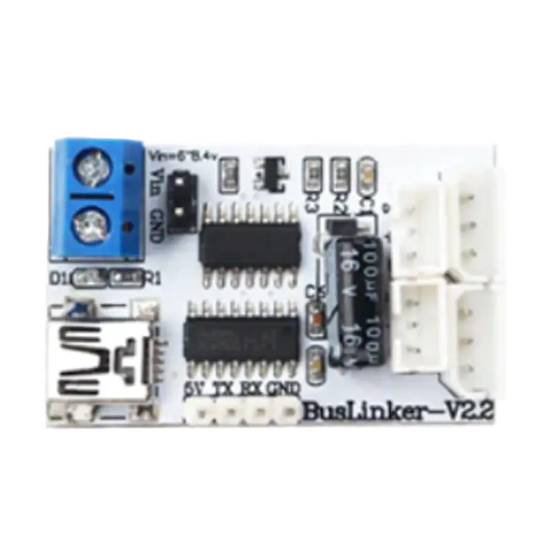
                <div style="padding: 12px 4px; text-align: center; color: #333;">
                    <span>TTL / USB Debugging Board</span>
                </div>
            </div>
        </div>
        <div style="width: calc(18% - 15px); min-width: 150px; background: white; border-radius: 8px; overflow: hidden; box-shadow: 0 2px 8px rgba(0,0,0,0.1);">
            <a target="_blank" href="https://docs.hiwonder.com/projects/16-Channel-Servo-Controller/en/latest/" style="display: block; text-decoration: none;">
                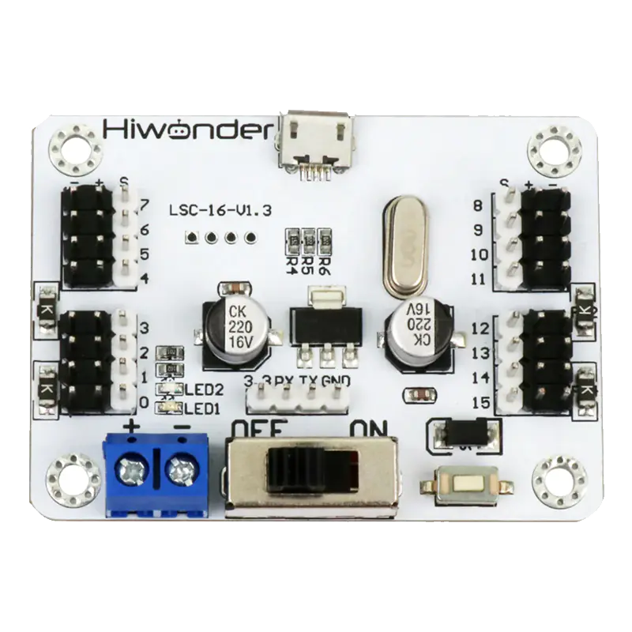
                <div style="padding: 12px 4px; text-align: center; color: #333;">
                    <span>LSC-16</span>
                </div>
            </a>
        </div>
        <div style="width: calc(18% - 15px); min-width: 150px; background: white; border-radius: 8px; overflow: hidden; box-shadow: 0 2px 8px rgba(0,0,0,0.1);">
            <div style="display: block; text-decoration: none;">
                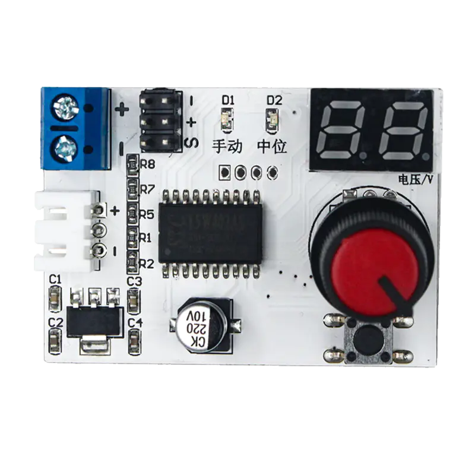
                <div style="padding: 12px 4px; text-align: center; color: #333;">
                    <span>Digital Servo Tester Controller</span>
                </div>
            </div>
        </div>
        <div style="width: calc(18% - 15px); min-width: 150px; background: white; border-radius: 8px; overflow: hidden; box-shadow: 0 2px 8px rgba(0,0,0,0.1);">
            <a target="_blank" href="https://docs.hiwonder.com/projects/Bus-Servo-Controller/en/latest/index.html" style="display: block; text-decoration: none;">
                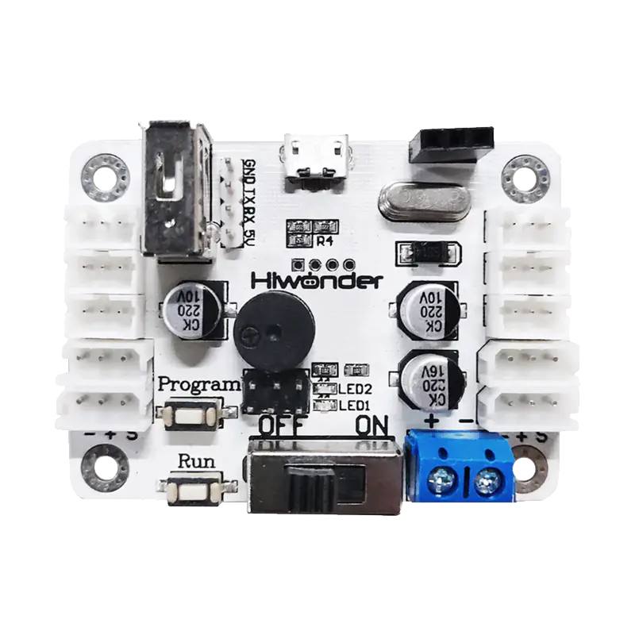
                <div style="padding: 12px 4px; text-align: center; color: #333;">
                    <span>Serial Bus Servo Controller</span>
                </div>
            </a>
        </div>
        <div style="width: calc(18% - 15px); min-width: 150px; background: white; border-radius: 8px; overflow: hidden; box-shadow: 0 2px 8px rgba(0,0,0,0.1);">
            <a target="_blank" href="https://docs.hiwonder.com/projects/6-Channel-Servo-Tester/en/latest" style="display: block; text-decoration: none;">
                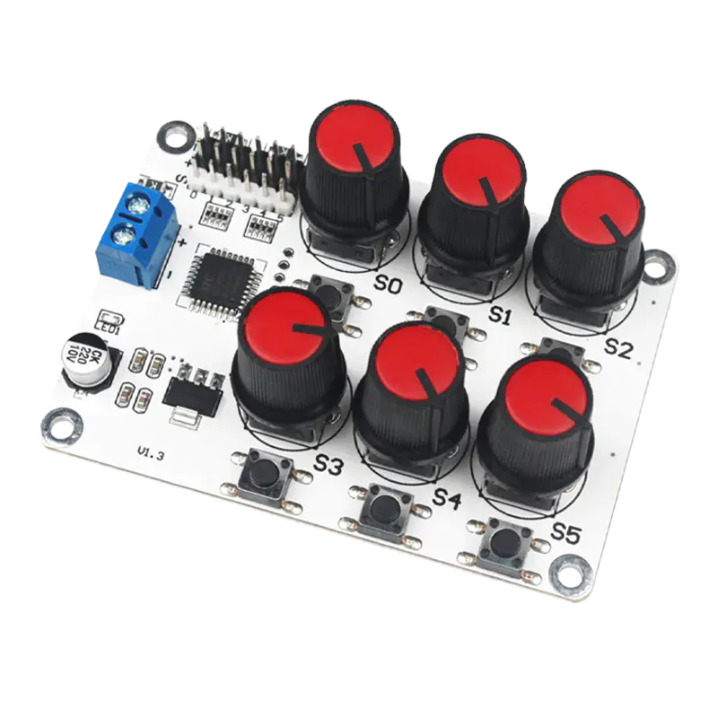
                <div style="padding: 12px 4px; text-align: center; color: #333;">
                    <span>6 Channel Digital Servo Tester Controller</span>
                </div>
            </a>
        </div>
        <div style="width: calc(18% - 15px); min-width: 150px; background: white; border-radius: 8px; overflow: hidden; box-shadow: 0 2px 8px rgba(0,0,0,0.1);">
            <a target="_blank" href="https://docs.hiwonder.com/projects/32-Channel-Servo-Controller/en/latest/" style="display: block; text-decoration: none;">
                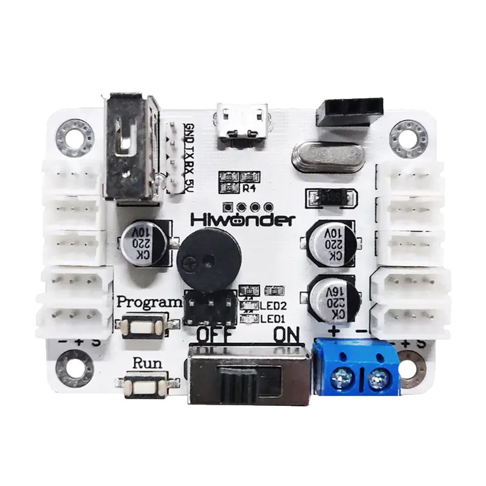
                <div style="padding: 12px 4px; text-align: center; color: #333;">
                    <span>LSC-32</span>
                </div>
            </a>
        </div>
        <div style="width: calc(18% - 15px); min-width: 150px; background: white; border-radius: 8px; overflow: hidden; box-shadow: 0 2px 8px rgba(0,0,0,0.1);">
            <a target="_blank" href="https://docs.hiwonder.com/projects/24-Channel-Servo-Controller/en/latest/" style="display: block; text-decoration: none;">
                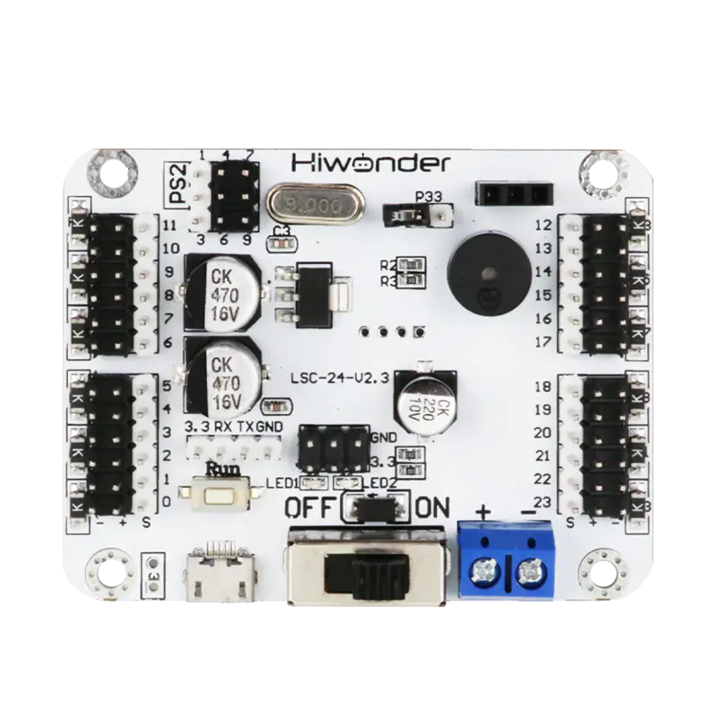
                <div style="padding: 12px 4px; text-align: center; color: #333;">
                    <span>LSC-24</span>
                </div>
            </a>
        </div>
        <div style="width: calc(18% - 15px); min-width: 150px; background: white; border-radius: 8px; overflow: hidden; box-shadow: 0 2px 8px rgba(0,0,0,0.1);">
            <a target="_blank" href="https://www.hiwonder.com.cn/store/learn/25.html" style="display: block; text-decoration: none;">
                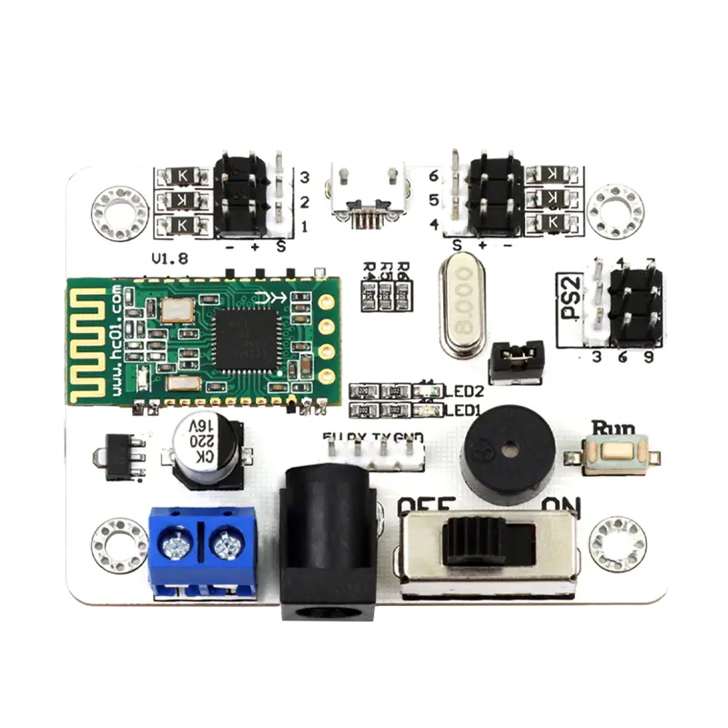
                <div style="padding: 12px 4px; text-align: center; color: #333;">
                    <span>LSC-6</span>
                </div>
            </a>
        </div>
        <div style="width: calc(18% - 15px); min-width: 150px; background: white; border-radius: 8px; overflow: hidden; box-shadow: 0 2px 8px rgba(0,0,0,0.1);">
            <a target="_blank" href="https://www.hiwonder.com.cn/store/learn/150.html" style="display: block; text-decoration: none;">
                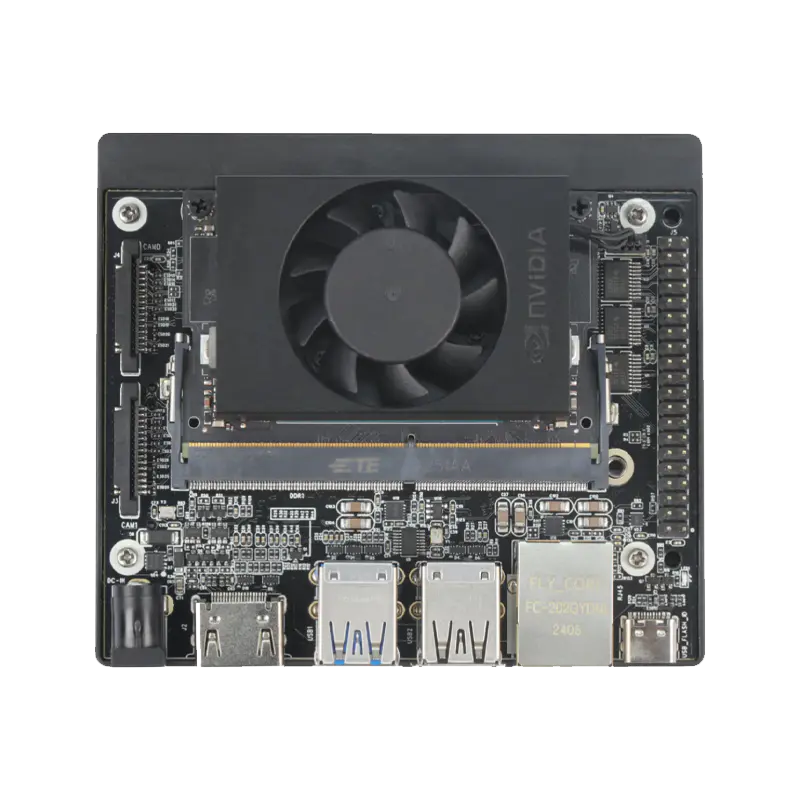
                <div style="padding: 12px 4px; text-align: center; color: #333;">
                    <span>Hiwonder Jetson Orin NX</span>
                </div>
            </a>
        </div>
        <div style="width: calc(18% - 15px); min-width: 150px; background: white; border-radius: 8px; overflow: hidden; box-shadow: 0 2px 8px rgba(0,0,0,0.1);">
            <a target="_blank" href="https://www.hiwonder.com.cn/store/learn/148.html" style="display: block; text-decoration: none;">
                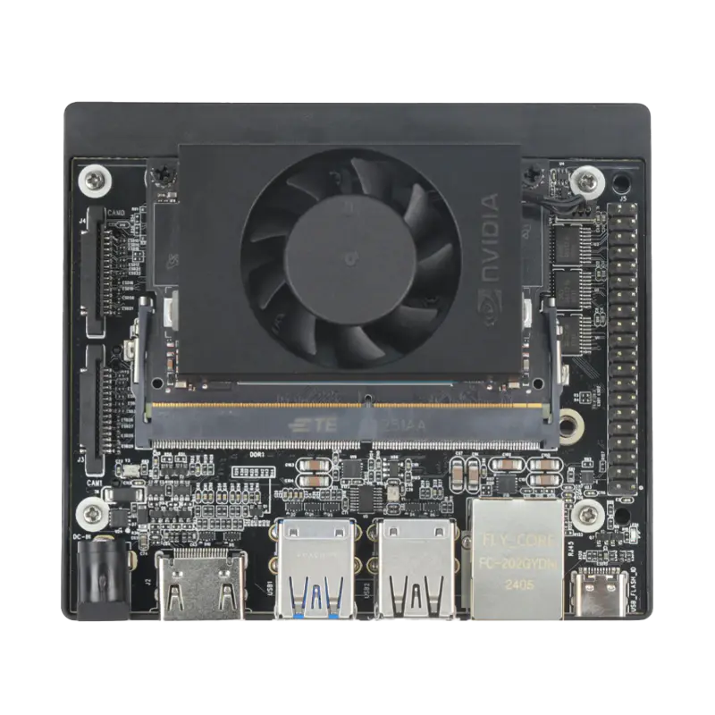
                <div style="padding: 12px 4px; text-align: center; color: #333;">
                    <span>Hiwonder Jetson Orin Nano</span>
                </div>
            </a>
        </div>
        <div style="width: calc(18% - 15px); min-width: 150px; background: white; border-radius: 8px; overflow: hidden; box-shadow: 0 2px 8px rgba(0,0,0,0.1);">
            <div style="display: block; text-decoration: none;">
                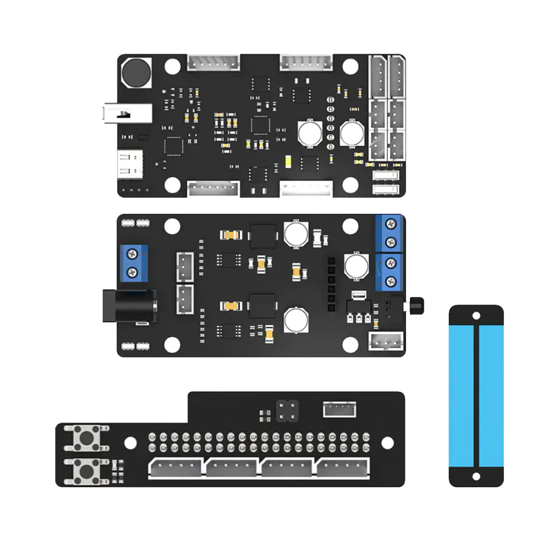
                <div style="padding: 12px 4px; text-align: center; color: #333;">
                    <span>ROS2 Upgrade Pack</span>
                </div>
            </div>
        </div>
        <div style="width: calc(18% - 15px); min-width: 150px; background: white; border-radius: 8px; overflow: hidden; box-shadow: 0 2px 8px rgba(0,0,0,0.1);">
            <a target="_blank" href="https://wiki.hiwonder.com/projects/Raspberry-Pi-5-Controller/en/latest/" style="display: block; text-decoration: none;">
                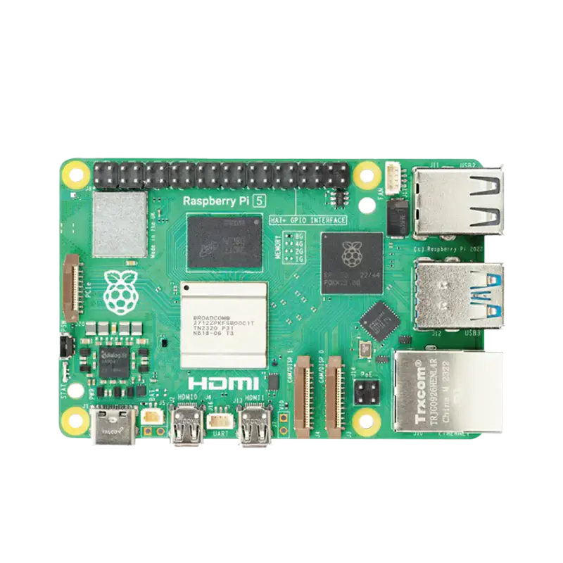
                <div style="padding: 12px 4px; text-align: center; color: #333;">
                    <span>Raspberry Pi 5</span>
                </div>
            </a>
        </div>
        <div style="width: calc(18% - 15px); min-width: 150px; background: white; border-radius: 8px; overflow: hidden; box-shadow: 0 2px 8px rgba(0,0,0,0.1);">
            <div style="display: block; text-decoration: none;">
                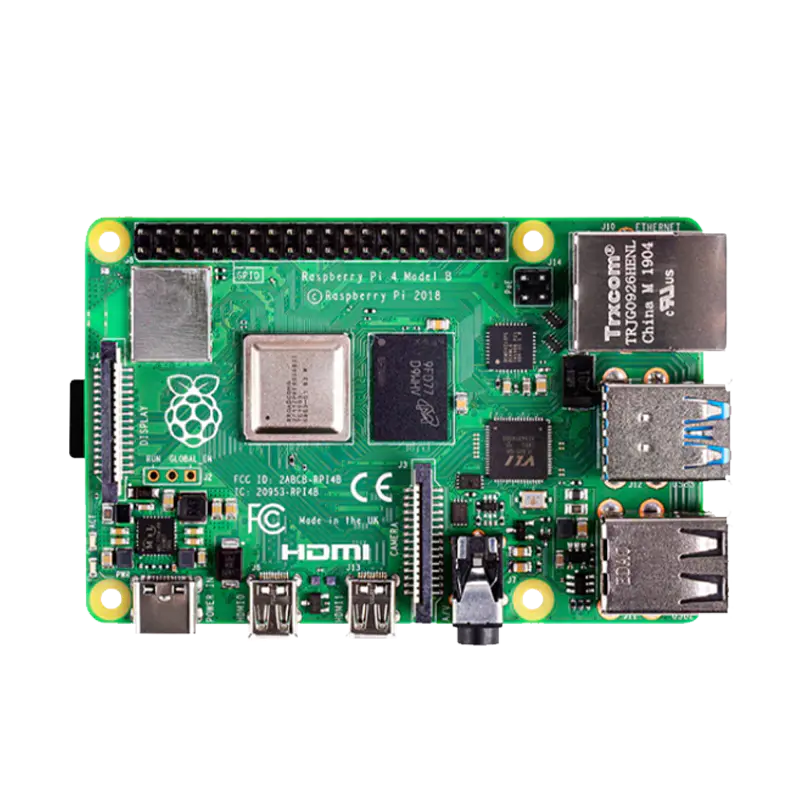
                <div style="padding: 12px 4px; text-align: center; color: #333;">
                    <span>Raspberry Pi 4B 4G/8G Board</span>
                </div>
            </div>
        </div>
        <div style="width: calc(18% - 15px); min-width: 150px; background: white; border-radius: 8px; overflow: hidden; box-shadow: 0 2px 8px rgba(0,0,0,0.1);">
            <a target="_blank" href="https://www.hiwonder.com.cn/store/learn/149.html" style="display: block; text-decoration: none;">
                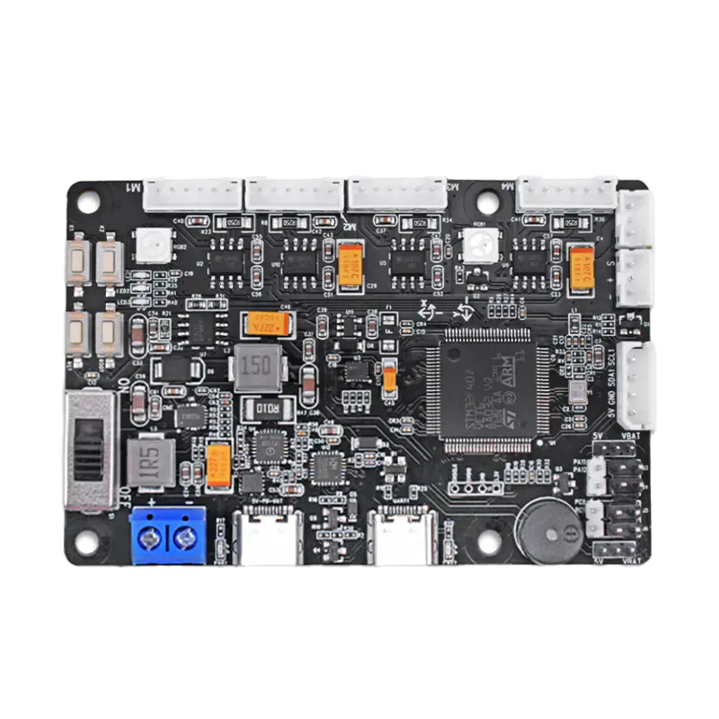
                <div style="padding: 12px 4px; text-align: center; color: #333;">
                    <span>RRC Lite</span>
                </div>
            </a>
        </div>
        <div style="width: calc(18% - 15px); min-width: 150px; background: white; border-radius: 8px; overflow: hidden; box-shadow: 0 2px 8px rgba(0,0,0,0.1);">
            <a target="_blank" href="https://www.hiwonder.com.cn/store/learn/152.html" style="display: block; text-decoration: none;">
                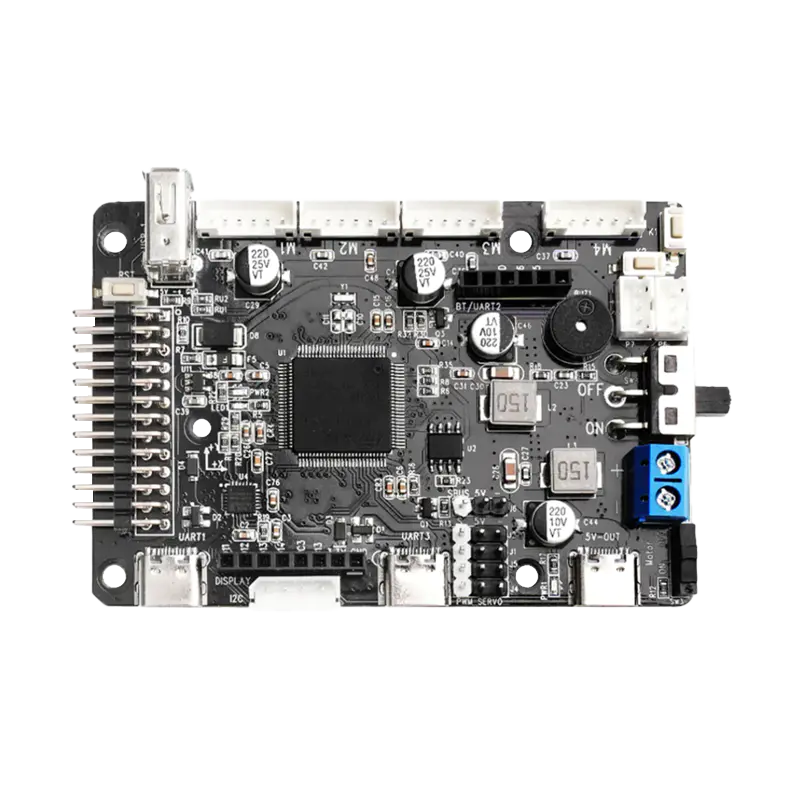
                <div style="padding: 12px 4px; text-align: center; color: #333;">
                    <span>ROS Robot Control Board</span>
                </div>
            </a>
        </div>
        <div style="width: calc(18% - 15px); min-width: 150px; background: white; border-radius: 8px; overflow: hidden; box-shadow: 0 2px 8px rgba(0,0,0,0.1);">
            <a target="_blank" href="https://wiki.hiwonder.com/projects/Raspberry-Pi-5-Expansion-Board/en/latest/" style="display: block; text-decoration: none;">
                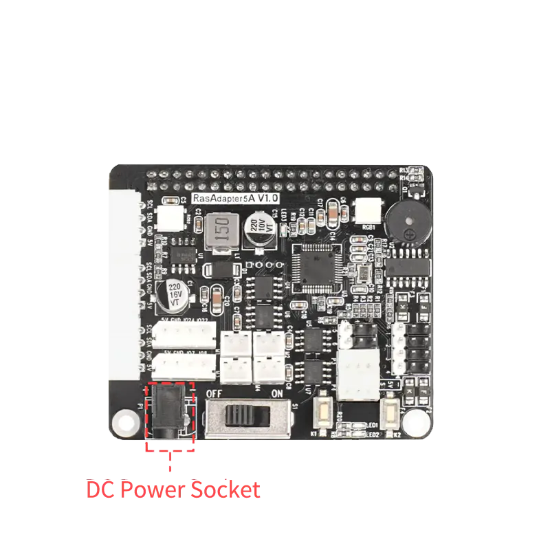
                <div style="padding: 12px 4px; text-align: center; color: #333;">
                    <span>Raspberry Pi 5 Expansion Board</span>
                </div>
            </a>
        </div>
        <div style="width: calc(18% - 15px); min-width: 150px; background: white; border-radius: 8px; overflow: hidden; box-shadow: 0 2px 8px rgba(0,0,0,0.1);">
            <a target="_blank" href="https://www.hiwonder.com.cn/store/learn/168.html" style="display: block; text-decoration: none;">
                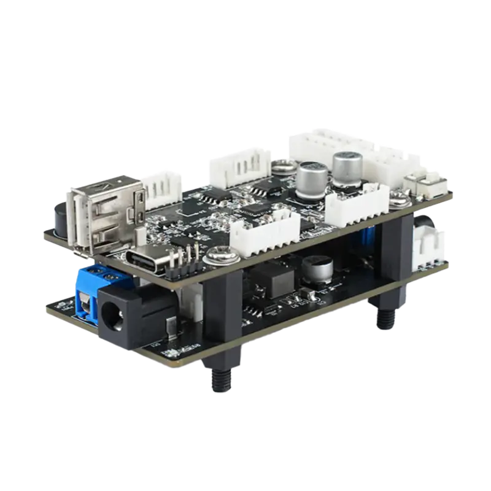
                <div style="padding: 12px 4px; text-align: center; color: #333;">
                    <span>miniROS Robot Controller</span>
                </div>
            </a>
        </div>
        <div style="width: calc(18% - 15px); min-width: 150px; background: white; border-radius: 8px; overflow: hidden; box-shadow: 0 2px 8px rgba(0,0,0,0.1);">
            <div style="display: block; text-decoration: none;">
                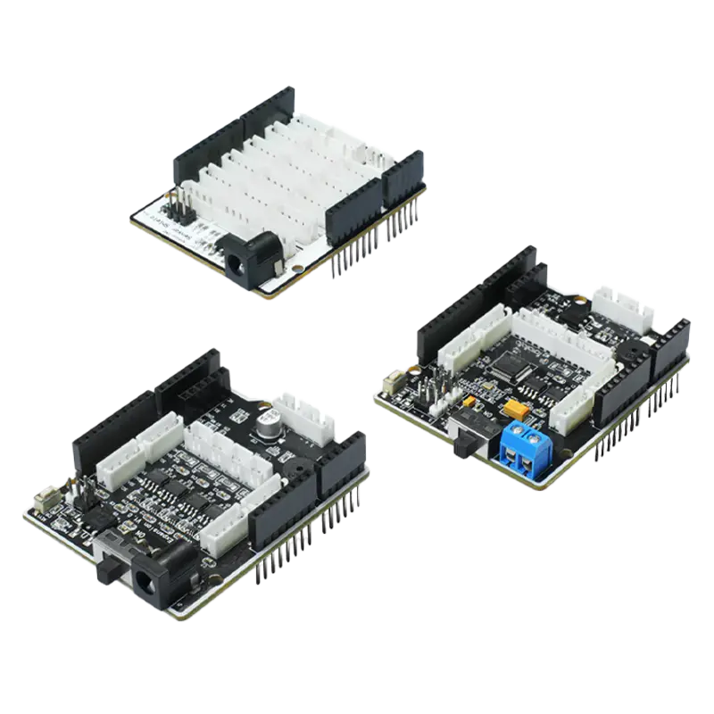
                <div style="padding: 12px 4px; text-align: center; color: #333;">
                    <span>UNO Expansion Board</span>
                </div>
            </div>
        </div>
    </div>
</div>

## Vehicle Chassis

<div class="container">
    <div style="display: flex; flex-wrap: wrap; gap: 20px; margin-bottom:50px;">
        <div style="width: calc(18% - 15px); min-width: 150px; background: white; border-radius: 8px; overflow: hidden; box-shadow: 0 2px 8px rgba(0,0,0,0.1);">
            <a target="_blank" href="https://www.hiwonder.com.cn/store/learn/126.html" style="display: block; text-decoration: none;">
                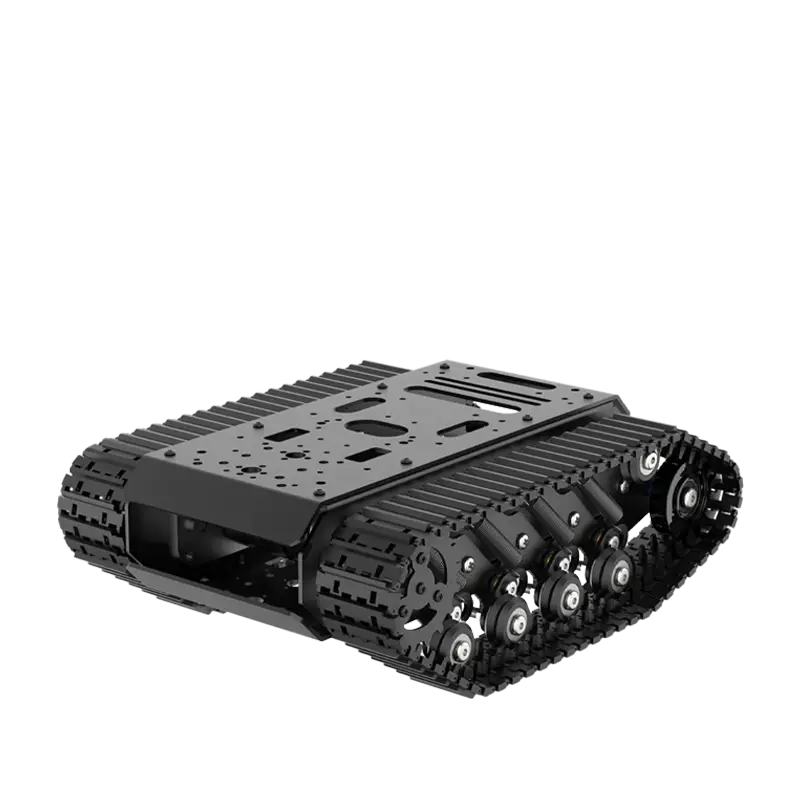
                <div style="padding: 12px 4px; text-align: center; color: #333;">
                    <span>Suspended Shock Absorbing Tracked Chassis</span>
                </div>
            </a>
        </div>
        <div style="width: calc(18% - 15px); min-width: 150px; background: white; border-radius: 8px; overflow: hidden; box-shadow: 0 2px 8px rgba(0,0,0,0.1);">
            <a target="_blank" href="https://docs.hiwonder.com/projects/Ackermann-Chassis/en/latest/" style="display: block; text-decoration: none;">
                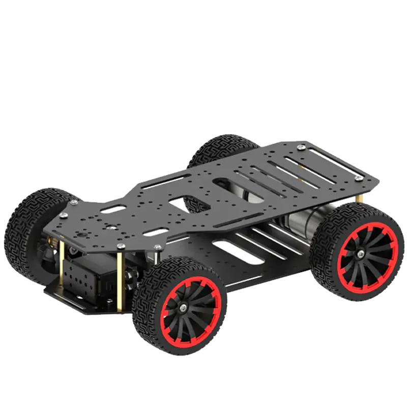
                <div style="padding: 12px 4px; text-align: center; color: #333;">
                    <span>Ackerman Intelligent Car/Metal Chassis</span>
                </div>
            </a>
        </div>
        <div style="width: calc(18% - 15px); min-width: 150px; background: white; border-radius: 8px; overflow: hidden; box-shadow: 0 2px 8px rgba(0,0,0,0.1);">
            <div style="display: block; text-decoration: none;">
                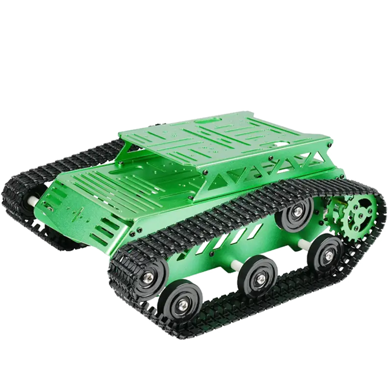
                <div style="padding: 12px 4px; text-align: center; color: #333;">
                    <span>Tank Car Chassis Kit(Green)</span>
                </div>
            </div>
        </div>
        <div style="width: calc(18% - 15px); min-width: 150px; background: white; border-radius: 8px; overflow: hidden; box-shadow: 0 2px 8px rgba(0,0,0,0.1);">
            <a target="_blank" href="https://www.hiwonder.com.cn/store/learn/113.html" style="display: block; text-decoration: none;">
                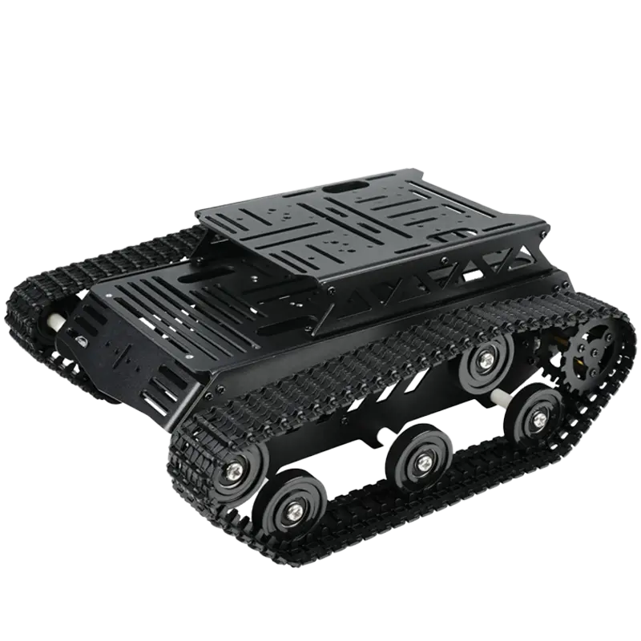
                <div style="padding: 12px 4px; text-align: center; color: #333;">
                    <span>Tank Car Chassis Kit(Black)</span>
                </div>
            </a>
        </div>
        <div style="width: calc(18% - 15px); min-width: 150px; background: white; border-radius: 8px; overflow: hidden; box-shadow: 0 2px 8px rgba(0,0,0,0.1);">
            <a target="_blank" href="https://docs.hiwonder.com/projects/Black-Mecanum-Wheel-Chassis/en/latest/" style="display: block; text-decoration: none;">
                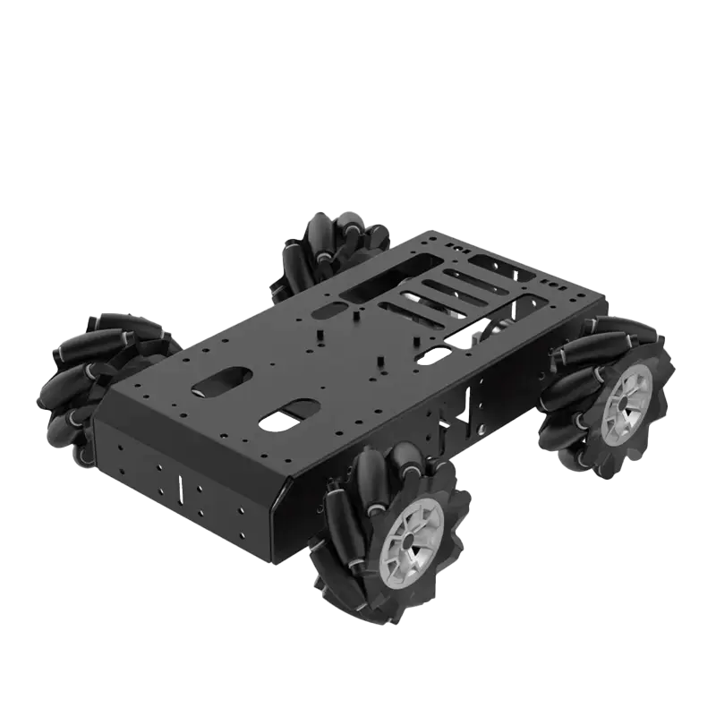
                <div style="padding: 12px 4px; text-align: center; color: #333;">
                    <span>Large Metal 4WD Vehicle Chassis(8V Motor)</span>
                </div>
            </a>
        </div>
        <div style="width: calc(18% - 15px); min-width: 150px; background: white; border-radius: 8px; overflow: hidden; box-shadow: 0 2px 8px rgba(0,0,0,0.1);">
            <a target="_blank" href="https://www.hiwonder.com.cn/store/learn/102.html" style="display: block; text-decoration: none;">
                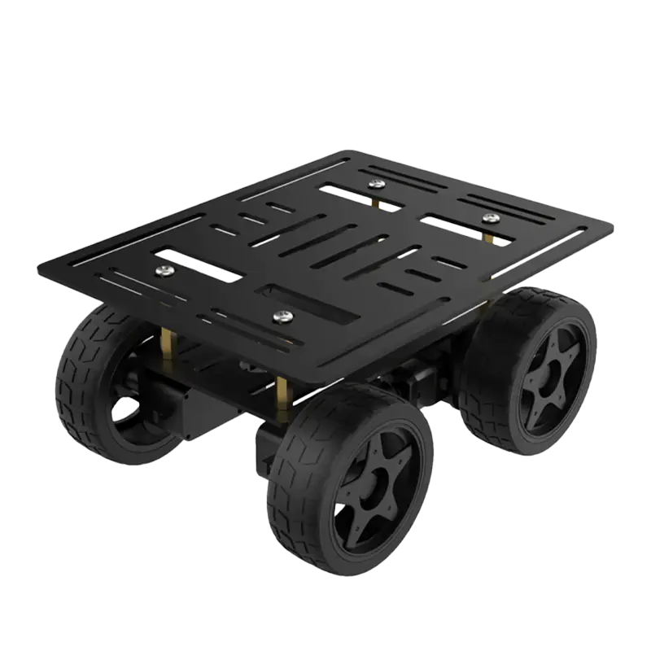
                <div style="padding: 12px 4px; text-align: center; color: #333;">
                    <span>4WD Chassis Car</span>
                </div>
            </a>
        </div>
        <div style="width: calc(18% - 15px); min-width: 150px; background: white; border-radius: 8px; overflow: hidden; box-shadow: 0 2px 8px rgba(0,0,0,0.1);">
            <a target="_blank" href="https://www.hiwonder.com.cn/store/learn/102.html" style="display: block; text-decoration: none;">
                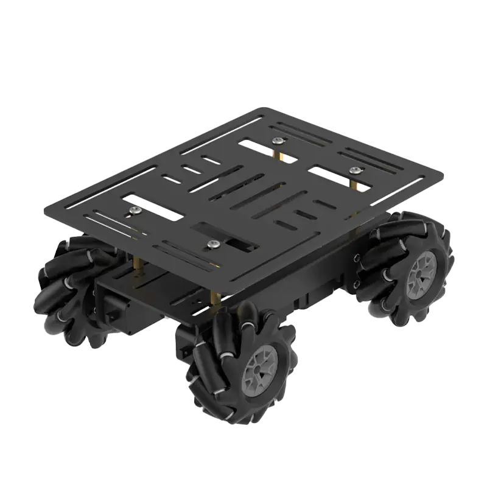
                <div style="padding: 12px 4px; text-align: center; color: #333;">
                    <span>Mecanum Wheel Chassis Car(Unassembled)</span>
                </div>
            </a>
        </div>
        <div style="width: calc(18% - 15px); min-width: 150px; background: white; border-radius: 8px; overflow: hidden; box-shadow: 0 2px 8px rgba(0,0,0,0.1);">
            <div style="display: block; text-decoration: none;">
                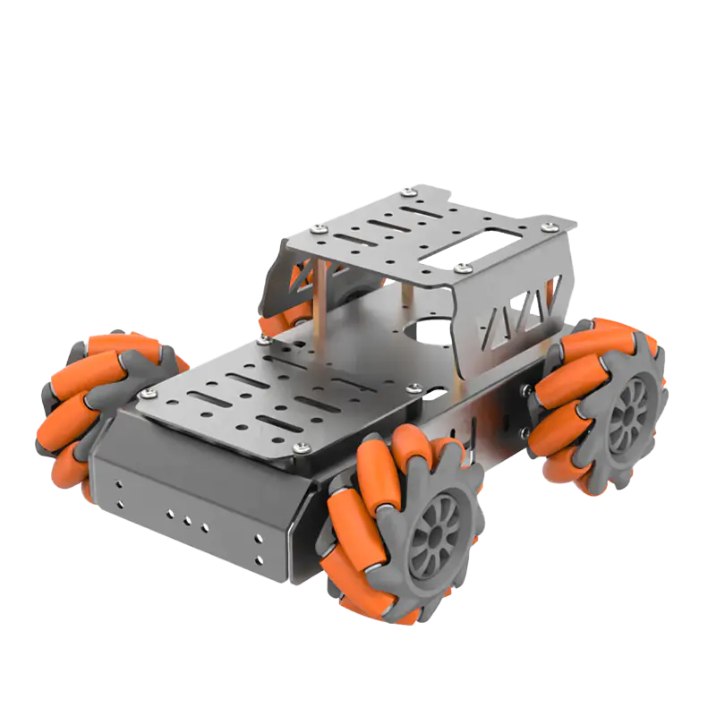
                <div style="padding: 12px 4px; text-align: center; color: #333;">
                    <span>Mecanum Wheel Chassis Car</span>
                </div>
            </div>
        </div>
    </div>
</div>

## Conveyor Belt & Sliding Rail

<div class="container">
    <div style="display: flex; flex-wrap: wrap; gap: 20px; margin-bottom:50px;">
        <div style="width: calc(18% - 15px); min-width: 150px; background: white; border-radius: 8px; overflow: hidden; box-shadow: 0 2px 8px rgba(0,0,0,0.1);">
            <div style="display: block; text-decoration: none;">
                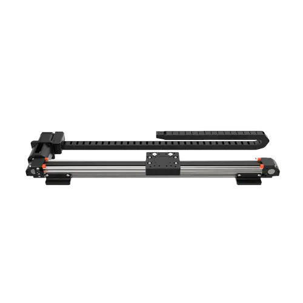
                <div style="padding: 12px 4px; text-align: center; color: #333;">
                    <span>Sliding Rail</span>
                </div>
            </div>
        </div>
        <div style="width: calc(18% - 15px); min-width: 150px; background: white; border-radius: 8px; overflow: hidden; box-shadow: 0 2px 8px rgba(0,0,0,0.1);">
            <div style="display: block; text-decoration: none;">
                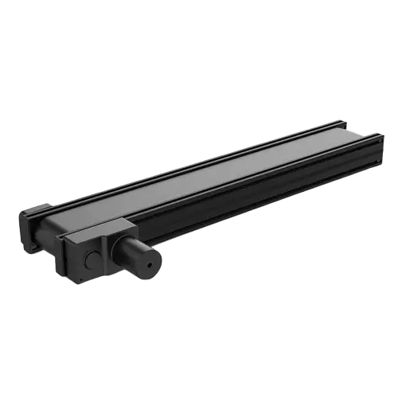
                <div style="padding: 12px 4px; text-align: center; color: #333;">
                    <span>Electrical Conveyor Belt</span>
                </div>
            </div>
        </div>
    </div>
</div>

## Robot Claw & Pan Tilt

<div class="container">
    <div style="display: flex; flex-wrap: wrap; gap: 20px; margin-bottom:50px;">
        <div style="width: calc(18% - 15px); min-width: 150px; background: white; border-radius: 8px; overflow: hidden; box-shadow: 0 2px 8px rgba(0,0,0,0.1);">
            <div style="display: block; text-decoration: none;">
                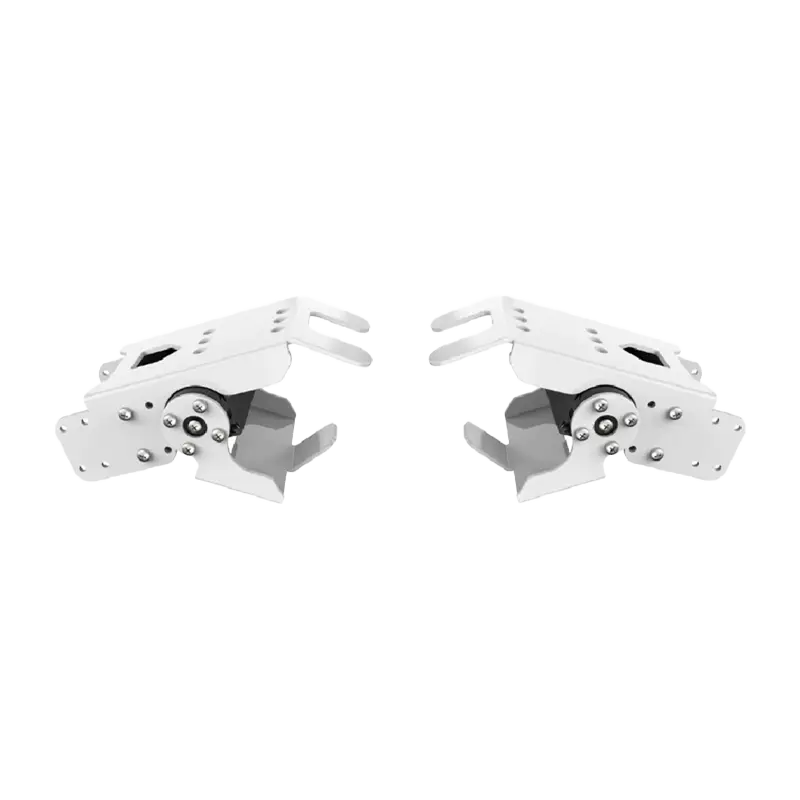
                <div style="padding: 12px 4px; text-align: center; color: #333;">
                    <span>Robotic Hands</span>
                </div>
            </div>
        </div>
        <div style="width: calc(18% - 15px); min-width: 150px; background: white; border-radius: 8px; overflow: hidden; box-shadow: 0 2px 8px rgba(0,0,0,0.1);">
            <div style="display: block; text-decoration: none;">
                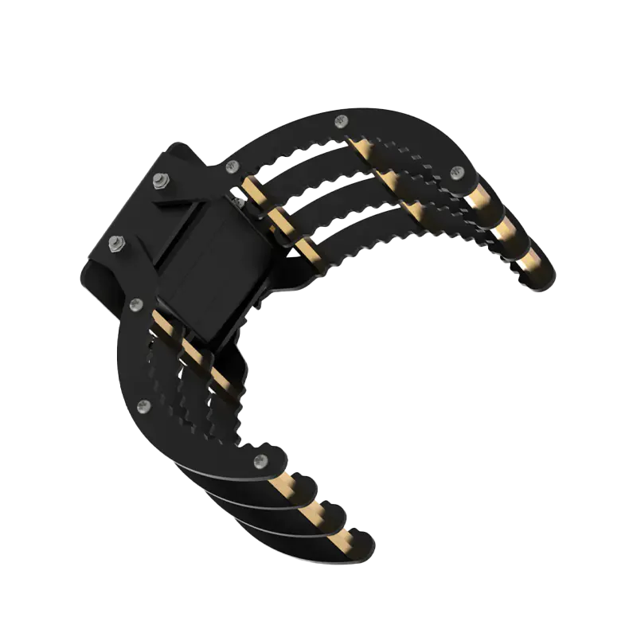
                <div style="padding: 12px 4px; text-align: center; color: #333;">
                    <span>Black Aluminum Alloy Gripper</span>
                </div>
            </div>
        </div>
        <div style="width: calc(18% - 15px); min-width: 150px; background: white; border-radius: 8px; overflow: hidden; box-shadow: 0 2px 8px rgba(0,0,0,0.1);">
            <div style="display: block; text-decoration: none;">
                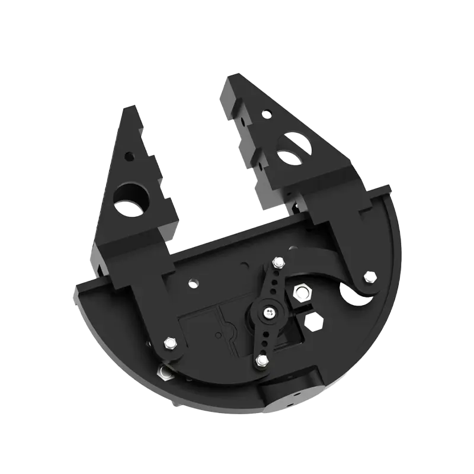
                <div style="padding: 12px 4px; text-align: center; color: #333;">
                    <span>Plastic Gripper</span>
                </div>
            </div>
        </div>
        <div style="width: calc(18% - 15px); min-width: 150px; background: white; border-radius: 8px; overflow: hidden; box-shadow: 0 2px 8px rgba(0,0,0,0.1);">
            <div style="display: block; text-decoration: none;">
                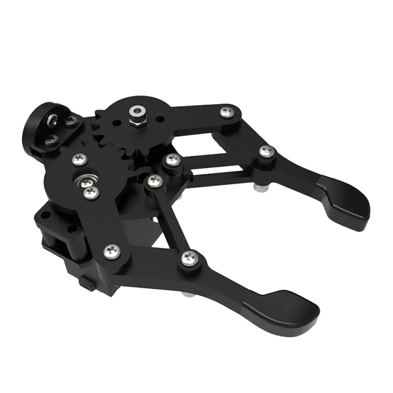
                <div style="padding: 12px 4px; text-align: center; color: #333;">
                    <span>Metal Picking Gripper</span>
                </div>
            </div>
        </div>
        <div style="width: calc(18% - 15px); min-width: 150px; background: white; border-radius: 8px; overflow: hidden; box-shadow: 0 2px 8px rgba(0,0,0,0.1);">
            <div style="display: block; text-decoration: none;">
                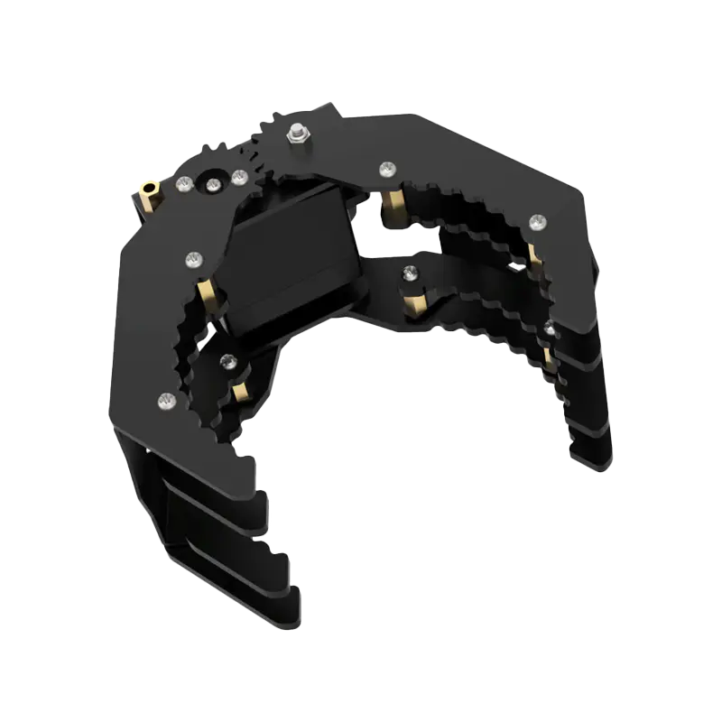
                <div style="padding: 12px 4px; text-align: center; color: #333;">
                    <span>Black Metal Mechanical Gripper for Robot DIY</span>
                </div>
            </div>
        </div>
        <div style="width: calc(18% - 15px); min-width: 150px; background: white; border-radius: 8px; overflow: hidden; box-shadow: 0 2px 8px rgba(0,0,0,0.1);">
            <div style="display: block; text-decoration: none;">
                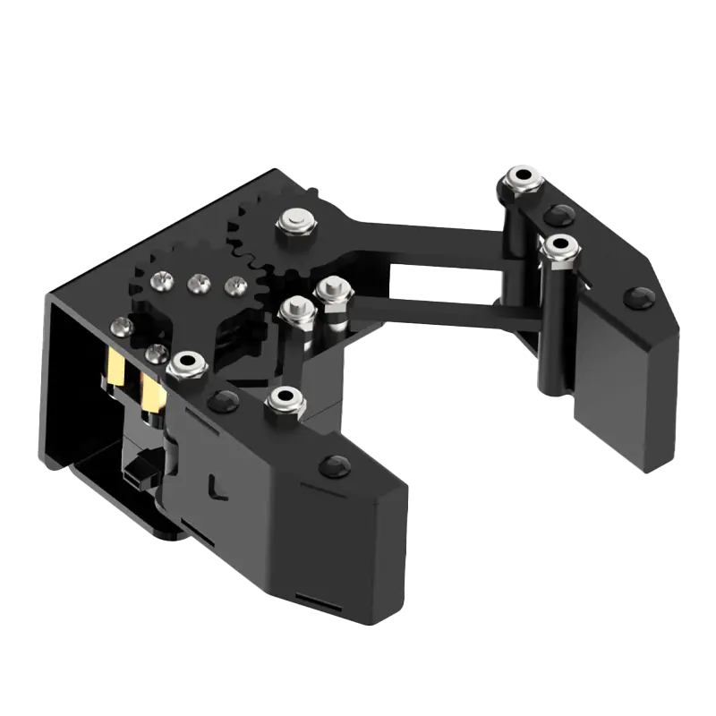
                <div style="padding: 12px 4px; text-align: center; color: #333;">
                    <span>BigClaw Mechanical Gripper for Robot DIY</span>
                </div>
            </div>
        </div>
        <div style="width: calc(18% - 15px); min-width: 150px; background: white; border-radius: 8px; overflow: hidden; box-shadow: 0 2px 8px rgba(0,0,0,0.1);">
            <div style="display: block; text-decoration: none;">
                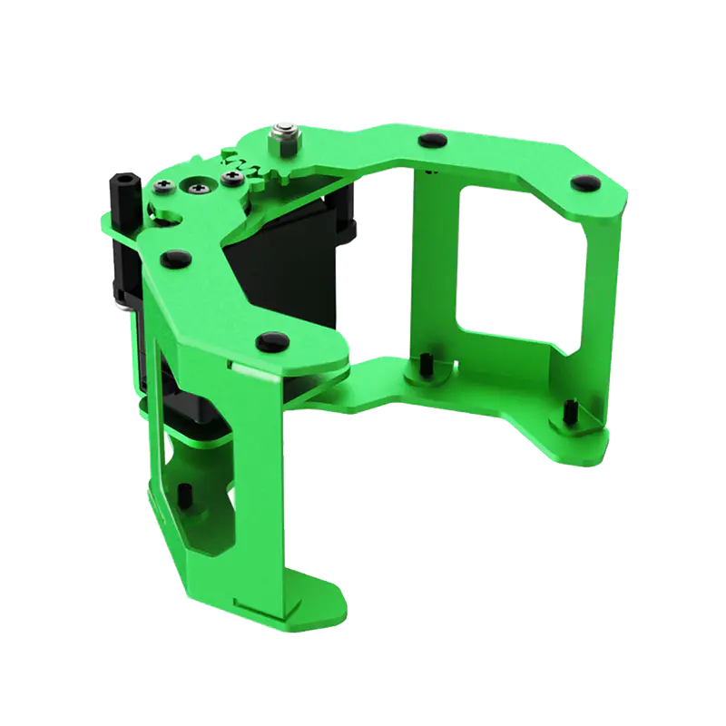
                <div style="padding: 12px 4px; text-align: center; color: #333;">
                    <span>Green Robot Gripper</span>
                </div>
            </div>
        </div>
    </div>
</div>

## AI Vision Module

<div class="container">
    <div style="display: flex; flex-wrap: wrap; gap: 20px; margin-bottom:50px;">
        <div style="width: calc(18% - 15px); min-width: 150px; background: white; border-radius: 8px; overflow: hidden; box-shadow: 0 2px 8px rgba(0,0,0,0.1);">
            <a target="_blank" href="https://docs.hiwonder.com/projects/WonderMV/en/latest/index.html" style="display: block; text-decoration: none;">
                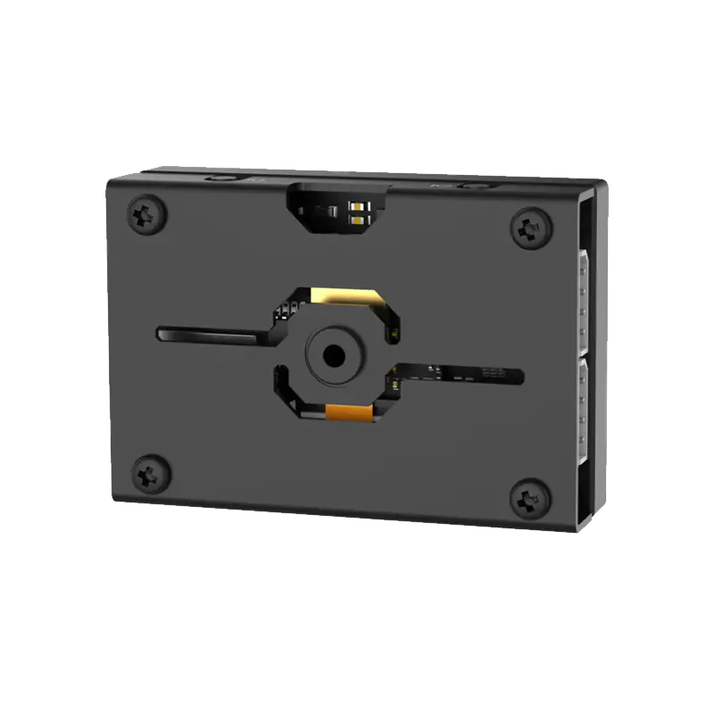
                <div style="padding: 12px 4px; text-align: center; color: #333;">
                    <span>WonderMV</span>
                </div>
            </a>
        </div>
        <div style="width: calc(18% - 15px); min-width: 150px; background: white; border-radius: 8px; overflow: hidden; box-shadow: 0 2px 8px rgba(0,0,0,0.1);">
            <a target="_blank" href="https://docs.hiwonder.com/projects/WonderLLM/en/latest/" style="display: block; text-decoration: none;">
                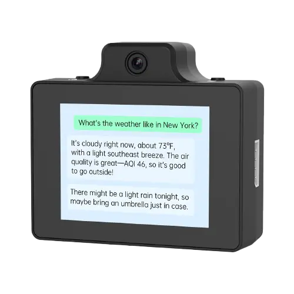
                <div style="padding: 12px 4px; text-align: center; color: #333;">
                    <span>WonderLLM</span>
                </div>
            </a>
        </div>
        <div style="width: calc(18% - 15px); min-width: 150px; background: white; border-radius: 8px; overflow: hidden; box-shadow: 0 2px 8px rgba(0,0,0,0.1);">
            <a target="_blank" href="https://docs.hiwonder.com/projects/CanMV-K230/en/latest/" style="display: block; text-decoration: none;">
                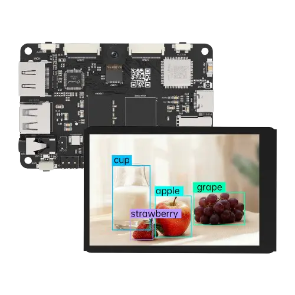
                <div style="padding: 12px 4px; text-align: center; color: #333;">
                    <span>CanMV K230</span>
                </div>
            </a>
        </div>
        <div style="width: calc(18% - 15px); min-width: 150px; background: white; border-radius: 8px; overflow: hidden; box-shadow: 0 2px 8px rgba(0,0,0,0.1);">
            <a target="_blank" href="https://www.hiwonder.com.cn/store/learn/140.html" style="display: block; text-decoration: none;">
                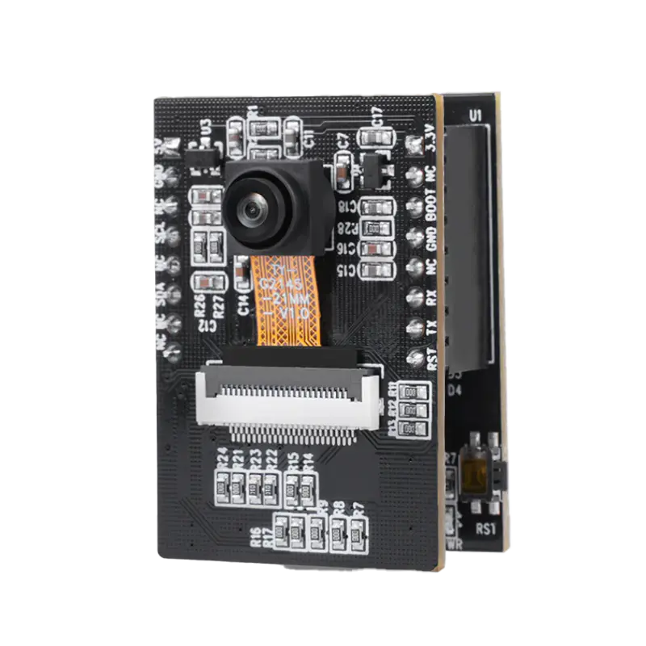
                <div style="padding: 12px 4px; text-align: center; color: #333;">
                    <span>ESP32 S3-Cam AI Vision Module</span>
                </div>
            </a>
        </div>
        <div style="width: calc(18% - 15px); min-width: 150px; background: white; border-radius: 8px; overflow: hidden; box-shadow: 0 2px 8px rgba(0,0,0,0.1);">
            <a target="_blank" href="https://docs.hiwonder.com/projects/ESP32-S3/en/latest/index.html" style="display: block; text-decoration: none;">
                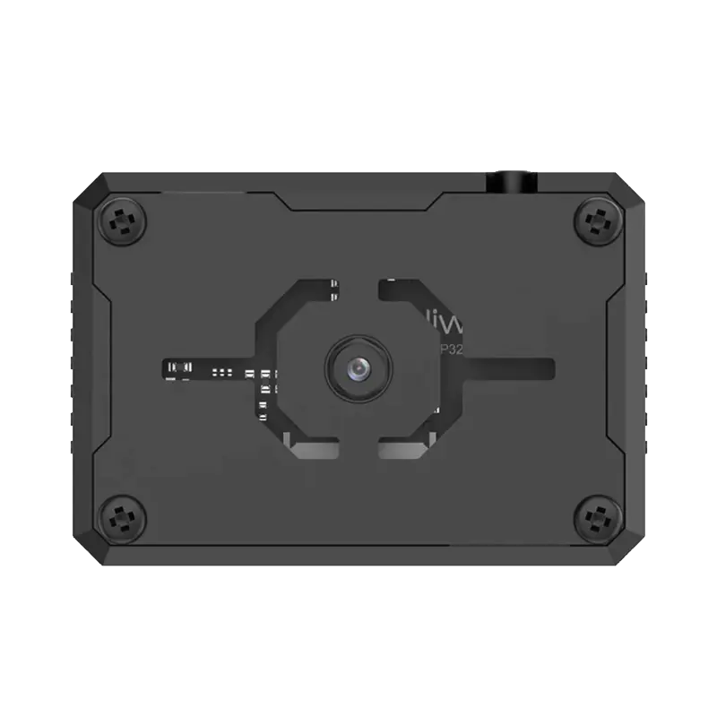
                <div style="padding: 12px 4px; text-align: center; color: #333;">
                    <span>ESP32-S3</span>
                </div>
            </a>
        </div>
        <div style="width: calc(18% - 15px); min-width: 150px; background: white; border-radius: 8px; overflow: hidden; box-shadow: 0 2px 8px rgba(0,0,0,0.1);">
            <a target="_blank" href="https://www.hiwonder.com.cn/store/learn/50.html" style="display: block; text-decoration: none;">
                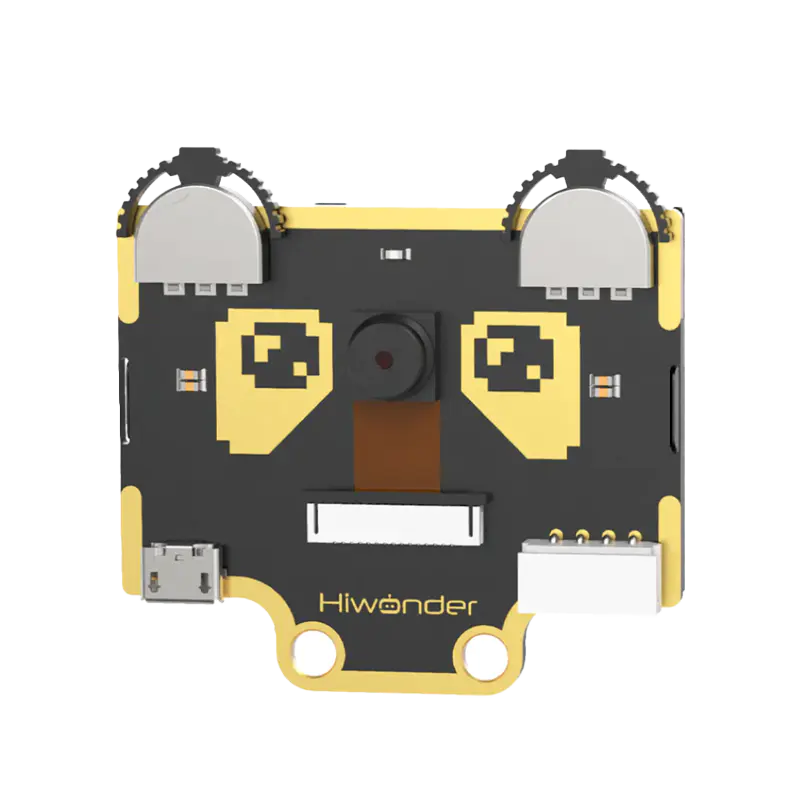
                <div style="padding: 12px 4px; text-align: center; color: #333;">
                    <span>WonderCam</span>
                </div>
            </a>
        </div>
        <div style="width: calc(18% - 15px); min-width: 150px; background: white; border-radius: 8px; overflow: hidden; box-shadow: 0 2px 8px rgba(0,0,0,0.1);">
            <a target="_blank" href="https://www.hiwonder.com.cn/store/learn/191.html" style="display: block; text-decoration: none;">
                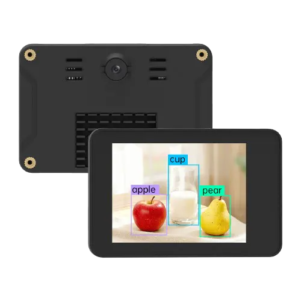
                <div style="padding: 12px 4px; text-align: center; color: #333;">
                    <span>WonderMK K230</span>
                </div>
            </a>
        </div>
        <div style="width: calc(18% - 15px); min-width: 150px; background: white; border-radius: 8px; overflow: hidden; box-shadow: 0 2px 8px rgba(0,0,0,0.1);">
            <a target="_blank" href="https://www.hiwonder.com.cn/store/learn/197.html" style="display: block; text-decoration: none;">
                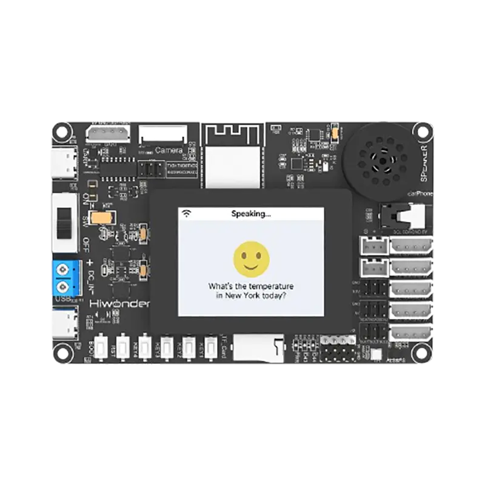
                <div style="padding: 12px 4px; text-align: center; color: #333;">
                    <span>ESP32-S3 Development Board</span>
                </div>
            </a>
        </div>
    </div>
</div>

## Sensor

<div class="container">
    <div style="display: flex; flex-wrap: wrap; gap: 20px; margin-bottom:50px;">
        <div style="width: calc(18% - 15px); min-width: 150px; background: white; border-radius: 8px; overflow: hidden; box-shadow: 0 2px 8px rgba(0,0,0,0.1);">
            <a target="_blank" href="https://docs.hiwonder.com/projects/8-ch-Line-Follower/en/latest/" style="display: block; text-decoration: none;">
                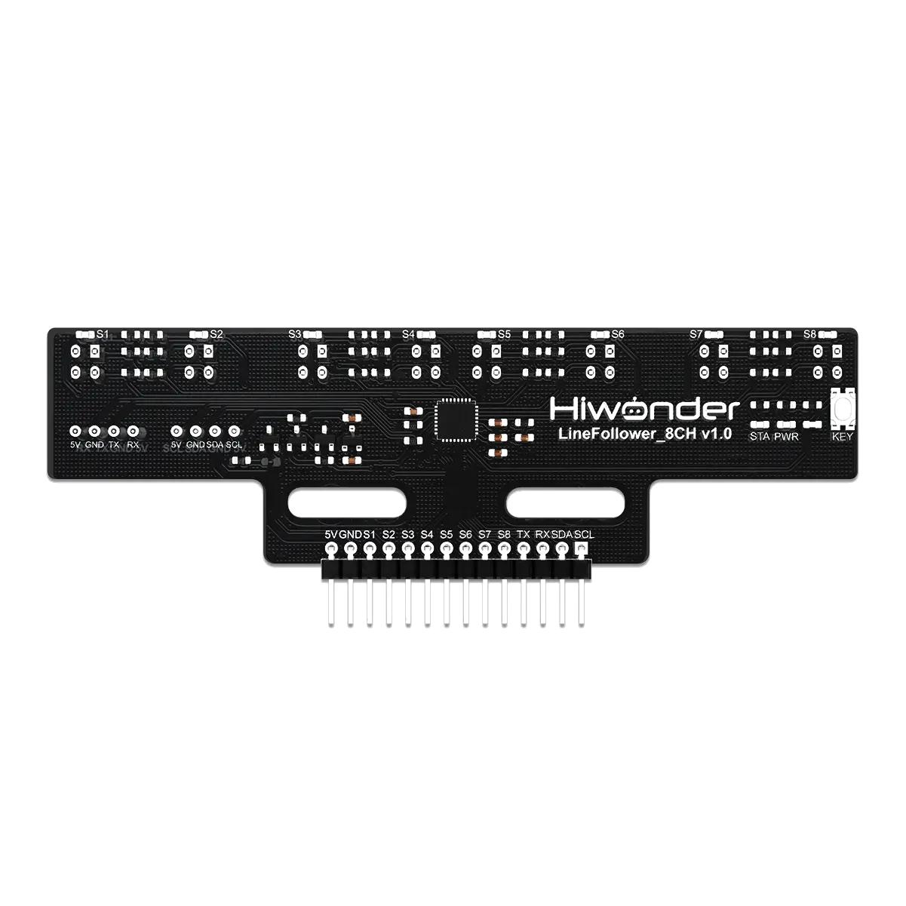
                <div style="padding: 12px 4px; text-align: center; color: #333;">
                    <span>8-Channel IR Line Follower Sensor</span>
                </div>
            </a>
        </div>
        <div style="width: calc(18% - 15px); min-width: 150px; background: white; border-radius: 8px; overflow: hidden; box-shadow: 0 2px 8px rgba(0,0,0,0.1);">
            <a target="_blank" href="https://wiki.hiwonder.com/projects/WonderEcho/en/latest/" style="display: block; text-decoration: none;">
                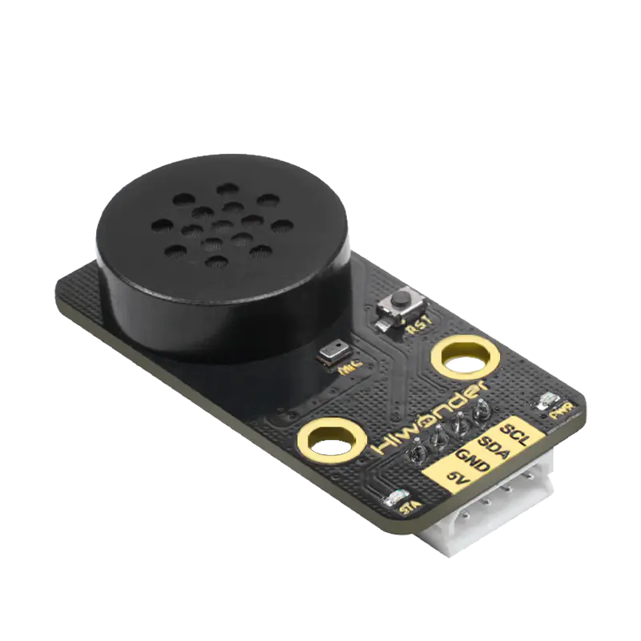
                <div style="padding: 12px 4px; text-align: center; color: #333;">
                    <span>WonderEcho</span>
                </div>
            </a>
        </div>
        <div style="width: calc(18% - 15px); min-width: 150px; background: white; border-radius: 8px; overflow: hidden; box-shadow: 0 2px 8px rgba(0,0,0,0.1);">
            <a target="_blank" href="https://docs.hiwonder.com/projects/IMU-Module/en/latest/index.html" style="display: block; text-decoration: none;">
                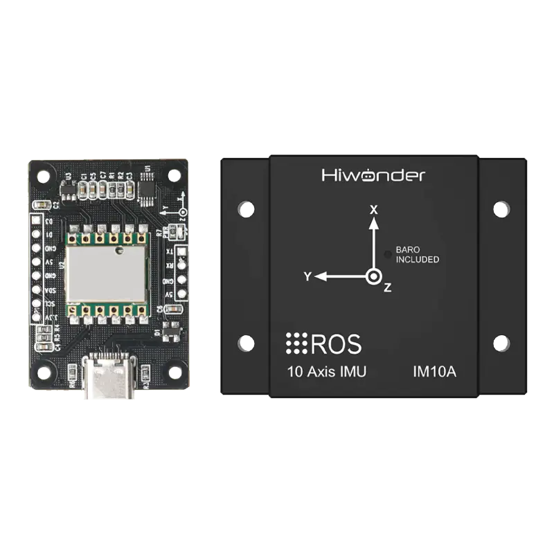
                <div style="padding: 12px 4px; text-align: center; color: #333;">
                    <span>IMU Inertial Navigation Module</span>
                </div>
            </a>
        </div>
        <div style="width: calc(18% - 15px); min-width: 150px; background: white; border-radius: 8px; overflow: hidden; box-shadow: 0 2px 8px rgba(0,0,0,0.1);">
            <a target="_blank" href="https://docs.hiwonder.com/projects/GPS-Module/en/latest/" style="display: block; text-decoration: none;">
                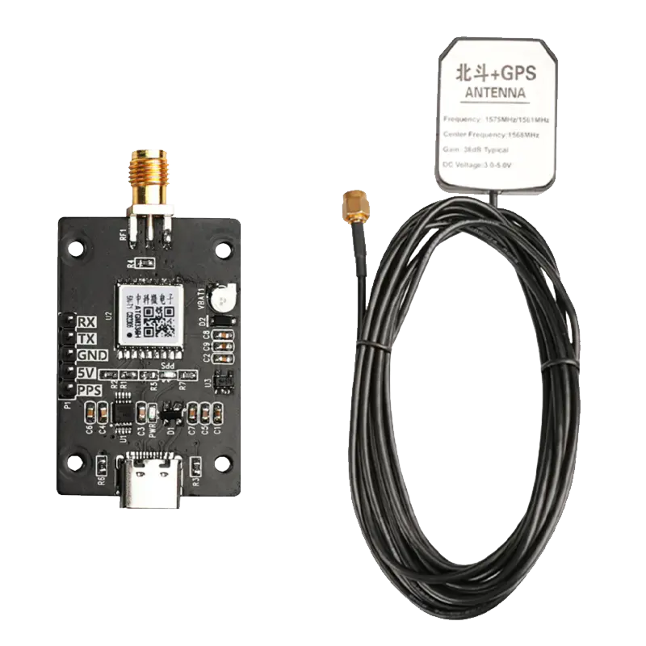
                <div style="padding: 12px 4px; text-align: center; color: #333;">
                    <span>GPS Beidou Positioning Module</span>
                </div>
            </a>
        </div>
        <div style="width: calc(18% - 15px); min-width: 150px; background: white; border-radius: 8px; overflow: hidden; box-shadow: 0 2px 8px rgba(0,0,0,0.1);">
            <a target="_blank" href="https://wiki.hiwonder.com/projects/4-Ch-Knob-Line-Follower/en" style="display: block; text-decoration: none;">
                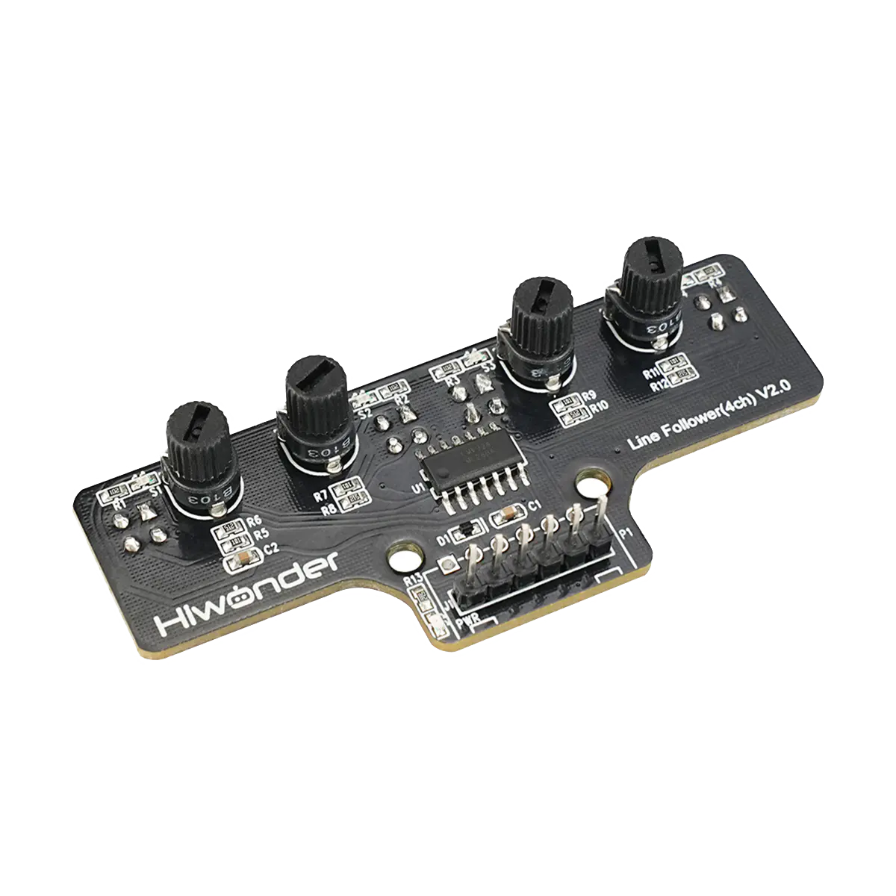
                <div style="padding: 12px 4px; text-align: center; color: #333;">
                    <span>4-Ch Knob Line Follower Sensor</span>
                </div>
            </a>
        </div>
        <div style="width: calc(18% - 15px); min-width: 150px; background: white; border-radius: 8px; overflow: hidden; box-shadow: 0 2px 8px rgba(0,0,0,0.1);">
            <div style="display: block; text-decoration: none;">
                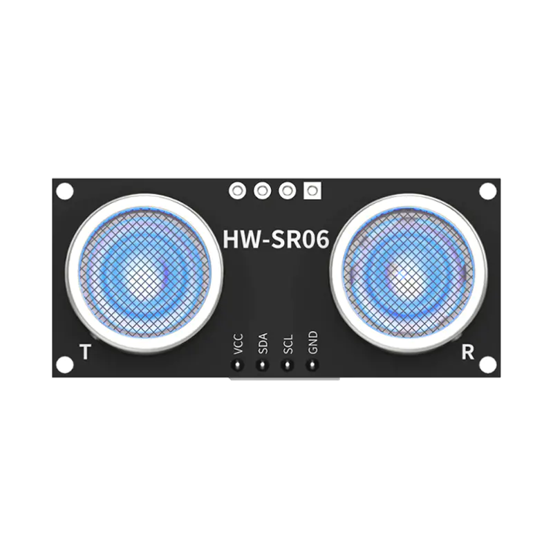
                <div style="padding: 12px 4px; text-align: center; color: #333;">
                    <span>Glowy Ultrasonic Sensor</span>
                </div>
            </div>
        </div>
        <div style="width: calc(18% - 15px); min-width: 150px; background: white; border-radius: 8px; overflow: hidden; box-shadow: 0 2px 8px rgba(0,0,0,0.1);">
            <a target="_blank" href="https://wiki.hiwonder.com/projects/Raindrop-Sensor/en/latest/" style="display: block; text-decoration: none;">
                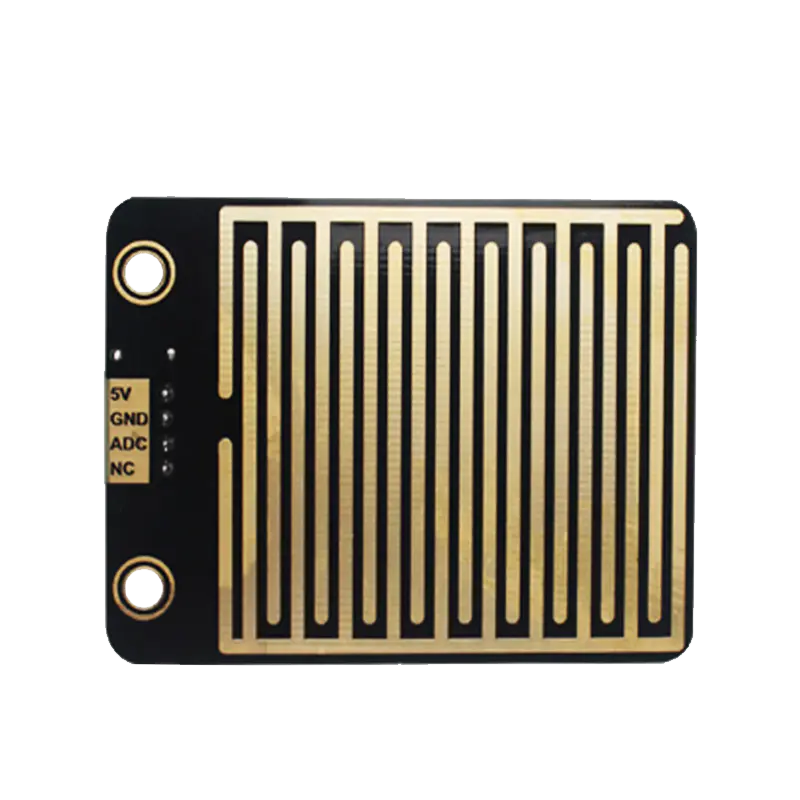
                <div style="padding: 12px 4px; text-align: center; color: #333;">
                    <span>Raindrop Sensor</span>
                </div>
            </a>
        </div>
        <div style="width: calc(18% - 15px); min-width: 150px; background: white; border-radius: 8px; overflow: hidden; box-shadow: 0 2px 8px rgba(0,0,0,0.1);">
            <a target="_blank" href="https://wiki.hiwonder.com/projects/Qdee-Ultrasonic-Sensor/en/latest/" style="display: block; text-decoration: none;">
                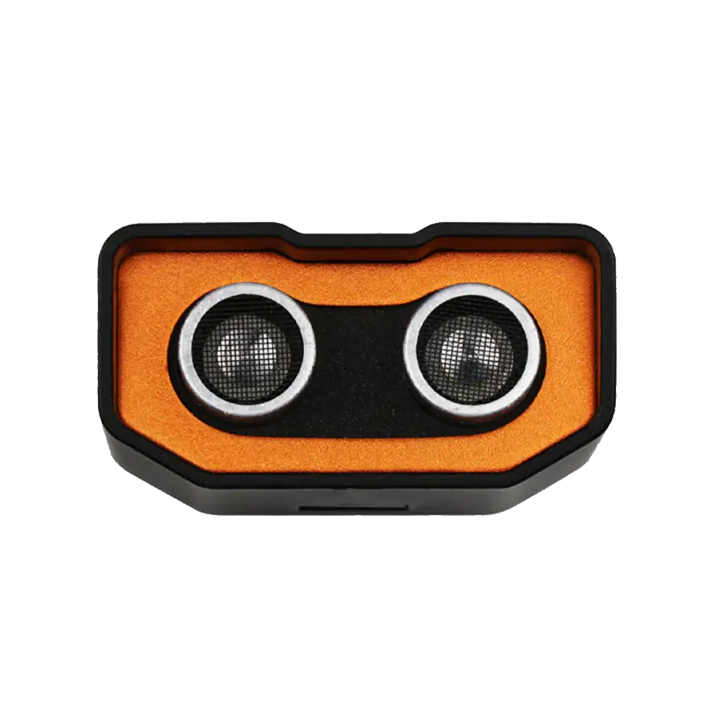
                <div style="padding: 12px 4px; text-align: center; color: #333;">
                    <span>Qdee Ultrasonic Sensor</span>
                </div>
            </a>
        </div>
        <div style="width: calc(18% - 15px); min-width: 150px; background: white; border-radius: 8px; overflow: hidden; box-shadow: 0 2px 8px rgba(0,0,0,0.1);">
            <a target="_blank" href="https://wiki.hiwonder.com/projects/Ultrasonic-Sensor-Black/en/latest" style="display: block; text-decoration: none;">
                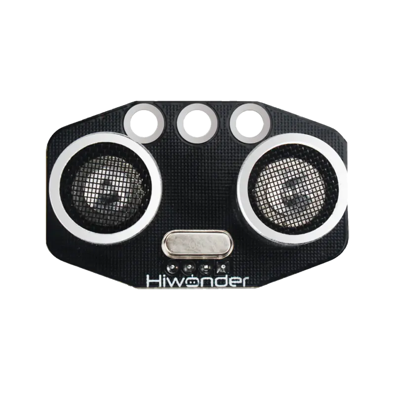
                <div style="padding: 12px 4px; text-align: center; color: #333;">
                    <span>Ultrasonic Module(black)</span>
                </div>
            </a>
        </div>
        <div style="width: calc(18% - 15px); min-width: 150px; background: white; border-radius: 8px; overflow: hidden; box-shadow: 0 2px 8px rgba(0,0,0,0.1);">
            <a target="_blank" href="https://www.hiwonder.com.cn/store/learn/79.html" style="display: block; text-decoration: none;">
                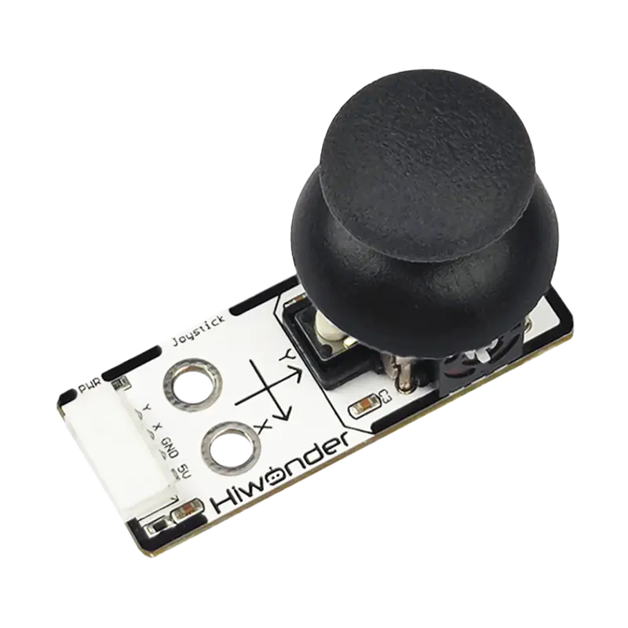
                <div style="padding: 12px 4px; text-align: center; color: #333;">
                    <span>Joystick Module</span>
                </div>
            </a>
        </div>
        <div style="width: calc(18% - 15px); min-width: 150px; background: white; border-radius: 8px; overflow: hidden; box-shadow: 0 2px 8px rgba(0,0,0,0.1);">
            <a target="_blank" href="https://www.hiwonder.com.cn/store/learn/48.html" style="display: block; text-decoration: none;">
                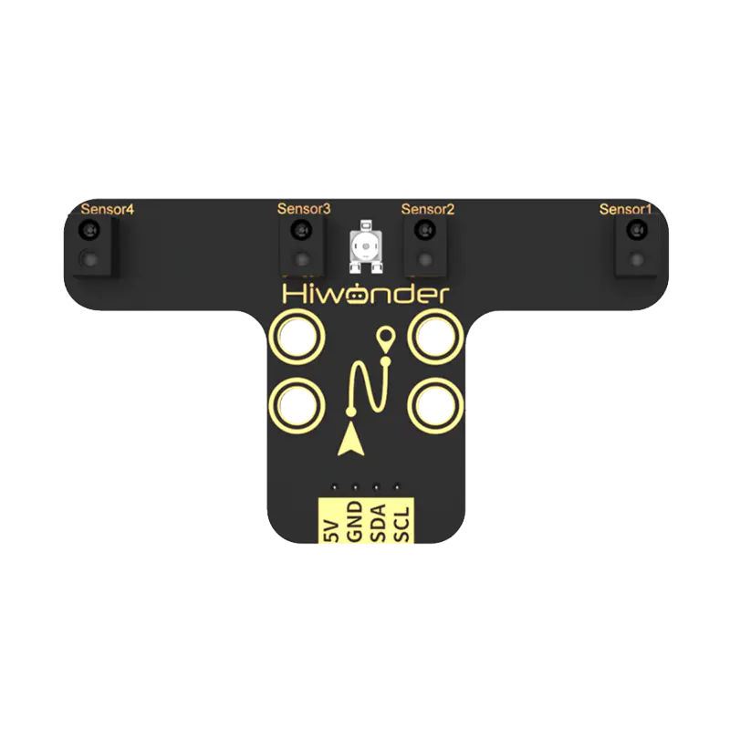
                <div style="padding: 12px 4px; text-align: center; color: #333;">
                    <span>4-ch Line Follower</span>
                </div>
            </a>
        </div>
        <div style="width: calc(18% - 15px); min-width: 150px; background: white; border-radius: 8px; overflow: hidden; box-shadow: 0 2px 8px rgba(0,0,0,0.1);">
            <a target="_blank" href="https://wiki.hiwonder.com/projects/Knob-Module/en/latest" style="display: block; text-decoration: none;">
                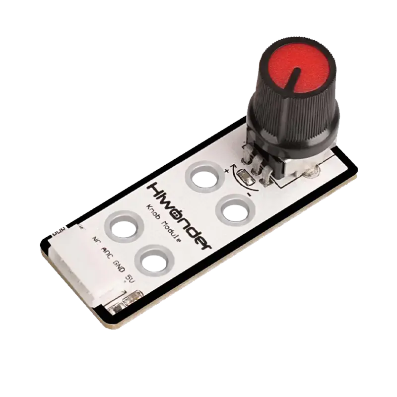
                <div style="padding: 12px 4px; text-align: center; color: #333;">
                    <span>Knob Module</span>
                </div>
            </a>
        </div>
        <div style="width: calc(18% - 15px); min-width: 150px; background: white; border-radius: 8px; overflow: hidden; box-shadow: 0 2px 8px rgba(0,0,0,0.1);">
            <a target="_blank" href="https://www.hiwonder.com.cn/store/learn/60.html" style="display: block; text-decoration: none;">
                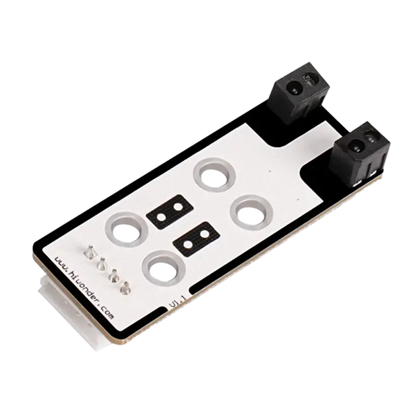
                <div style="padding: 12px 4px; text-align: center; color: #333;">
                    <span>Line Follower</span>
                </div>
            </a>
        </div>
        <div style="width: calc(18% - 15px); min-width: 150px; background: white; border-radius: 8px; overflow: hidden; box-shadow: 0 2px 8px rgba(0,0,0,0.1);">
            <a target="_blank" href="https://wiki.hiwonder.com/projects/Ultrasonic-Module-White/en/latest" style="display: block; text-decoration: none;">
                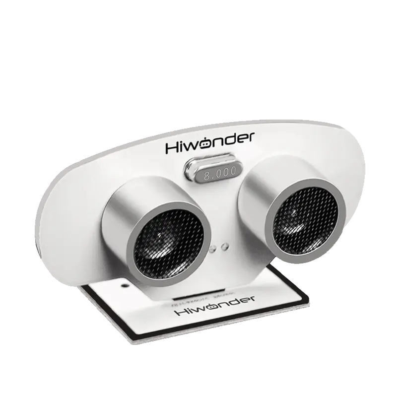
                <div style="padding: 12px 4px; text-align: center; color: #333;">
                    <span>Ultrasonic Sensor(white)</span>
                </div>
            </a>
        </div>
        <div style="width: calc(18% - 15px); min-width: 150px; background: white; border-radius: 8px; overflow: hidden; box-shadow: 0 2px 8px rgba(0,0,0,0.1);">
            <a target="_blank" href="https://wiki.hiwonder.com/projects/Touch-Sensor/en/latest" style="display: block; text-decoration: none;">
                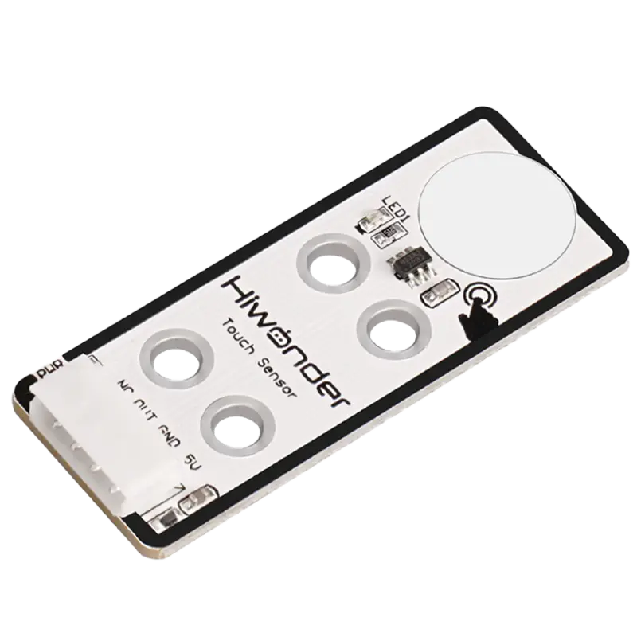
                <div style="padding: 12px 4px; text-align: center; color: #333;">
                    <span>Touch Sensor</span>
                </div>
            </a>
        </div>
        <div style="width: calc(18% - 15px); min-width: 150px; background: white; border-radius: 8px; overflow: hidden; box-shadow: 0 2px 8px rgba(0,0,0,0.1);">
            <a target="_blank" href="https://wiki.hiwonder.com/projects/Infrared-Obstacle-Avoidance-Sensor/en/latest" style="display: block; text-decoration: none;">
                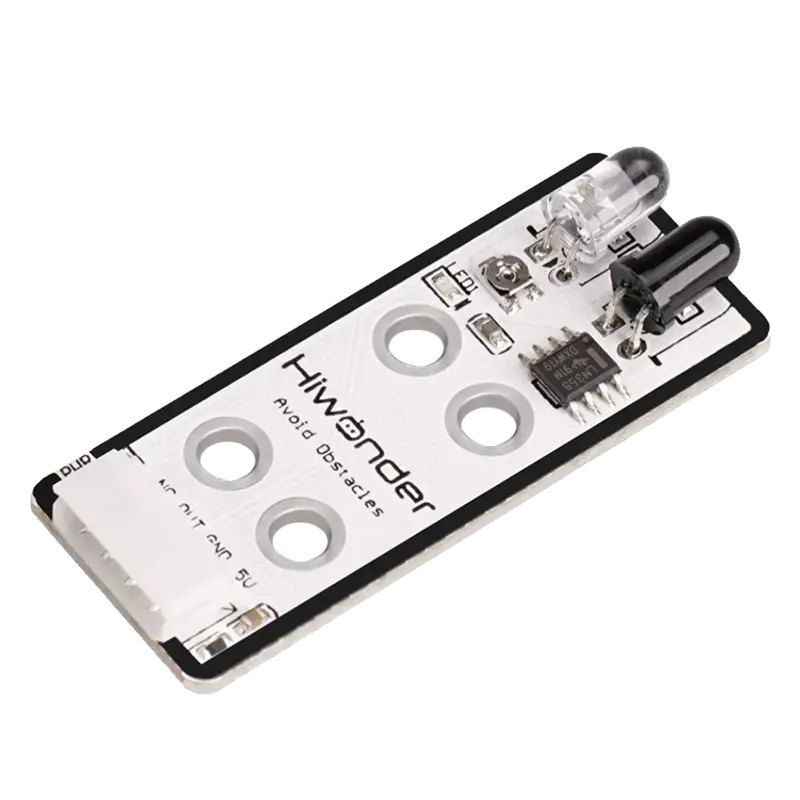
                <div style="padding: 12px 4px; text-align: center; color: #333;">
                    <span>Infrared Obstacle Avoidance Sensor</span>
                </div>
            </a>
        </div>
        <div style="width: calc(18% - 15px); min-width: 150px; background: white; border-radius: 8px; overflow: hidden; box-shadow: 0 2px 8px rgba(0,0,0,0.1);">
            <a target="_blank" href="https://wiki.hiwonder.com/projects/Color-Sensor/en/latest" style="display: block; text-decoration: none;">
                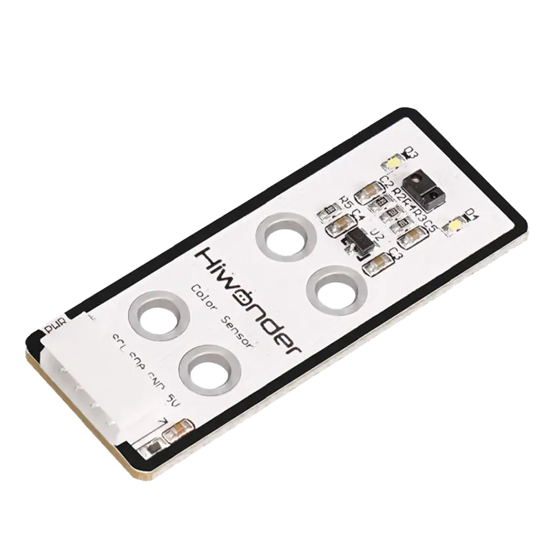
                <div style="padding: 12px 4px; text-align: center; color: #333;">
                    <span>Color Sensor</span>
                </div>
            </a>
        </div>
        <div style="width: calc(18% - 15px); min-width: 150px; background: white; border-radius: 8px; overflow: hidden; box-shadow: 0 2px 8px rgba(0,0,0,0.1);">
            <a target="_blank" href="https://www.hiwonder.com.cn/store/learn/68.html" style="display: block; text-decoration: none;">
                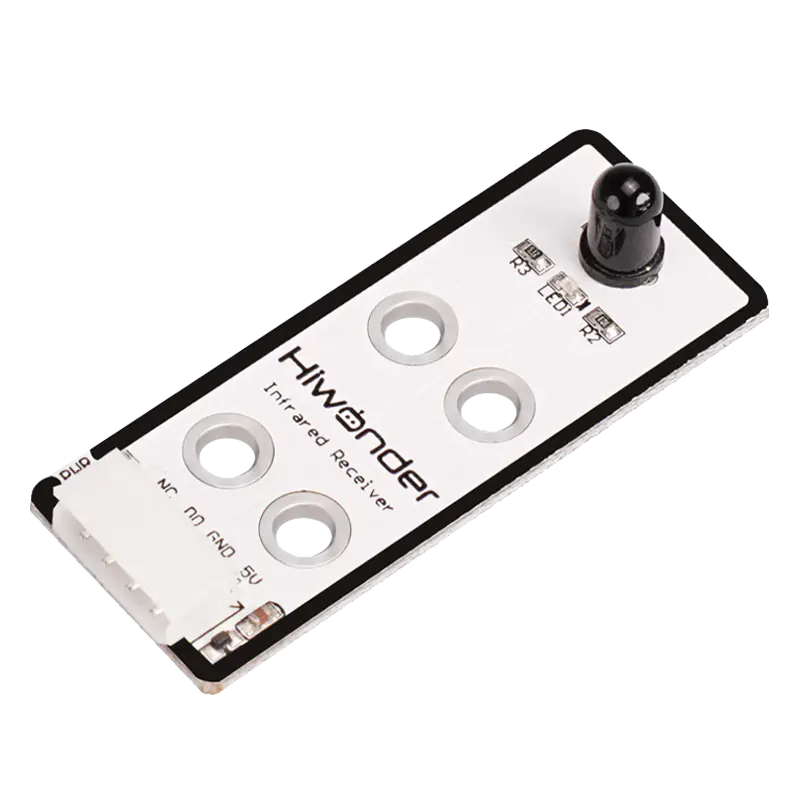
                <div style="padding: 12px 4px; text-align: center; color: #333;">
                    <span>Infrared Receiver</span>
                </div>
            </a>
        </div>
        <div style="width: calc(18% - 15px); min-width: 150px; background: white; border-radius: 8px; overflow: hidden; box-shadow: 0 2px 8px rgba(0,0,0,0.1);">
            <a target="_blank" href="https://www.hiwonder.com.cn/store/learn/59.html" style="display: block; text-decoration: none;">
                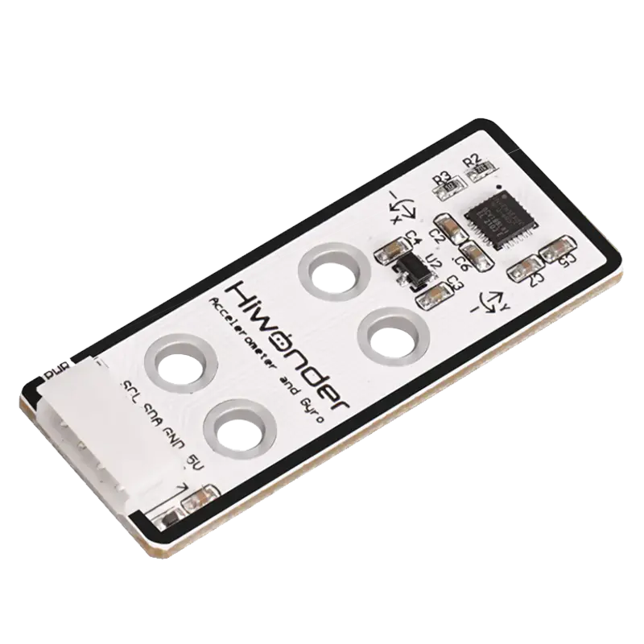
                <div style="padding: 12px 4px; text-align: center; color: #333;">
                    <span>Acceleration Sensor</span>
                </div>
            </a>
        </div>
        <div style="width: calc(18% - 15px); min-width: 150px; background: white; border-radius: 8px; overflow: hidden; box-shadow: 0 2px 8px rgba(0,0,0,0.1);">
            <a target="_blank" href="https://wiki.hiwonder.com/projects/Sound-Sensor/en/latest" style="display: block; text-decoration: none;">
                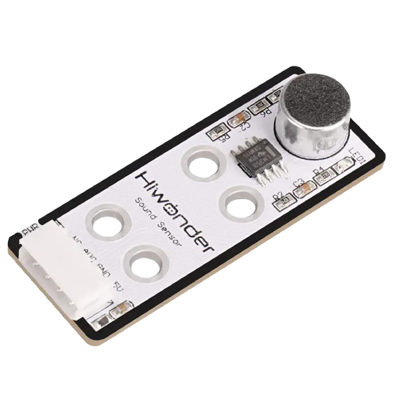
                <div style="padding: 12px 4px; text-align: center; color: #333;">
                    <span>Sound Sensor</span>
                </div>
            </a>
        </div>
        <div style="width: calc(18% - 15px); min-width: 150px; background: white; border-radius: 8px; overflow: hidden; box-shadow: 0 2px 8px rgba(0,0,0,0.1);">
            <a target="_blank" href="https://wiki.hiwonder.com/projects/Light-Sensor-White/en/latest" style="display: block; text-decoration: none;">
                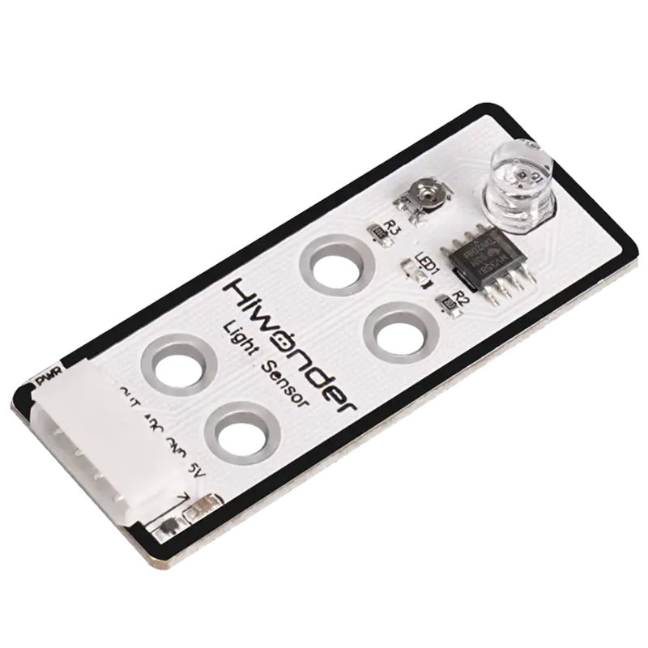
                <div style="padding: 12px 4px; text-align: center; color: #333;">
                    <span>Light Sensor</span>
                </div>
            </a>
        </div>
        <div style="width: calc(18% - 15px); min-width: 150px; background: white; border-radius: 8px; overflow: hidden; box-shadow: 0 2px 8px rgba(0,0,0,0.1);">
            <a target="_blank" href="https://wiki.hiwonder.com/projects/Soil-Sensor/en/latest" style="display: block; text-decoration: none;">
                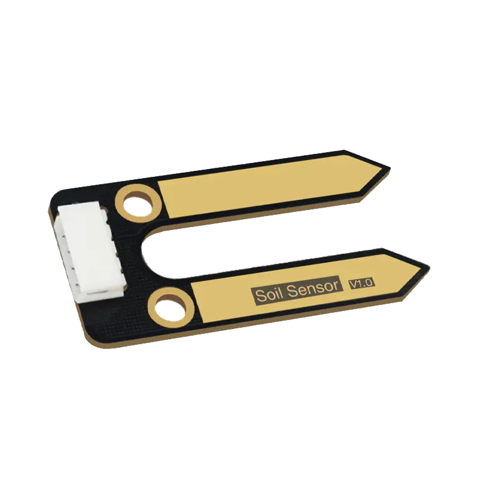
                <div style="padding: 12px 4px; text-align: center; color: #333;">
                    <span>Soil Moisture Sensor</span>
                </div>
            </a>
        </div>
        <div style="width: calc(18% - 15px); min-width: 150px; background: white; border-radius: 8px; overflow: hidden; box-shadow: 0 2px 8px rgba(0,0,0,0.1);">
            <a target="_blank" href="https://www.hiwonder.com.cn/store/learn/57.html" style="display: block; text-decoration: none;">
                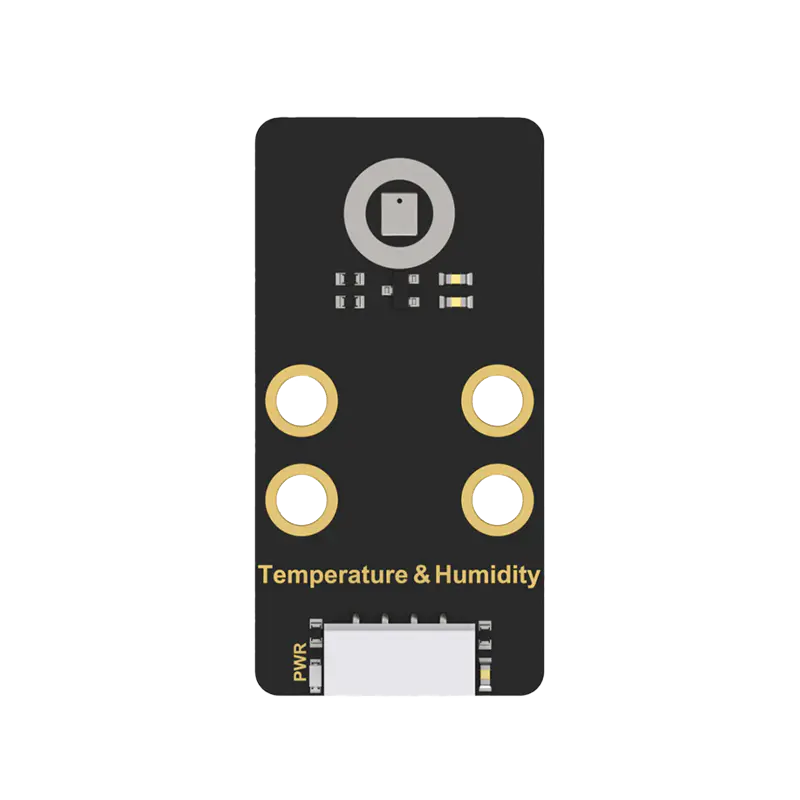
                <div style="padding: 12px 4px; text-align: center; color: #333;">
                    <span>Temperature and Humidity Sensor</span>
                </div>
            </a>
        </div>
    </div>
</div>

## Output Module

<div class="container">
    <div style="display: flex; flex-wrap: wrap; gap: 20px; margin-bottom:50px;">
        <div style="width: calc(18% - 15px); min-width: 150px; background: white; border-radius: 8px; overflow: hidden; box-shadow: 0 2px 8px rgba(0,0,0,0.1);">
            <a target="_blank" href="https://wiki.hiwonder.com/projects/WonderEcho/en/latest/" style="display: block; text-decoration: none;">
                
                <div style="padding: 12px 4px; text-align: center; color: #333;">
                    <span>WonderEcho</span>
                </div>
            </a>
        </div>
        <div style="width: calc(18% - 15px); min-width: 150px; background: white; border-radius: 8px; overflow: hidden; box-shadow: 0 2px 8px rgba(0,0,0,0.1);">
            <a target="_blank" href="https://wiki.hiwonder.com/projects/Glowing-Ultrasonic-Sensor/en/latest/" style="display: block; text-decoration: none;">
                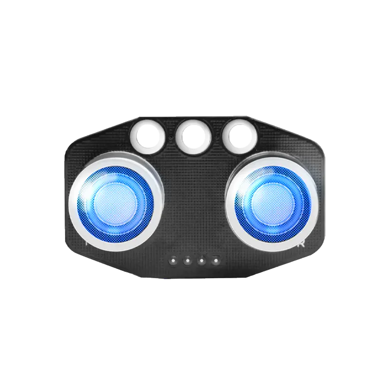
                <div style="padding: 12px 4px; text-align: center; color: #333;">
                    <span>Glowy Ultrasonic Sensor</span>
                </div>
            </a>
        </div>
        <div style="width: calc(18% - 15px); min-width: 150px; background: white; border-radius: 8px; overflow: hidden; box-shadow: 0 2px 8px rgba(0,0,0,0.1);">
            <a target="_blank" href="https://www.hiwonder.com.cn/store/learn/81.html" style="display: block; text-decoration: none;">
                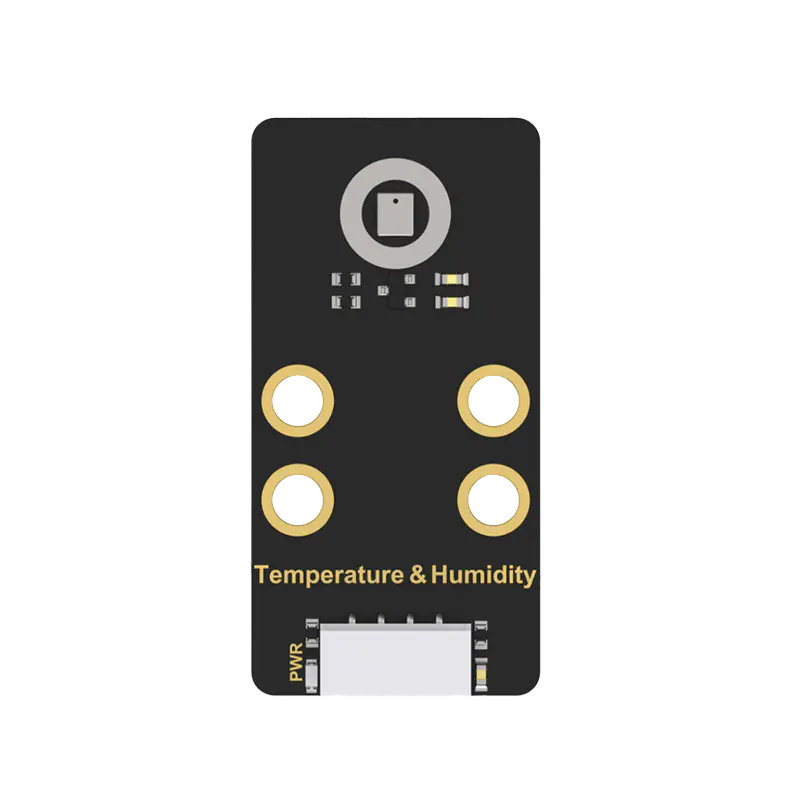
                <div style="padding: 12px 4px; text-align: center; color: #333;">
                    <span>PWM Servo Adapter Module</span>
                </div>
            </a>
        </div>
        <div style="width: calc(18% - 15px); min-width: 150px; background: white; border-radius: 8px; overflow: hidden; box-shadow: 0 2px 8px rgba(0,0,0,0.1);">
            <a target="_blank" href="https://www.hiwonder.com.cn/store/learn/58.html" style="display: block; text-decoration: none;">
                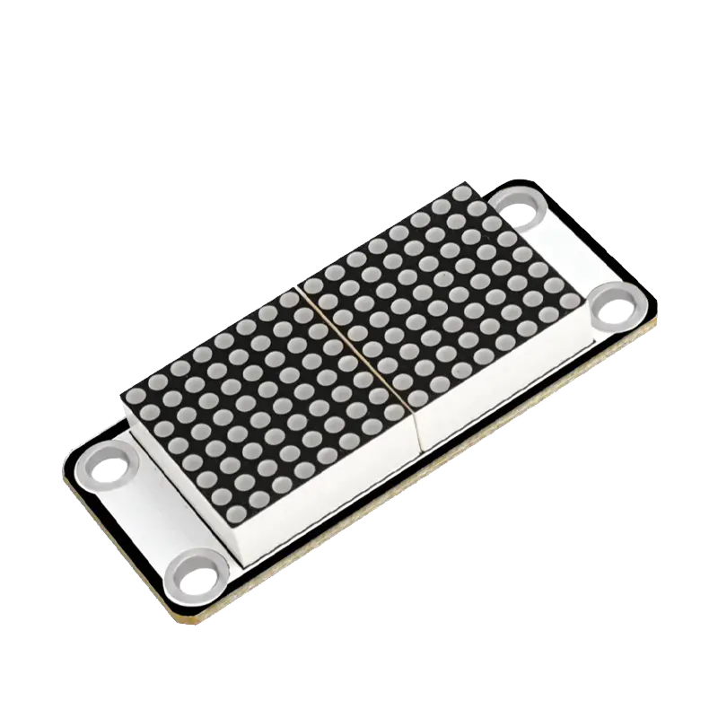
                <div style="padding: 12px 4px; text-align: center; color: #333;">
                    <span>Dot Matrix Module</span>
                </div>
            </a>
        </div>
        <div style="width: calc(18% - 15px); min-width: 150px; background: white; border-radius: 8px; overflow: hidden; box-shadow: 0 2px 8px rgba(0,0,0,0.1);">
            <a target="_blank" href="https://wiki.hiwonder.com/projects/MP3-Module/en/latest" style="display: block; text-decoration: none;">
                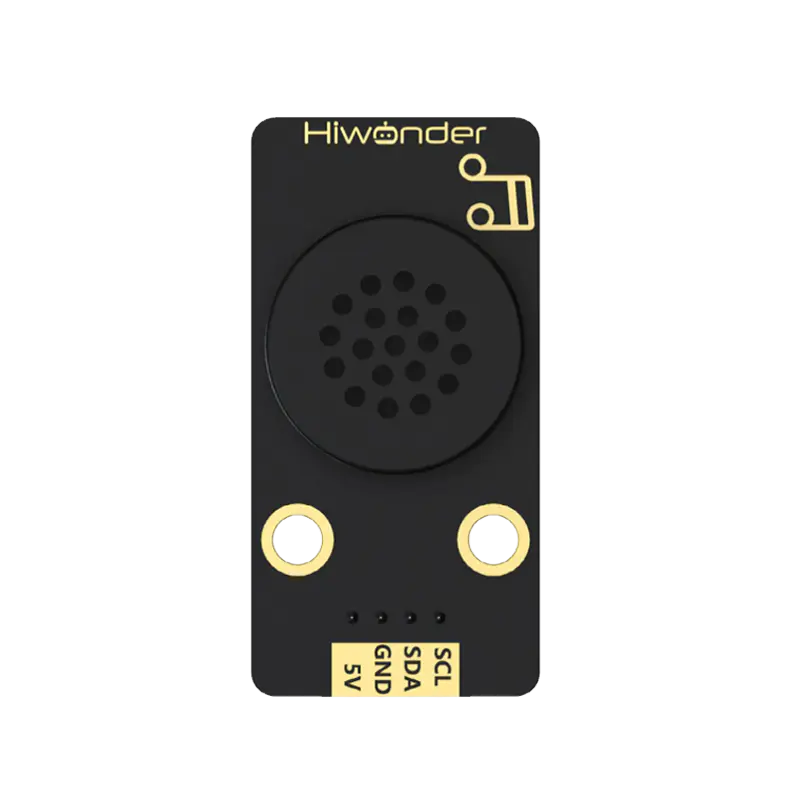
                <div style="padding: 12px 4px; text-align: center; color: #333;">
                    <span>MP3 Module</span>
                </div>
            </a>
        </div>
        <div style="width: calc(18% - 15px); min-width: 150px; background: white; border-radius: 8px; overflow: hidden; box-shadow: 0 2px 8px rgba(0,0,0,0.1);">
            <a target="_blank" href="https://wiki.hiwonder.com/projects/Digital-Tube-Module/en/latest" style="display: block; text-decoration: none;">
                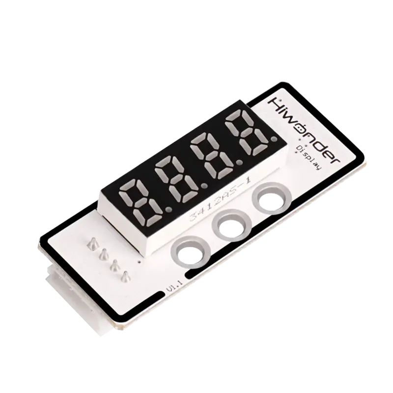
                <div style="padding: 12px 4px; text-align: center; color: #333;">
                    <span>Digital Tube Module</span>
                </div>
            </a>
        </div>
        <div style="width: calc(18% - 15px); min-width: 150px; background: white; border-radius: 8px; overflow: hidden; box-shadow: 0 2px 8px rgba(0,0,0,0.1);">
            <a target="_blank" href="https://wiki.hiwonder.com/projects/Fan-Module-White/en/latest" style="display: block; text-decoration: none;">
                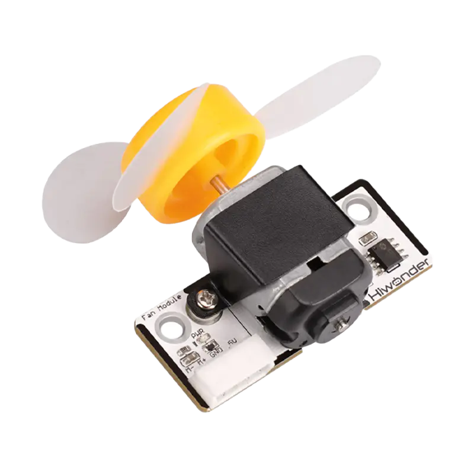
                <div style="padding: 12px 4px; text-align: center; color: #333;">
                    <span>Fan Module</span>
                </div>
            </a>
        </div>
        <div style="width: calc(18% - 15px); min-width: 150px; background: white; border-radius: 8px; overflow: hidden; box-shadow: 0 2px 8px rgba(0,0,0,0.1);">
            <a target="_blank" href="https://wiki.hiwonder.com/projects/RGB-Module/en/latest/" style="display: block; text-decoration: none;">
                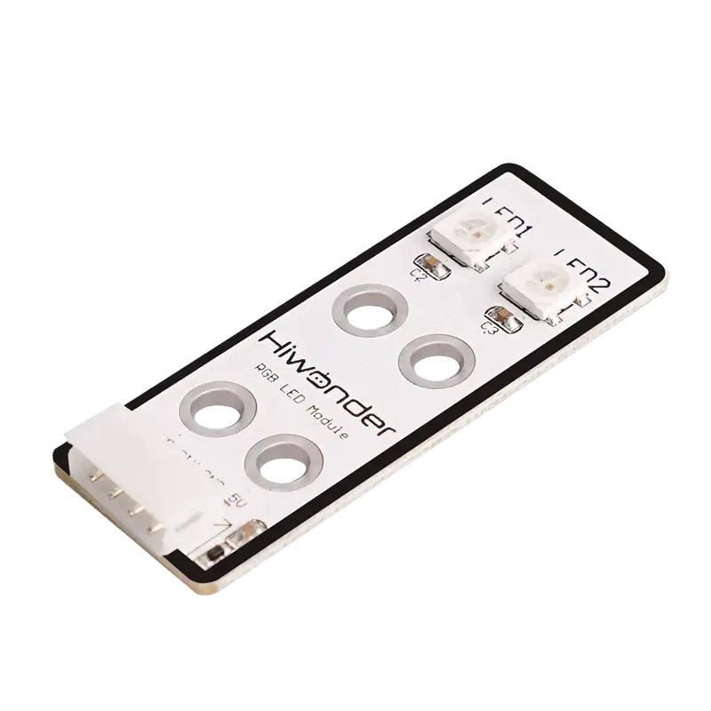
                <div style="padding: 12px 4px; text-align: center; color: #333;">
                    <span>RGB Module</span>
                </div>
            </a>
        </div>
        <div style="width: calc(18% - 15px); min-width: 150px; background: white; border-radius: 8px; overflow: hidden; box-shadow: 0 2px 8px rgba(0,0,0,0.1);">
            <a target="_blank" href="https://wiki.hiwonder.com/projects/OLED-Display-Module/en/latest" style="display: block; text-decoration: none;">
                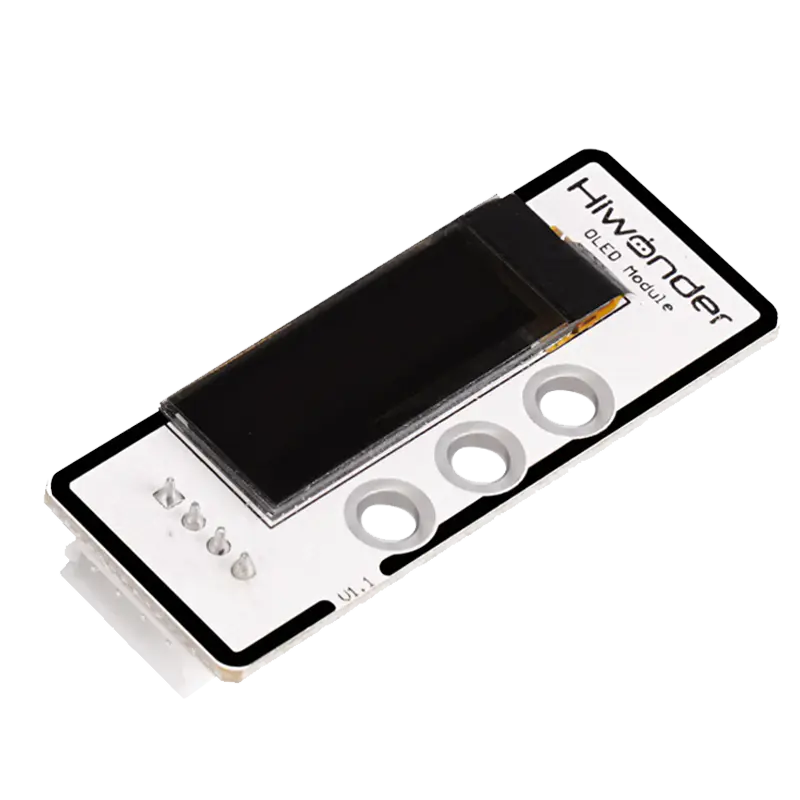
                <div style="padding: 12px 4px; text-align: center; color: #333;">
                    <span>OLED Display Module</span>
                </div>
            </a>
        </div>
        <div style="width: calc(18% - 15px); min-width: 150px; background: white; border-radius: 8px; overflow: hidden; box-shadow: 0 2px 8px rgba(0,0,0,0.1);">
            <a target="_blank" href="https://www.hiwonder.com.cn/store/learn/77.html" style="display: block; text-decoration: none;">
                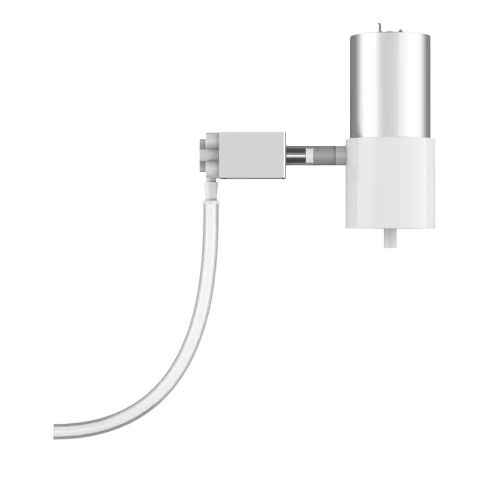
                <div style="padding: 12px 4px; text-align: center; color: #333;">
                    <span>Air Pump Module</span>
                </div>
            </a>
        </div>
        <div style="width: calc(18% - 15px); min-width: 150px; background: white; border-radius: 8px; overflow: hidden; box-shadow: 0 2px 8px rgba(0,0,0,0.1);">
            <a target="_blank" href="https://wiki.hiwonder.com/projects/Water-Pump/en/latest" style="display: block; text-decoration: none;">
                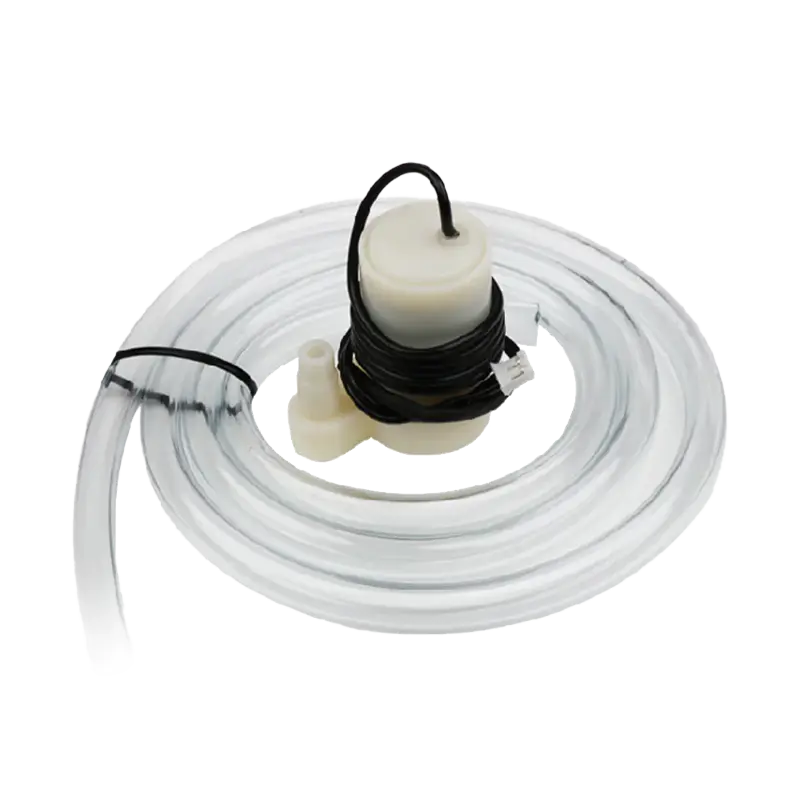
                <div style="padding: 12px 4px; text-align: center; color: #333;">
                    <span>Water Pump Module</span>
                </div>
            </a>
        </div>
        <div style="width: calc(18% - 15px); min-width: 150px; background: white; border-radius: 8px; overflow: hidden; box-shadow: 0 2px 8px rgba(0,0,0,0.1);">
            <div style="display: block; text-decoration: none;">
                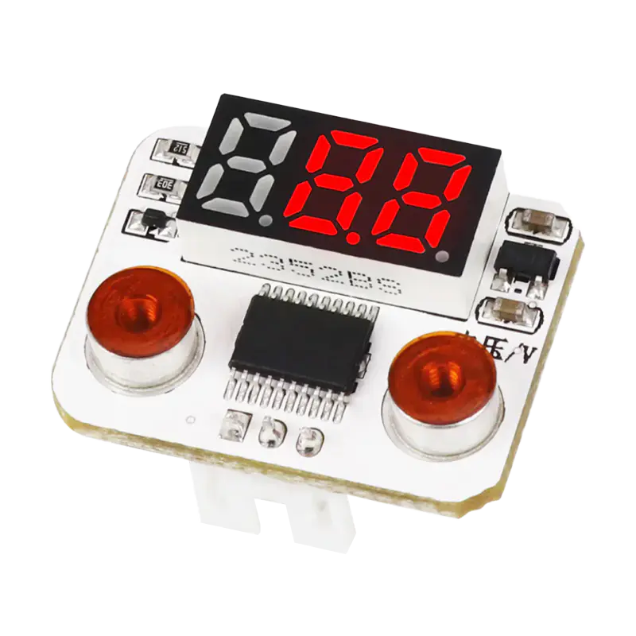
                <div style="padding: 12px 4px; text-align: center; color: #333;">
                    <span>Voltage Display Module</span>
                </div>
            </div>
        </div>
    </div>
</div>

## Communication Moulde

<div class="container">
    <div style="display: flex; flex-wrap: wrap; gap: 20px; margin-bottom:50px;">
        <div style="width: calc(18% - 15px); min-width: 150px; background: white; border-radius: 8px; overflow: hidden; box-shadow: 0 2px 8px rgba(0,0,0,0.1);">
            <a target="_blank" href="https://www.hiwonder.com.cn/store/learn/91.html" style="display: block; text-decoration: none;">
                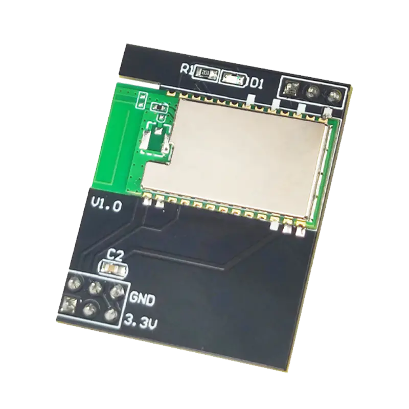
                <div style="padding: 12px 4px; text-align: center; color: #333;">
                    <span>Bluetooth Module</span>
                </div>
            </a>
        </div>
    </div>
</div>

## Remote Control

<div class="container">
    <div style="display: flex; flex-wrap: wrap; gap: 20px; margin-bottom:50px;">
        <div style="width: calc(18% - 15px); min-width: 150px; background: white; border-radius: 8px; overflow: hidden; box-shadow: 0 2px 8px rgba(0,0,0,0.1);">
            <div style="display: block; text-decoration: none;">
                
                <div style="padding: 12px 4px; text-align: center; color: #333;">
                    <span>PS2 Wireless Controller with USB Receiver</span>
                </div>
            </div>
        </div>
        <div style="width: calc(18% - 15px); min-width: 150px; background: white; border-radius: 8px; overflow: hidden; box-shadow: 0 2px 8px rgba(0,0,0,0.1);">
            <a target="_blank" href="https://www.hiwonder.com.cn/store/learn/86.html" style="display: block; text-decoration: none;">
                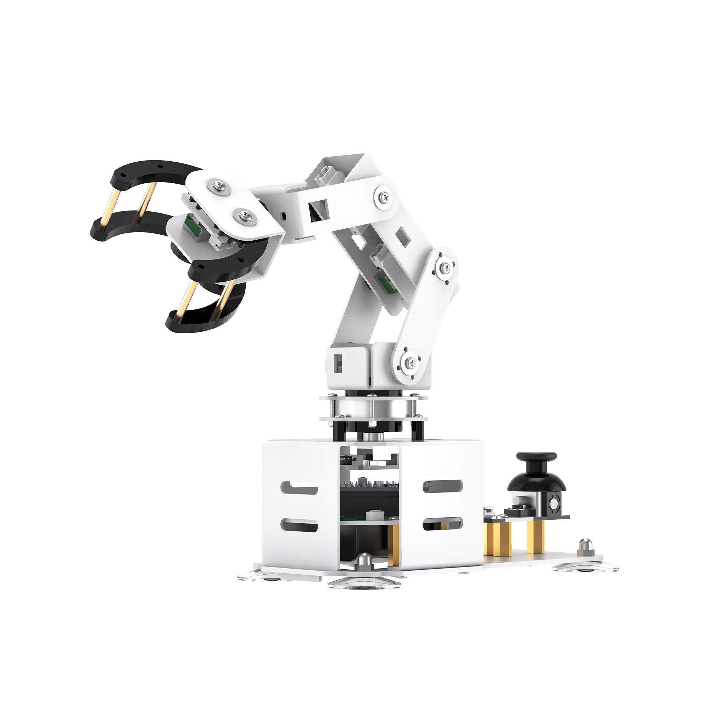
                <div style="padding: 12px 4px; text-align: center; color: #333;">
                    <span>Synchronization Controller</span>
                </div>
            </a>
        </div>
    </div>
</div>

## Display Module

<div class="container">
    <div style="display: flex; flex-wrap: wrap; gap: 20px; margin-bottom:50px;">
        <div style="width: calc(18% - 15px); min-width: 150px; background: white; border-radius: 8px; overflow: hidden; box-shadow: 0 2px 8px rgba(0,0,0,0.1);">
            <div style="display: block; text-decoration: none;">
                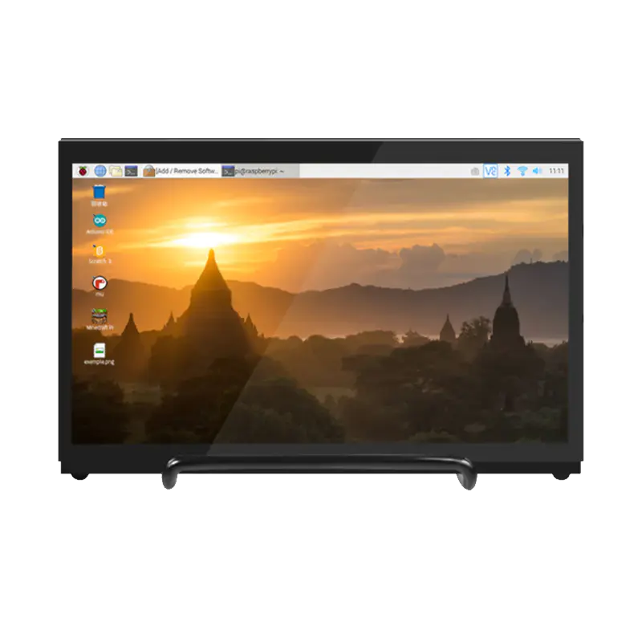
                <div style="padding: 12px 4px; text-align: center; color: #333;">
                    <span>7-inch HD Touch Screen</span>
                </div>
            </div>
        </div>
        <div style="width: calc(18% - 15px); min-width: 150px; background: white; border-radius: 8px; overflow: hidden; box-shadow: 0 2px 8px rgba(0,0,0,0.1);">
            <a target="_blank" href="https://wiki.hiwonder.com/projects/Digital-Tube-Module/en/latest" style="display: block; text-decoration: none;">
                
                <div style="padding: 12px 4px; text-align: center; color: #333;">
                    <span>Digital Tube Module</span>
                </div>
            </a>
        </div>
        <div style="width: calc(18% - 15px); min-width: 150px; background: white; border-radius: 8px; overflow: hidden; box-shadow: 0 2px 8px rgba(0,0,0,0.1);">
            <a target="_blank" href="https://wiki.hiwonder.com/projects/RGB-Module/en/latest/" style="display: block; text-decoration: none;">
                
                <div style="padding: 12px 4px; text-align: center; color: #333;">
                    <span>RGB Module</span>
                </div>
            </a>
        </div>
        <div style="width: calc(18% - 15px); min-width: 150px; background: white; border-radius: 8px; overflow: hidden; box-shadow: 0 2px 8px rgba(0,0,0,0.1);">
            <a target="_blank" href="https://wiki.hiwonder.com/projects/OLED-Display-Module/en/latest" style="display: block; text-decoration: none;">
                
                <div style="padding: 12px 4px; text-align: center; color: #333;">
                    <span>OLED Display Module</span>
                </div>
            </a>
        </div>
    </div>
</div>

## Camera & Lidar

<div class="container">
    <div style="display: flex; flex-wrap: wrap; gap: 20px; margin-bottom:50px;">
        <div style="width: calc(18% - 15px); min-width: 150px; background: white; border-radius: 8px; overflow: hidden; box-shadow: 0 2px 8px rgba(0,0,0,0.1);">
            <a target="_blank" href="https://docs.hiwonder.com/projects/Aurora930-Pro/en/latest/" style="display: block; text-decoration: none;">
                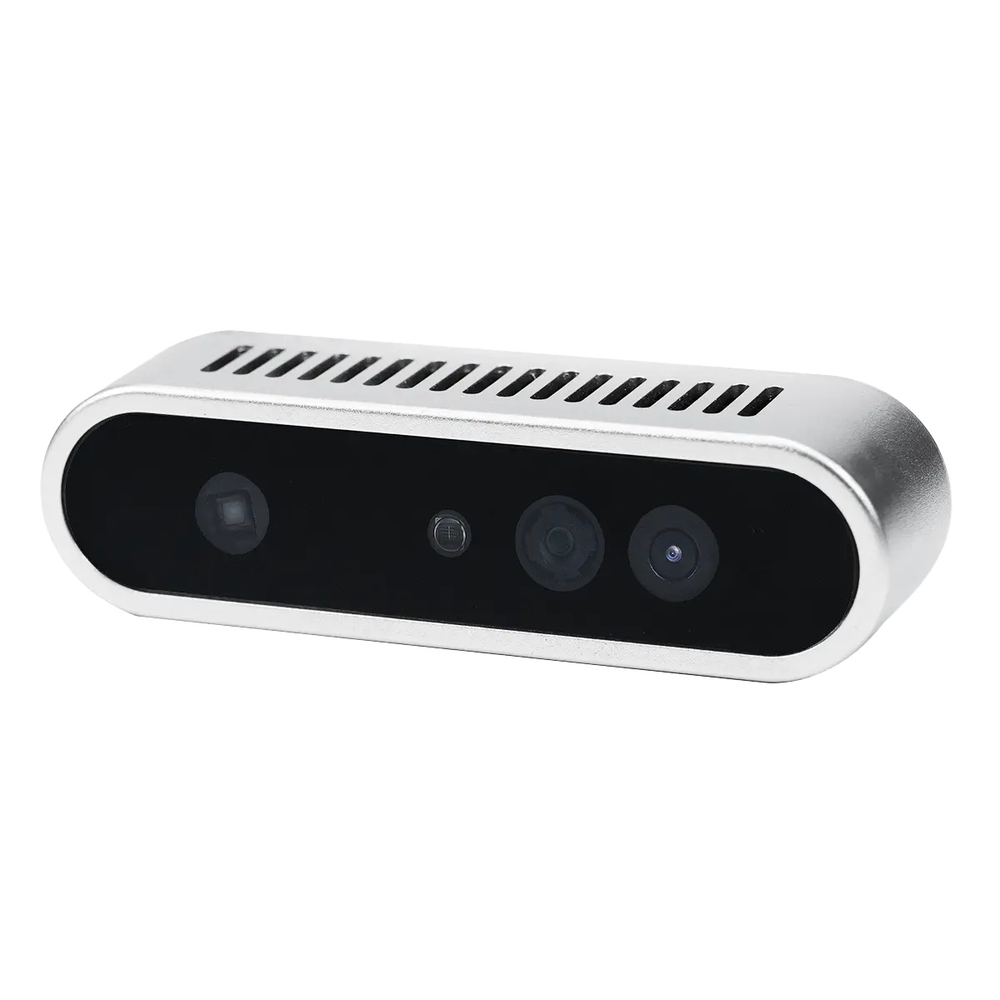
                <div style="padding: 12px 4px; text-align: center; color: #333;">
                    <span>Aurora930 Pro</span>
                </div>
            </a>
        </div>
        <div style="width: calc(18% - 15px); min-width: 150px; background: white; border-radius: 8px; overflow: hidden; box-shadow: 0 2px 8px rgba(0,0,0,0.1);">
            <div style="display: block; text-decoration: none;">
                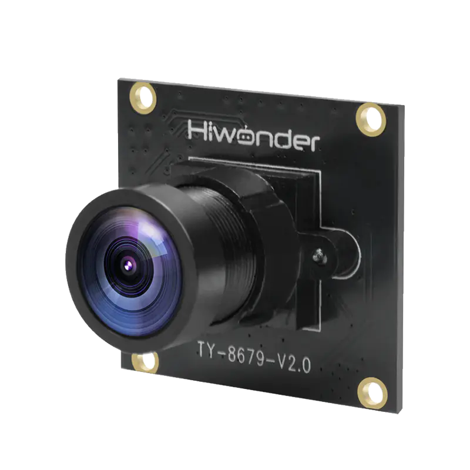
                <div style="padding: 12px 4px; text-align: center; color: #333;">
                    <span>8-Megapixel USB Wide-Angle Camera</span>
                </div>
            </div>
        </div>
        <div style="width: calc(18% - 15px); min-width: 150px; background: white; border-radius: 8px; overflow: hidden; box-shadow: 0 2px 8px rgba(0,0,0,0.1);">
            <div style="display: block; text-decoration: none;">
                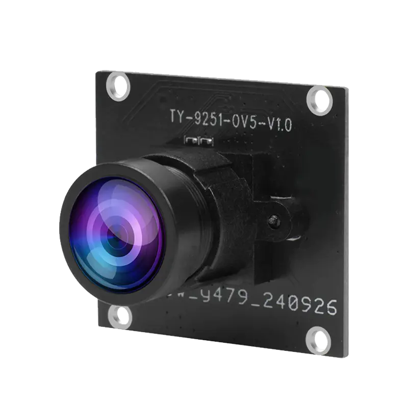
                <div style="padding: 12px 4px; text-align: center; color: #333;">
                    <span>5-Megapixel USB Wide-Angle Camera</span>
                </div>
            </div>
        </div>
        <div style="width: calc(18% - 15px); min-width: 150px; background: white; border-radius: 8px; overflow: hidden; box-shadow: 0 2px 8px rgba(0,0,0,0.1);">
            <div style="display: block; text-decoration: none;">
                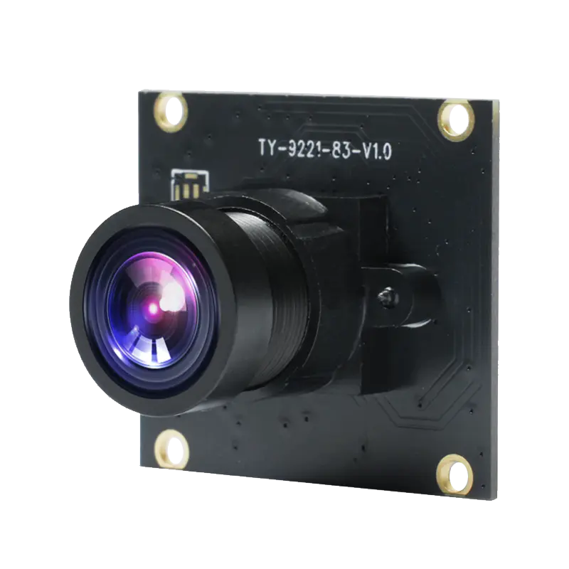
                <div style="padding: 12px 4px; text-align: center; color: #333;">
                    <span>2-Megapixel USB Wide-Angle Camera</span>
                </div>
            </div>
        </div>
        <div style="width: calc(18% - 15px); min-width: 150px; background: white; border-radius: 8px; overflow: hidden; box-shadow: 0 2px 8px rgba(0,0,0,0.1);">
            <a target="_blank" href="https://drive.google.com/drive/folders/1wbXtyoLHtbBQ27utA_ecVhGlfIw3KLA2?usp=sharing" style="display: block; text-decoration: none;">
                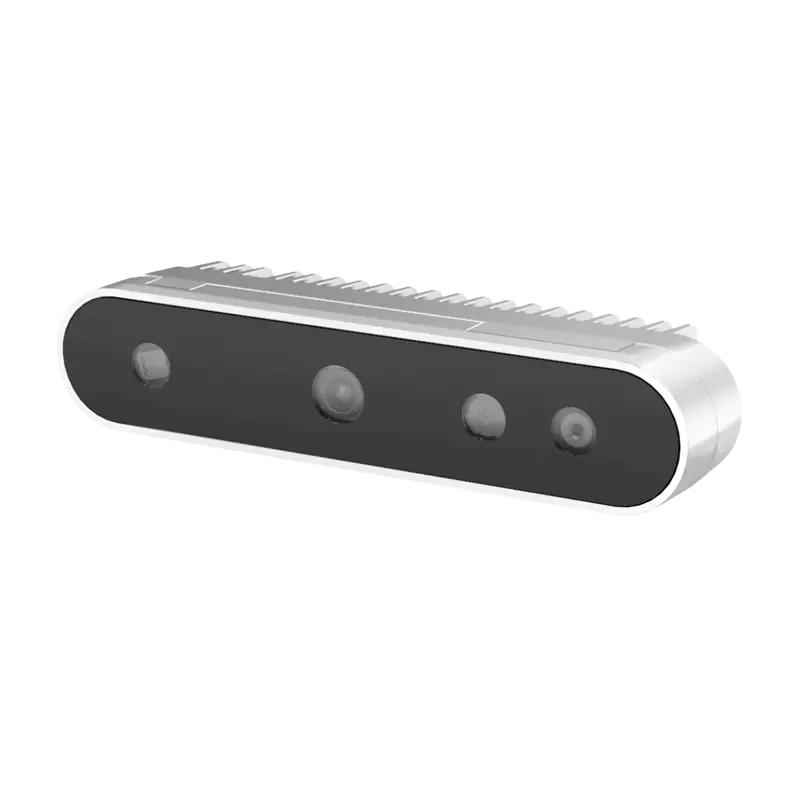
                <div style="padding: 12px 4px; text-align: center; color: #333;">
                    <span>Angstrong Nuwa-HP60C Camera</span>
                </div>
            </a>
        </div>
        <div style="width: calc(18% - 15px); min-width: 150px; background: white; border-radius: 8px; overflow: hidden; box-shadow: 0 2px 8px rgba(0,0,0,0.1);">
            <a target="_blank" href="https://drive.google.com/drive/folders/1knn062KHzr6d2mqx9fTRcibtFQVssEhq?usp=sharing" style="display: block; text-decoration: none;">
                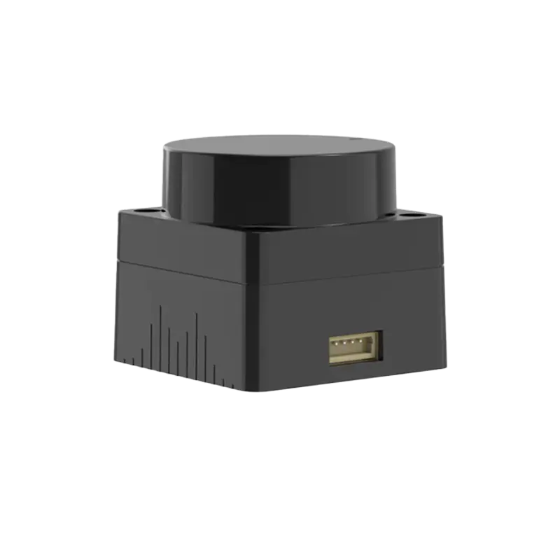
                <div style="padding: 12px 4px; text-align: center; color: #333;">
                    <span>Orbbec Oradar MS200 Lidar</span>
                </div>
            </a>
        </div>
        <div style="width: calc(18% - 15px); min-width: 150px; background: white; border-radius: 8px; overflow: hidden; box-shadow: 0 2px 8px rgba(0,0,0,0.1);">
            <a target="_blank" href="https://www.hiwonder.com.cn/store/learn/143.html" style="display: block; text-decoration: none;">
                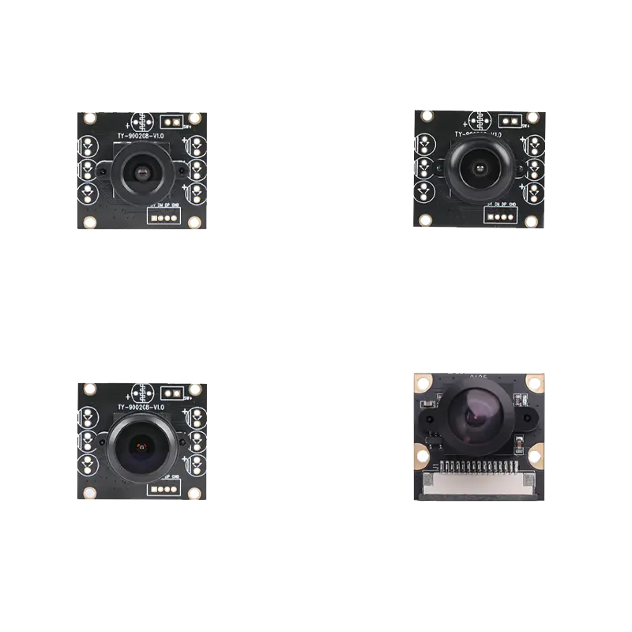
                <div style="padding: 12px 4px; text-align: center; color: #333;">
                    <span>HD Wide Angle Camera Collection</span>
                </div>
            </a>
        </div>
        <div style="width: calc(18% - 15px); min-width: 150px; background: white; border-radius: 8px; overflow: hidden; box-shadow: 0 2px 8px rgba(0,0,0,0.1);">
            <a target="_blank" href="https://drive.google.com/drive/folders/1V7zEAyt0jPzf-LrUO_CF4H9uotp_lV7c?usp=sharing" style="display: block; text-decoration: none;">
                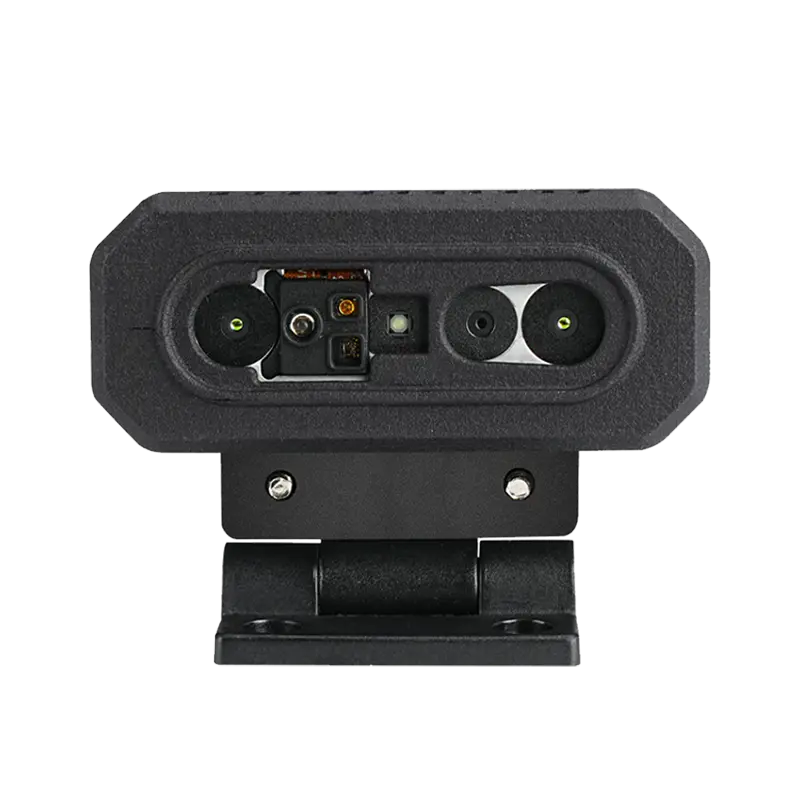
                <div style="padding: 12px 4px; text-align: center; color: #333;">
                    <span>ORBBEC® Gemini Plus Camera</span>
                </div>
            </a>
        </div>
        <div style="width: calc(18% - 15px); min-width: 150px; background: white; border-radius: 8px; overflow: hidden; box-shadow: 0 2px 8px rgba(0,0,0,0.1);">
            <a target="_blank" href="https://drive.google.com/drive/folders/18CVV_3vmvyWoRfpuVkATmZ0nrm3FWMFb?usp=sharing" style="display: block; text-decoration: none;">
                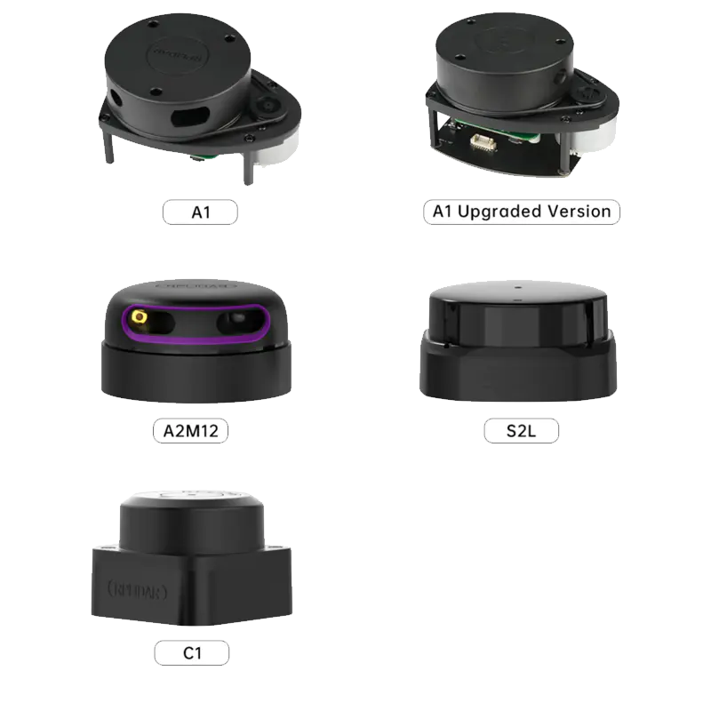
                <div style="padding: 12px 4px; text-align: center; color: #333;">
                    <span>SLAMTEC RPLIDAR Lidar C1 A1 A2M12 S2L</span>
                </div>
            </a>
        </div>
        <div style="width: calc(18% - 15px); min-width: 150px; background: white; border-radius: 8px; overflow: hidden; box-shadow: 0 2px 8px rgba(0,0,0,0.1);">
            <a target="_blank" href="https://drive.google.com/drive/folders/18CVV_3vmvyWoRfpuVkATmZ0nrm3FWMFb" style="display: block; text-decoration: none;">
                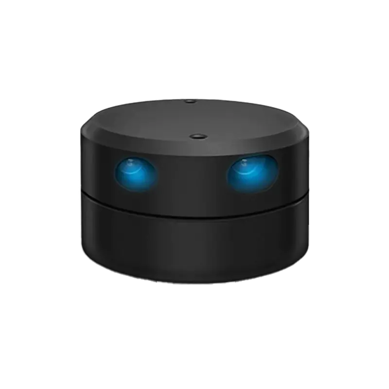
                <div style="padding: 12px 4px; text-align: center; color: #333;">
                    <span>YDLIDAR G4 Lidar</span>
                </div>
            </a>
        </div>
        <div style="width: calc(18% - 15px); min-width: 150px; background: white; border-radius: 8px; overflow: hidden; box-shadow: 0 2px 8px rgba(0,0,0,0.1);">
            <a target="_blank" href="https://drive.google.com/drive/folders/18CVV_3vmvyWoRfpuVkATmZ0nrm3FWMFb?usp=sharing" style="display: block; text-decoration: none;">
                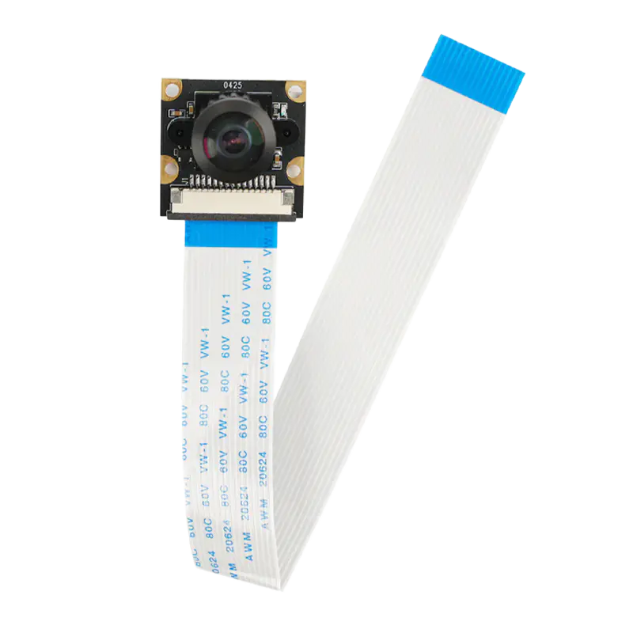
                <div style="padding: 12px 4px; text-align: center; color: #333;">
                    <span>800W pixel NVIDIA HD Monocular Camera</span>
                </div>
            </a>
        </div>
        <div style="width: calc(18% - 15px); min-width: 150px; background: white; border-radius: 8px; overflow: hidden; box-shadow: 0 2px 8px rgba(0,0,0,0.1);">
            <a target="_blank" href="https://drive.google.com/drive/folders/1f4LGaOQR77KFg2y63o9ETfIjoTsK26qk?usp=sharing" style="display: block; text-decoration: none;">
                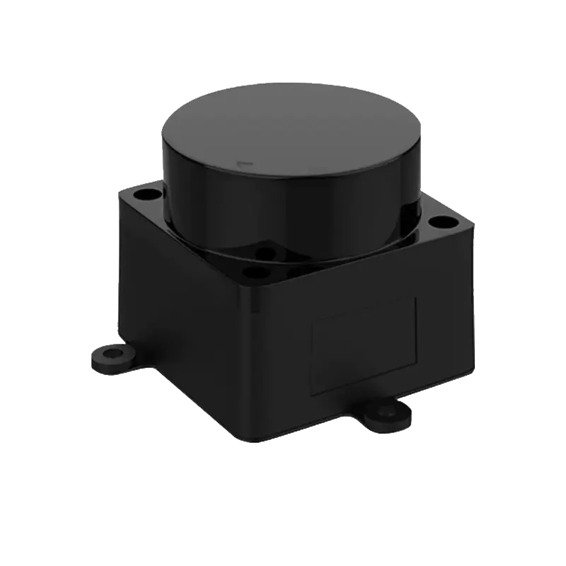
                <div style="padding: 12px 4px; text-align: center; color: #333;">
                    <span>STL-19P D500 Lidar</span>
                </div>
            </a>
        </div>
    </div>
</div>

## MIC & Voice Module

<div class="container">
    <div style="display: flex; flex-wrap: wrap; gap: 20px; margin-bottom:50px;">
        <div style="width: calc(18% - 15px); min-width: 150px; background: white; border-radius: 8px; overflow: hidden; box-shadow: 0 2px 8px rgba(0,0,0,0.1);">
            <a target="_blank" href="https://www.hiwonder.com.cn/store/learn/135.html" style="display: block; text-decoration: none;">
                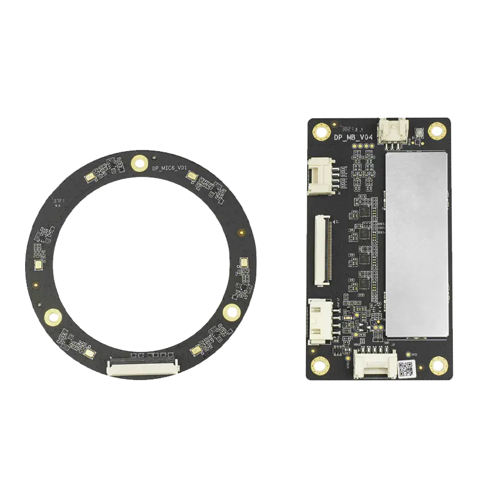
                <div style="padding: 12px 4px; text-align: center; color: #333;">
                    <span>iFLYTEK Far-Field Microphone Array Module</span>
                </div>
            </a>
        </div>
    </div>
</div>

## Others

<div class="container">
    <div style="display: flex; flex-wrap: wrap; gap: 20px; margin-bottom:50px;">
        <div style="width: calc(18% - 15px); min-width: 150px; background: white; border-radius: 8px; overflow: hidden; box-shadow: 0 2px 8px rgba(0,0,0,0.1);">
            <div style="display: block; text-decoration: none;">
                
                <div style="padding: 12px 4px; text-align: center; color: #333;">
                    <span>PS2 Wireless Controller with USB Receiver</span>
                </div>
            </div>
        </div>
        <div style="width: calc(18% - 15px); min-width: 150px; background: white; border-radius: 8px; overflow: hidden; box-shadow: 0 2px 8px rgba(0,0,0,0.1);">
            <a target="_blank" href="https://www.hiwonder.com.cn/store/learn/141.html" style="display: block; text-decoration: none;">
                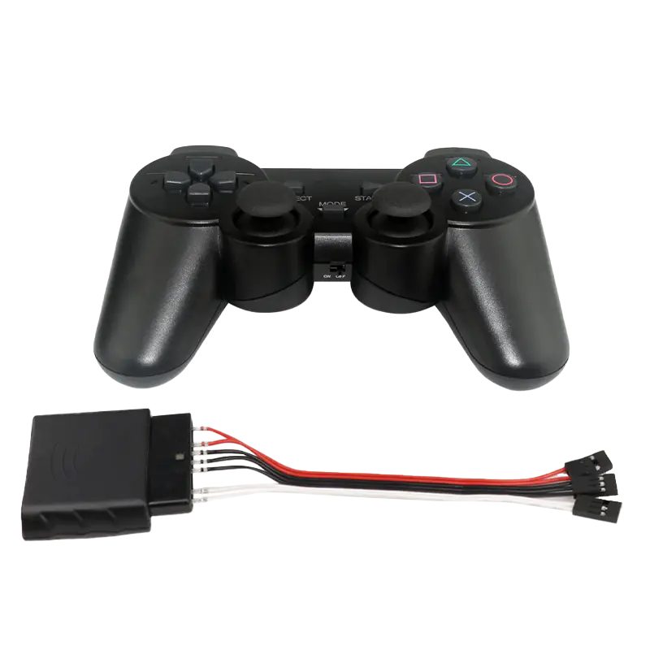
                <div style="padding: 12px 4px; text-align: center; color: #333;">
                    <span>PS2 Wireless Controller with Cable Receiver</span>
                </div>
            </a>
        </div>
        <div style="width: calc(18% - 15px); min-width: 150px; background: white; border-radius: 8px; overflow: hidden; box-shadow: 0 2px 8px rgba(0,0,0,0.1);">
            <div style="display: block; text-decoration: none;">
                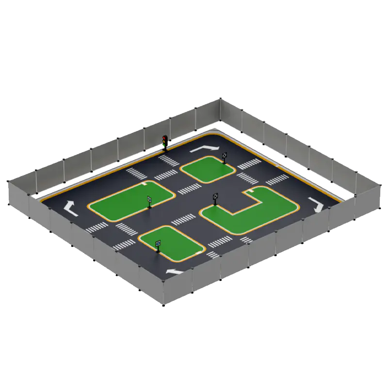
                <div style="padding: 12px 4px; text-align: center; color: #333;">
                    <span>Autonomous Driving Mapping</span>
                </div>
            </div>
        </div>
        <div style="width: calc(18% - 15px); min-width: 150px; background: white; border-radius: 8px; overflow: hidden; box-shadow: 0 2px 8px rgba(0,0,0,0.1);">
            <div style="display: block; text-decoration: none;">
                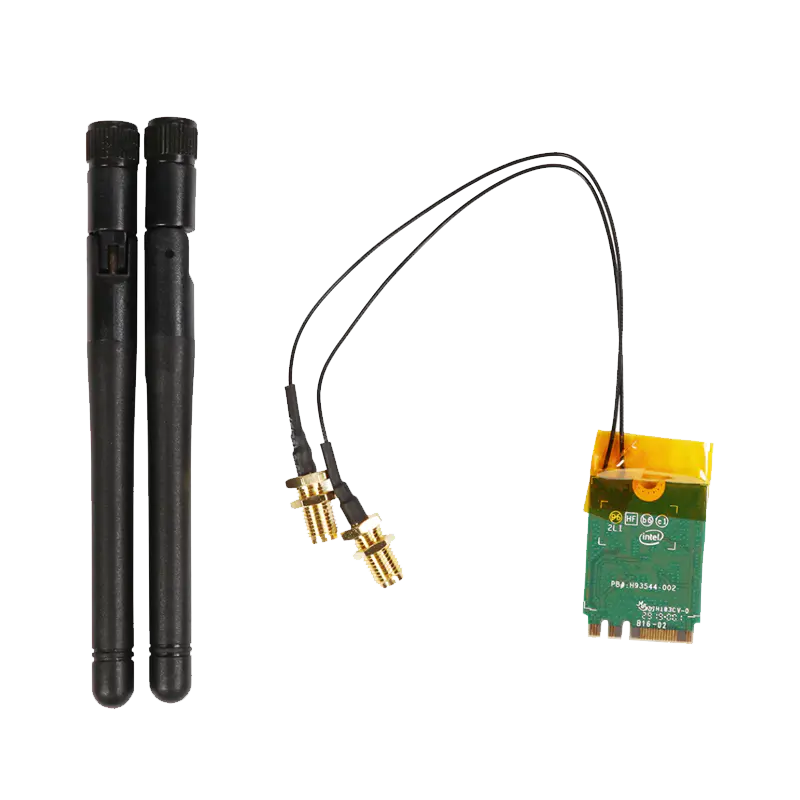
                <div style="padding: 12px 4px; text-align: center; color: #333;">
                    <span>JETSON NANO Wireless Network Card</span>
                </div>
            </div>
        </div>
    </div>
</div>
